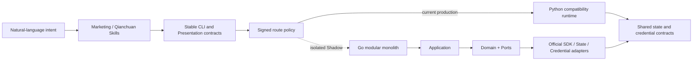

<p align="center">
  
</p>

<h1 align="center">ocean-watch</h1>

<p align="center">Ocean Engine delivery and monitoring for Codex</p>

<p align="center">
  <a href=".codex-plugin/plugin.json"></a>
  <a href="https://github.com/westng/ocean-watch/actions/workflows/ci.yml"></a>
  <a href="https://github.com/westng/ocean-watch/tags"></a>
  <a href="pyproject.toml"></a>
  <a href="LICENSE"></a>
</p>

[中文](README.md) | English

`ocean-watch` uses official Ocean Engine APIs for OAuth, account management, material discovery, plan creation, reporting, and delivery analysis. Its two Skills share one CLI runtime but never share apps, tokens, accounts, templates, or creation transactions.

| Skill | Channel | Support |
| --- | --- | --- |
| `ads-plan-monitor` | Ocean Engine Marketing | OAuth, responsible accounts, uploaded/creator materials, templates, plans, reports, strategy |
| `qc-plan-monitor` | Qianchuan | OAuth, responsible accounts, product/live templates, creator and product discovery, plan operations, plan/material reports |

Qianchuan live templates and creation are supported. Strategy remains read-only by default. Create, remove, and plan-setting commands require an explicit `--submit` for online writes.

Daily users do not need to memorize commands, parameters, or Skill names. Describe the desired result in Codex; it will select the channel, ask for missing information, and show a preview before any write.

## Install

Requires Codex CLI `0.144.1+` and Python `3.10+`:

```bash
codex plugin marketplace add westng/ocean-watch
codex plugin add ocean-watch@ocean-watch
```

Start a new Codex task after installation or upgrade. For first use, ask: `Initialize Ocean Engine monitoring and guide me through Marketing authorization.`

Codex checks the local environment during first use. To run the check manually:

```bash
ocean-watch setup doctor
```

See the Chinese [Getting started guide](docs/getting-started.md) for the complete workflow. Installation never starts OAuth; the temporary callback server starts only when `auth authorize` runs.

### Versions and releases

Repository version Tags remain the Codex Marketplace installation source, with a GitHub Release created from the matching Chinese Changelog section. The current Release does not build or publish Go runtime candidate assets. The production runtime policy remains disabled and every command stays on Python until all Go migration gates and independent approvals pass. Version changes remain in `CHANGELOG.md`. To pin a version, register the Marketplace at its Tag:

```bash
codex plugin marketplace add westng/ocean-watch --ref vX.Y.Z
codex plugin add ocean-watch@ocean-watch
```

See the [release guide](docs/releasing.md) for the maintainer workflow.

## Everyday Q&A

These questions are examples, not fixed commands. You can use conversational wording, abbreviations, or follow-up questions; Codex routes by intent.

### First-time setup

**Q:** This is my first time using Ocean Watch. Can you check the environment and guide me through Marketing authorization?

**Ocean Watch:** It checks the runtime, secure credential backend, and OAuth port, then guides you through channel-specific app configuration and authorization. Marketing and Qianchuan are authorized separately.

### Responsible accounts and spend

**Q:** Add Qianchuan account `1234567890` to the accounts I manage and call it “Flagship Store.”

**Ocean Watch:** It adds the account to the local registry. Later questions such as “Which accounts am I responsible for?” or “What are my commonly used ad accounts?” return the enabled account list only, without querying reports or refreshing tokens.

**Follow-up:** Now show today's spend for those accounts, summarize by channel, and identify failures.

**Ocean Watch:** It resolves “those accounts” from the conversation, queries account-level reports concurrently, and isolates individual failures. Marketing and Qianchuan GMV/ROI remain separate because their official definitions differ.

### Create Marketing plans from uploaded videos

**Q:** Find today's videos for my sunscreen account, group five per unit, and create plans with my mixed-material template. Let me review them first.

**Ocean Watch:** It previews the advertiser, template, groups, budget, ROI, and plan count. Nothing is submitted until you explicitly confirm the preview; resumable project IDs remain visible if unit creation fails after project creation.

### Use creator-authorized materials

**Q:** Find videos from creator `DOUYIN_SHOW_ID` that are still authorized for this advertiser, then preflight a native-material plan.

**Ocean Watch:** It distinguishes public videos from materials that this advertiser can actually deliver. Batch preflight separates ready, completed, resumable, and blocked jobs before confirmation.

### Process Qianchuan plans from Douyin links

**Q:** Create a sunscreen product template for Qianchuan account `1234567890`, product `987654321`, budget 5000, and target ROI 1.7.

**Ocean Watch:** It validates the channel, advertiser, and product bindings before saving the template.

**Follow-up:** Use that template for these Douyin works. Create a plan when the creator has no matching plan; otherwise append only missing materials. Preflight first.

**Ocean Watch:** Official APIs verify authorization, ownership, and product matching. Invalid, unauthorized, mismatched, and existing materials are skipped. After confirmation, successful rows always contain `Plan ID | Creator | Product ID | Material ID | Material title`; skips and failures are explained separately.

### Remove a Qianchuan work safely

**Q:** I want to remove this Douyin work from plan `AD_ID`. Show the exact materials and linked impact first, but do not execute.

**Ocean Watch:** It maps the work to exact plan materials and only permits removal of custom-selected materials. Submission requires another confirmation and is followed by an official state check.

### Create a Qianchuan live plan

**Q:** Create a live all-domain template for Qianchuan account `1234567890` and preview a live plan with the default settings.

**Ocean Watch:** It uses a dedicated live template without product-work fields, then previews budget, bidding, schedule, and intelligent material settings before submission.

### Review performance

**Q:** Show the last seven days of Marketing material performance, list the top ten by spend and high-spend low-conversion materials, then recommend actions.

**Ocean Watch:** It returns a read-only report with pause, observe, or scale recommendations and never changes plans automatically.

**Follow-up:** What about today's product all-domain plans for Qianchuan account `1234567890`?

**Ocean Watch:** It queries Qianchuan plan reporting, summarizes spend, GMV, orders, and weighted ROI, and preserves Qianchuan-specific metric definitions.

## Confirmation rules

- Account, material, template, and report queries are read-only.
- Create, append, and remove workflows preview first and require explicit confirmation.
- Templates, tokens, and materials cannot cross channel or advertiser boundaries.
- Partial skips or failures are reported without hiding successful results.

## Automation and diagnostics

Everyday users should express delivery goals in natural language without learning internal command groups. Use the stable CLI only for scripting, precise arguments, or diagnostics; see the [CLI reference](docs/cli.md) for actions and parameters. CLI groups are a migration compatibility contract, not the new architecture's domain modules and not evidence that a command has moved to Go. The [Go SDK migration matrix](docs/go-sdk-migration-matrix.md) is the authority for per-command routing status.

## Security

- App secrets, access tokens, refresh tokens, and authorization codes never belong in Git configuration.
- Credentials use Keychain on macOS, DPAPI on Windows, and Secret Service on Linux.
- User configuration and state live under `$CODEX_HOME/ads-plan-monitor/`.
- Official business traffic is restricted to approved Ocean Engine HTTPS hosts. A read-only F2 CLI in the current Python interpreter resolves public Qianchuan work metadata and maps it to stable author, product, and video fields without downloading media or creating its database; product hints may reject an obvious mismatch early but never replace official Qianchuan authorization, ownership, or product validation.
- Reports, caches, logs, job files, and journals are not open-source repository content.

See [Security](SECURITY.md) and [Configuration](docs/configuration.md).

## For developers

Run the shared CLI without installing the package:

```bash
python3 skills/ads-plan-monitor/run.py --help
python3 skills/qc-plan-monitor/run.py --help
```

Or install an editable package:

```bash
python3 -m venv .venv
source .venv/bin/activate              # Windows: .venv\Scripts\activate
python3 -m pip install -e ".[dev]"
ocean-watch --help
```

## Current Runtime Architecture

As of 2026-07-28, the repository is in a dual-runtime migration with a single production path:



| Scope | Current state |
| --- | --- |
| Installed users and production commands | Both Skill `run.py` entrypoints still route to the Python runtime in `skills/ads-plan-monitor/src/ocean_watch/` |
| Production routing policy | `.codex-plugin/runtime-policy.json` remains `enabled: false`; installed users cannot switch to Go automatically |
| Go SDK candidate | `prototype/ocean-watch-go/` contains official SDK adapters, modular business implementations, and contract tests, but remains an isolated Shadow candidate |
| Native bootstrap candidate | `prototype/runtime-bootstrap/` validates candidate signatures, platforms, digests, and versions, but is not part of the production installation path yet |
| Known migration gaps | `auth set-app/authorize/status/refresh/sync-accounts/mappings` and `qc-materials inspect-work` do not yet have Go CLI handlers |
| Production prerequisites | Real canaries, five-platform native consumption, candidate identity binding, independent approvals, and all G1-G5 Gates are not yet complete |

Most P1-P5 automation is implemented in the isolated candidate, but “Go component implemented,” “Go handler wired,” and “production route enabled” are separate states. Candidate code, local tests, or ordinary CI success never means installed users are running Go. See [Architecture](docs/architecture.md) for the runtime boundary, [Go SDK migration matrix](docs/go-sdk-migration-matrix.md) for per-command status, and [machine contracts](contracts/README.md) for phase status, blockers, and acceptance definitions.

## Documentation

- [Documentation index](docs/README.md)
- [Getting started](docs/getting-started.md) (Chinese)
- [CLI reference](docs/cli.md) (Chinese)
- [Configuration](docs/configuration.md) (Chinese)
- [Architecture](docs/architecture.md) (Chinese)
- [Go SDK migration matrix](docs/go-sdk-migration-matrix.md) (Chinese)
- [Phase status and acceptance contracts](contracts/README.md) (Chinese)
- [Release guide](docs/releasing.md) (Chinese)
- [Contributing](CONTRIBUTING.md)
- [Changelog](CHANGELOG.md)

## Quality checks

```bash
PYTHONDONTWRITEBYTECODE=1 python3 -m unittest discover -s tests -v
ruff check skills/ads-plan-monitor/src scripts tests
bandit -q --severity-level medium -r skills/ads-plan-monitor/src/ocean_watch scripts
(cd prototype/ocean-watch-go && GOTOOLCHAIN=go1.26.5 go test ./...)
(cd prototype/runtime-bootstrap && GOTOOLCHAIN=go1.26.5 go test ./...)
python3 scripts/version_tag.py check
git diff --check
```

CI validates the production runtime with Python `3.12` on Windows, macOS, and Linux, runs Python `3.10` compatibility checks on Linux, and tests both Go modules on Linux. Daily CI does not build candidates, consume native candidates on five platforms, or produce G5 Gate evidence.

## License

MIT
