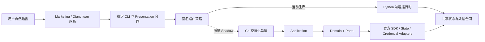

<p align="center">
  
</p>

<h1 align="center">ocean-watch</h1>

<p align="center">面向 Codex 的巨量引擎投放与盯盘 Plugin</p>

<p align="center">
  <a href=".codex-plugin/plugin.json"></a>
  <a href="https://github.com/westng/ocean-watch/actions/workflows/ci.yml"></a>
  <a href="https://github.com/westng/ocean-watch/tags"></a>
  <a href="pyproject.toml"></a>
  <a href="LICENSE"></a>
</p>

中文 | [English](README.en-US.md)

`ocean-watch` 通过巨量引擎官方 API 完成 OAuth 授权、账户管理、素材查询、计划创建、报表汇总和投放分析。Plugin 包含两个职责独立的 Skill，共用同一套 CLI，但不共享应用、Token、账户、模板或创建事务：

| Skill | 渠道 | 已支持 |
| --- | --- | --- |
| `ads-plan-monitor` | 巨量营销 | 授权、负责账户、上传/达人素材、模板、计划、报表、策略 |
| `qc-plan-monitor` | 巨量千川 | 授权、负责账户、商品/直播全域模板、达人与商品查询、计划处理、全域与乘方账户/商品/直播间/达人/计划/素材报表 |

千川直播模板和创建流程已经开放；策略建议仍以只读分析为主。所有创建、删除和参数调整命令默认只预览，只有显式传入 `--submit` 才会调用在线写接口。

如果你只是日常使用，不需要记命令、参数或 Skill 名称。安装后直接在 Codex 中描述目标即可；Codex 会选择正确渠道、补问缺少的信息，并在写入计划前展示预览。

## 安装

需要 Codex CLI `0.144.1+` 和 Python `3.9+`：

```bash
codex plugin marketplace add westng/ocean-watch
codex plugin add ocean-watch@ocean-watch
```

安装或升级后新建一个 Codex 任务。第一次可以直接说“帮我初始化巨量引擎盯盘”，不必手动执行后续业务命令。

首次使用时 Codex 会先检查本机环境；需要手动检查时运行：

```bash
ocean-watch setup doctor
```

完整流程见[快速开始](docs/getting-started.md)。安装阶段不会启动 OAuth；首次执行 `auth authorize` 时才会临时启动本地回调服务。

### 版本与发布

本项目以 Git 仓库版本 Tag 作为 Codex Marketplace 安装源，并为同一提交创建使用中文 Changelog 的 GitHub Release。当前 Release 不构建或发布 Go 运行时候选资产；生产运行时策略仍关闭，所有命令继续走 Python，直到 Go 迁移门禁和独立审批全部通过。版本变化统一记录在 `CHANGELOG.md`；需要固定版本时，在注册 Marketplace 时指定 Tag：

```bash
codex plugin marketplace add westng/ocean-watch --ref vX.Y.Z
codex plugin add ocean-watch@ocean-watch
```

维护者流程见[发布指南](docs/releasing.md)。

## 普通用户使用 Q&A

下面的问法只是示意，不是固定口令。你可以使用口语、简称或上下文追问，Codex 会根据意图选择对应能力。

### 第一次配置营销或千川

**问：** 我第一次使用，能帮我检查环境并完成巨量营销授权吗？

**Ocean Watch：** 会检查 Python、Codex 版本、安全凭据仓库和 OAuth 端口，再引导你配置对应渠道的 App ID 与 Secret。授权完成后会反馈同步到的广告主；巨量营销和巨量千川需要分别授权。

### 查看负责账户和账户消耗

**问：** 把千川账户 `1234567890` 设为我负责的账户，名称叫“品牌旗舰店”。

**Ocean Watch：** 会把它加入本机账户簿。以后问“我负责的账户有哪些”“我常用的广告账户”等相近说法，只返回启用账户名单，不查询报表、不刷新 Token。

**继续问：** 那再看一下这些账户今天的消耗，按渠道汇总，并标出失败账户。

**Ocean Watch：** 会理解“这些账户”指刚才的负责账户，并发查询账户级报表、隔离单账户失败。营销和千川的成交金额、ROI 口径不同，会分渠道展示，不强行混算。

### 用上传视频创建营销计划

**问：** 查询“夏季防晒”账户今天上传的视频，每 5 条组成一个单元，用防晒霜混剪模板创建计划，先让我确认。

**Ocean Watch：** 会先展示广告主、模板、视频分组、预算、ROI 和计划数量，不会直接提交。你确认“按刚才的预览提交”后才会在线创建；若项目成功而单元失败，结果会保留项目 ID，供后续续建。

### 使用达人授权素材投放

**问：** 找出抖音号 `DOUYIN_SHOW_ID` 仍授权给这个营销账户的视频，用原生素材模板先做创建预检。

**Ocean Watch：** 会区分公开视频与当前广告主真正拥有投放授权的素材，只使用有效授权快照。批量预检会分别列出可创建、已完成、可续建和被阻断的项目，再等待确认。

### 按抖音作品链接批量处理千川计划

**问：** 为千川账户 `1234567890` 建一个防晒霜商品全域模板，商品 ID 是 `987654321`，预算 5000，目标 ROI 1.7。

**Ocean Watch：** 会先校验模板与广告主、商品和渠道的绑定，再保存模板。

**继续问：** 用刚才的模板处理这些抖音作品。达人没有对应计划就新建，已有计划只追加缺少的素材，先预检。

**Ocean Watch：** 会通过官方接口确认达人授权、作品归属和商品匹配；无效链接、商品不匹配、未授权作品和已存在素材会跳过。确认执行后，成功明细固定返回 `计划ID｜达人昵称｜商品ID｜素材ID｜素材标题`，跳过和失败原因单独说明。

### 删除千川计划中的指定作品

**问：** 我想从千川计划 `AD_ID` 中移除这个抖音作品，先告诉我会影响哪些素材，不要直接执行。

**Ocean Watch：** 会把作品精确映射到计划素材，只允许删除自提素材，并展示多账号或多商品场景下的联动影响。再次确认后才提交删除，提交后还会复查官方状态。

### 创建千川直播全域计划

**问：** 给千川账户 `1234567890` 的直播账号创建直播全域模板，先用默认设置预览一条直播计划。

**Ocean Watch：** 会使用独立的直播模板，不混入商品或作品素材字段，并先展示预算、出价方式、直播时段和智能选材设置，等你确认后再提交。

### 查看报表并获得投放建议

**问：** 看一下这个营销账户最近 7 天的素材表现，列出消耗前 10 和高消耗低转化素材，再给我优化建议。

**Ocean Watch：** 会在对话中展示只读报表，并给出停投、观察或放量建议，不会自行修改计划。

**继续问：** 千川账户 `1234567890` 今天的商品全域计划呢？

**Ocean Watch：** 会查询千川计划报表，汇总消耗、成交金额、订单和加权 ROI，并保持千川指标口径独立。

### 按业务对象查询千川全域与乘方数据

**问：** 看一下千川账户 `1234567890` 昨天包含乘方的整体消耗和成交。

**Ocean Watch：** 会识别这是单广告主的全域与乘方账户聚合，调用官方乘方账户接口；如果明确说“只看全域”，则改用全域账户接口。问“我负责的账户表现”时仍查询本机负责账户集合，不会误当成单广告主报表。

**继续问：** 商品 `987654321` 这周的消耗、GMV 和 ROI 呢？再按小时看看直播间 `ROOM_ID` 昨晚的效果。

**Ocean Watch：** 会先按商品维度查询效果数据，再按直播间和小时维度查询；如果只问“找这个商品或商品 ID”，则走商品资产查询。达人、计划、素材和可用报表字段也会按对象与上下文选择各自接口，不要求用户说出命令或固定口令。

## 使用时的确认规则

- 查询账户、素材、模板和报表属于只读操作，可直接执行。
- 创建、追加、删除和计划参数调整默认先预览；没有明确确认，不执行在线写入。
- 模板必须绑定正确渠道、广告主和商品，不能跨账户复用 Token 或素材。
- 一次任务可以有部分跳过或失败；Codex 会保留成功结果并单独说明失败原因。

## 自动化与排错

普通用户应直接用自然语言表达投放目标，不需要了解内部命令分组。需要脚本化、精确传参或排错时再使用稳定 CLI；完整 action 和参数见 [CLI 参考](docs/cli.md)。CLI 分组是迁移期兼容合同，不代表新架构的领域模块，也不用于判断某个命令是否已经切换到 Go；逐命令路由状态以 [Go SDK 迁移矩阵](docs/go-sdk-migration-matrix.md)为准。

## 安全与隐私

- App Secret、Access Token、Refresh Token 和授权码不写入 Git 配置。
- macOS 使用 Keychain，Windows 使用 DPAPI，Linux 使用 Secret Service。
- 用户配置和状态位于 `$CODEX_HOME/ads-plan-monitor/`。
- 官方业务请求只允许巨量官方 HTTPS 主机；可选千川作品解析服务只接收公开抖音链接。
- 报表、缓存、日志、任务清单和执行 journal 不属于开源仓库内容。

详见[安全说明](SECURITY.md)和[配置与授权](docs/configuration.md)。

## 开发者

无需安装即可运行统一入口：

```bash
python3 skills/ads-plan-monitor/run.py --help
python3 skills/qc-plan-monitor/run.py --help
```

也可以安装可编辑包：

```bash
python3 -m venv .venv
source .venv/bin/activate              # Windows: .venv\Scripts\activate
python3 -m pip install -e ".[dev]"
ocean-watch --help
```

## 当前运行时架构

截至 2026-07-28，仓库处于“双运行时、单生产路径”的迁移阶段：



| 范围 | 当前状态 |
| --- | --- |
| 用户安装与生产命令 | 两个 Skill 的 `run.py` 仍统一进入 `skills/ads-plan-monitor/src/ocean_watch/` 中的 Python 运行时 |
| 生产路由策略 | `.codex-plugin/runtime-policy.json` 保持 `enabled: false`；已安装用户不会自动切换到 Go |
| Go SDK 候选 | `prototype/ocean-watch-go/` 已包含官方 SDK Adapter、模块化业务实现和合同测试，当前仅作为隔离 Shadow 候选 |
| 原生启动候选 | `prototype/runtime-bootstrap/` 负责候选资产的签名、平台、摘要和版本校验，尚未进入生产安装路径 |
| 已知迁移缺口 | `auth set-app/authorize/status/refresh/sync-accounts/mappings` 与 `qc-materials inspect-work` 尚未接入 Go CLI handler |
| 上线条件 | 真实 canary、五平台原生消费、候选身份绑定、独立签字与 G1–G5 Gate 尚未全部通过 |

P1–P5 的主要自动化范围已经在隔离候选中落地，但“Go 组件已实现”“Go handler 已接入”和“生产路由已启用”是三个独立状态。候选代码、本地测试或普通 CI 通过都不代表用户已经运行 Go。当前边界见[架构说明](docs/architecture.md)，逐命令状态见[Go SDK 迁移矩阵](docs/go-sdk-migration-matrix.md)，阶段完成度、阻断项与验收定义见[机器契约](contracts/README.md)。

## 文档

从[文档中心](docs/README.md)开始，或直接查看：

- [快速开始](docs/getting-started.md)
- [CLI 参考](docs/cli.md)
- [配置与授权](docs/configuration.md)
- [架构说明](docs/architecture.md)
- [Go SDK 迁移矩阵](docs/go-sdk-migration-matrix.md)
- [阶段状态与验收契约](contracts/README.md)
- [发布指南](docs/releasing.md)
- [贡献指南](CONTRIBUTING.md)
- [更新日志](CHANGELOG.md)

## 质量检查

```bash
PYTHONDONTWRITEBYTECODE=1 python3 -m unittest discover -s tests -v
ruff check skills/ads-plan-monitor/src scripts tests
bandit -q --severity-level medium -r skills/ads-plan-monitor/src/ocean_watch scripts
(cd prototype/ocean-watch-go && GOTOOLCHAIN=go1.26.5 go test ./...)
(cd prototype/runtime-bootstrap && GOTOOLCHAIN=go1.26.5 go test ./...)
python3 scripts/version_tag.py check
git diff --check
```

CI 使用 Python `3.12` 在 Windows、macOS 和 Linux 验证现行运行时，使用 Python `3.9` 在 Linux 执行兼容性检查，并在 Linux 测试两个 Go module。日常 CI 不构建候选、不执行五平台 native candidate 消费，也不产生 G5 Gate 证据。

## License

MIT
