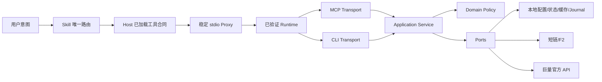
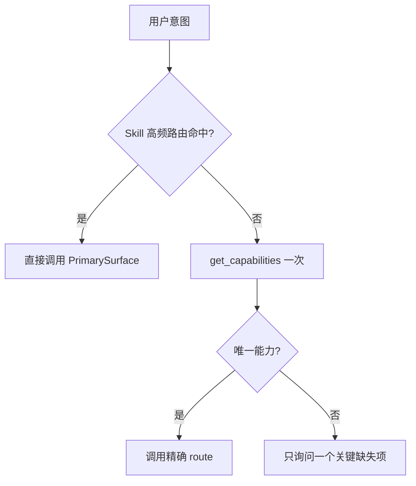
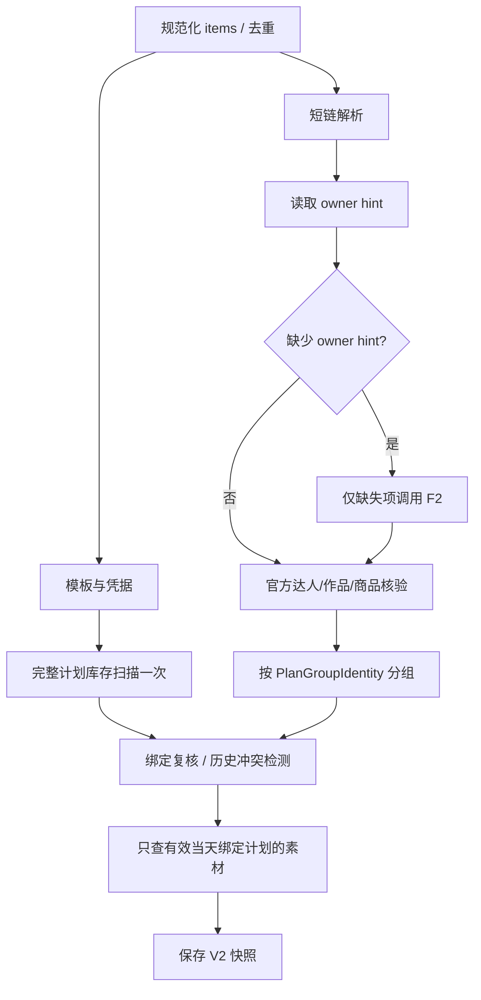

# Ocean Watch Plugin 目标架构 V3

> 文档状态：实施级设计已完成；W0–W7 已实现并通过本地验证，W8 候选已构建安装且等待新任务 Host 加载检查，W9–W10 尚未执行
>
> 文档属性：AI 辅助目标架构与技术决策
>
> 权威边界：本文定义目标合同并记录当前实施阶段，不单独证明产品行为或验收结论；当前行为仍以代码、测试、Plugin 清单、Skill 和正式文档为准
>
> 证据核实日期：2026-08-18
>
> 适用范围：整套 Ocean Watch Plugin，重点修复千川作品批次预检，并统一意图路由、MCP/CLI 边界、本地状态、升级和验收规则
>
> 外部约束：MCP 保持本地 stdio，不发布公网；Plugin 安装或升级不要求退出或重启客户端

## 1. 架构决定

V3 采用“稳定 Host 合同 + 可热切换 Runtime + 单一 Application Service + 显式领域身份”的架构。



固定决定：

1. Skill 只做意图识别、缺失参数确认和唯一入口选择，不拆业务批次。
2. MCP 和 CLI 只做输入/输出适配，调用同一个 Application Service，不复制业务规则。
3. 一次用户批次只进入一次 Runtime；逐行语义通过结构化 `items[]` 保留。
4. 计划组身份由模板、达人、商品集合、计划类型和商务共同决定，不再只用达人 ID。
5. `group_id` 表示稳定业务组，实际每日计划实例使用 `business_date + group_id` 绑定到 `ad_id`；不再仅凭达人和商品猜测。
6. 预检不调用官方写接口；确认提交必须使用未过期、未漂移的快照。
7. 缓存只能减少公共元数据工作，不能替代当前官方授权、归属、商品和计划状态核验。
8. 兼容 Runtime 更新在当前任务热切换；Skill、工具名称、Schema 或注解变化在新任务加载，不要求退出客户端。
9. 全插件能力元数据只有一个注册表；CLI、MCP、`get_capabilities` 和 Skill 路由通过生成或静态校验保持一致。

## 2. 目标与非目标

### 2.1 目标

- 普通意图首命中唯一能力，不做仓库、Memory、缓存路径或工具目录探索。
- 一次 25 条混合类型输入在单次 MCP 调用中正确分组。
- 单批、等价拆批、顺序变化和重复执行产生相同 `group_id` 与业务决策。
- 同一达人不同类型或商务绝不自动追加到同一计划。
- MCP 与 CLI 对同一规范化输入产生相同领域结果。
- 当前任务可安全接管工具合同不变的 Runtime 更新；坏候选自动拒绝且不中断旧 Runtime。
- 验收区分正确性、性能、Host 加载、升级、CI 和正式发布。

### 2.2 非目标

- 不建设通用 DAG、工作流引擎、分布式队列或公网 MCP 服务。
- 不用缓存代替官方业务事实。
- 不保证 Host 将合同变化热加载到已经运行的任务。
- 不自动猜测历史计划的类型或商务。
- 不在本次整改中为所有 CLI 命令机械增加 MCP 工具。
- 不因架构整改自动创建 Tag、Release 或 Marketplace 发布。

## 3. 分层职责

| 层 | 唯一职责 | 禁止职责 |
| --- | --- | --- |
| Skill | 识别 Marketing/Qianchuan、只读/写入意图和所需参数；调用唯一入口 | 拆批、匹配计划、扫描环境、执行业务回退 |
| Codex Host | 在任务创建时加载 Skill 与 MCP 工具合同 | 被 Ocean Watch 假定支持任务内合同刷新 |
| Stable Proxy | 候选发现、完整性校验、合同兼容、租约、切换、拒绝、回滚 | 业务分组、缓存业务事实、修改工具结果 |
| MCP Transport | JSON Schema、请求边界、错误封装、Presentation | 领域匹配、调用 CLI 子进程、隐式提交 |
| CLI Transport | 参数/行解析、交互确认、输出格式 | 保留第二套领域算法 |
| Application Service | 整批编排、去重、共享读取、官方核验、分组、匹配、快照、提交复核 | 直接依赖文件路径或 HTTP 细节 |
| Domain | 规范化、`group_id`、匹配政策、状态机和不变量 | 网络和文件 I/O |
| Ports/Adapters | 配置、凭据、短链、F2、官方 API、缓存、绑定、锁、Journal | 决定计划身份或静默降级 |

## 4. 全插件能力注册与意图路由

### 4.1 单一能力注册表

新增类型化 `CapabilityRegistry`，保存业务能力元数据，不保存 Handler、Schema 字符串或模型提示词：

```go
type CapabilitySpec struct {
    ID             string
    Channel        string
    Effect         Effect
    RequiresSubmit bool
    MCPTool        string
    CLICommand     string
    PrimarySurface Surface
    FastRoute      bool
}
```

固定规则：

- `ID` 是稳定语义身份，例如 `qianchuan.work_preflight`、`shared.template_list`；不能用中文文案作为 key。
- 一个能力可同时有 MCP 和 CLI Transport，但 `PrimarySurface` 只有一个；Skill 只路由主表面，不做静默 fallback。
- 高频能力标记 `FastRoute=true`，在 Skill 中直接静态命中；其他能力由一次 `get_capabilities` 返回唯一入口。
- CLI `contracts.Commands` 的 channel/effect/requires-submit 从注册表派生或被逐项静态校验。
- 每个 MCP 注册工具必须绑定一个 `CapabilitySpec`；工具 Title、Description、Schema 和 Handler 仍由 MCP 层维护，但工具名称、渠道、副作用和主路由不能另写一套。
- `get_capabilities` 从注册表输出能力 ID、主表面、精确 route、渠道和副作用；不再只列 CLI 命令。
- 两个 Skill 的 Fast Routing 表保留为人类可读 Markdown，并放在 `<!-- capability-routes:start -->` / `<!-- capability-routes:end -->` 受控标记区；Go 测试按注册表逐行解析和校验，不引入会改写 Skill 的生成脚本。人工业务规则继续保留在 Skill 标记区之外。

### 4.2 路由决策



禁止行为：

- 高频意图先调用 `get_capabilities`；
- 为确认工具存在而枚举工具、搜索 Memory、仓库或 Plugin 缓存；
- MCP 不可用后自动改走具有不同合同的 CLI；
- 同一能力在 Marketing 与 Qianchuan 之间共享凭据或业务实现；
- 由运行时自由文本相似度决定有副作用的命令。

### 4.3 一致性 Gate

构建和 CI 必须证明：

- 每个 CLI 命令恰好属于一个 capability；
- 每个 MCP 工具恰好属于一个 capability；
- capability ID、MCP tool、CLI command 均无重复；
- `online_write` 必须 `requires_submit=true`；
- Skill 高频路由与 `FastRoute=true` 集合一致；
- `get_capabilities` fixture 与注册表一致；
- Host tool catalog digest 与 MCP 实际 `tools/list` 一致。

统一注册表是编译期/构建期权威来源，不是普通业务请求的动态服务依赖，因此不会给高频请求增加一轮调用。

## 5. Host 与升级兼容合同

官方 OpenAI Plugin 文档在 2026-08-18 的规则是：安装后开始新任务或新 CLI 会话，Bundled Skill 才可用；安装包可为新任务增加 Skill、Connector 和 MCP 工具。该文档没有承诺任务内刷新 Skill/工具合同，也没有要求退出客户端。

| 变更类型 | 当前任务 | 新任务 | 用户动作 | 版本要求 |
| --- | --- | --- | --- | --- |
| Runtime 内部修复，工具目录字节级一致 | Proxy 验证后自动切换 | 使用新 Runtime | 无 | build metadata 可变；正式发布按版本策略 |
| 性能、Adapter 或 Application 内部修改，Schema 不变 | 同上 | 同上 | 无 | 同上 |
| 新增/删除工具 | 旧 Runtime 继续服务 | 加载新合同 | 新建任务；不退出客户端 | Plugin 版本必须前进 |
| 输入/输出 Schema、工具注解或描述变化 | 旧 Runtime 继续服务 | 加载新合同 | 新建任务；不退出客户端 | Plugin 版本必须前进 |
| Skill 内容或路由变化 | 当前任务继续使用已加载 Skill | 加载新 Skill | 新建任务；不退出客户端 | Plugin 版本/build 必须可区分 |
| 候选损坏、hash 不符、自报版本不符 | 不接管 | 不接管 | 无；继续旧版本 | 标记 rejected hash |
| 新合同版本不可用 | 当前旧任务不受影响 | 新任务暴露明确安装/合同错误 | 修复或回滚 Plugin | 禁止 CLI 静默替代 MCP |

Proxy 的兼容判定继续采用完整工具目录字节比较；不得把“工具名称相同”误当成 Schema 兼容。构建测试可以对规范化工具目录计算 digest 以定位漂移，但 V3 首次迁移不得给 Runtime manifest v1 增加未知顶层字段，也不得直接升级 manifest Schema：当前 v1 Proxy 使用 `DisallowUnknownFields` 且只接受 `schema_version=1`，直接改变格式会让旧任务在发布新版 Host 兼容别名前拒绝候选，破坏“不退出客户端”的升级链。若未来确需 manifest v2，必须先发布一个能同时读取 v1/v2 的桥接版本；实际接管仍以候选 `tools/list` 与 Host 完整目录一致为最终条件。

## 6. 千川批次输入合同 V2

`preflight_qianchuan_works` 保留工具名称，但输入和输出 Schema 升级，因此属于 Host 合同变化。安装后由新任务加载，不要求退出客户端。

### 6.1 MCP 输入

```json
{
  "plan_template": "qcpt_...",
  "items": [
    {
      "work_url": "https://v.douyin.com/.../",
      "plan_type": "随手po",
      "business": "刘岛"
    },
    {
      "work_url": "https://v.douyin.com/.../",
      "plan_type": "真人口播营销",
      "business": "刘岛"
    }
  ],
  "concurrency": 8,
  "auth_account_id": "optional"
}
```

Schema 约束：

- `items`: 1–100；保持用户顺序。
- `work_url`: 必填，1–2048 字符；只提取第一个合法抖音短链或作品 URL。
- `plan_type`、`business`: 可选，去首尾空白后 0–128 字符；空值是明确身份值，不从相邻行继承。
- 删除 MCP 顶层 `work_urls`、`plan_type`、`business`；不保留第二套 MCP 批次合同。
- `concurrency`: 1–10，默认 8；只限制单命令并发，不代表官方 QPS。
- MCP 不接受 `submit`、配置路径、Token、Cookie 或任意 payload。

CLI 可在一个迁移版本内继续接受 `--work-url` 与整批 `--plan-type/--business`，但必须在 Transport 层立刻转换成同一个 `[]BatchItem`。该兼容只服务 CLI 用户，不进入 MCP Schema，不保留第二套 Application 逻辑。

### 6.2 规范化模型

```go
type BatchItem struct {
    InputIndex int
    WorkURL    string
    PlanType   string
    Business   string
}

type VerifiedBatchItem struct {
    BatchItem
    Work       VerifiedWork
    ProductIDs []string
}
```

每个作品先独立计算 `ProductIDs = sort(unique(intersection(template_product_ids, officially_verified_work_product_ids)))`；交集为空时该项返回 `PRODUCT_MISMATCH`。分组随后使用该项的完整商品集合，因此同一达人下商品交集不同的作品不会被先合并再取并集。

规范化顺序固定为：

1. 保留 `InputIndex`；
2. 提取并规范化 URL；
3. 按最终 `aweme_item_id` 去重；
4. 重复 ID 若类型或商务不同，返回 `DUPLICATE_ITEM_CONFLICT`；完全相同则保留首条并记录重复索引；
5. `plan_type`、`business` 只执行 `strings.TrimSpace`，不做大小写、同义词或模型语义归并；
6. 任何默认值只能来自显式模板合同，不能来自上一行或第一行。

## 7. 计划组领域模型

### 7.1 计划组身份

```go
type PlanGroupIdentity struct {
    AdvertiserID string
    TemplateID   string
    CreatorID    string
    ProductIDs   []string
    PlanType     string
    Business     string
}
```

规则：

- `ProductIDs` 使用模板绑定商品与该组已核实商品的规范化交集，排序、去重且至少一个。
- 同一达人、模板和商品下，`PlanType` 或 `Business` 任一不同即为不同计划组。
- 空类型与非空类型不同；空商务与非空商务不同。
- 达人昵称、作品标题、输入顺序、日期和计划名称不属于身份。
- `group_id = "qcg_" + hex(sha256(canonical_json(identity)))`；canonical JSON 使用 UTF-8、无额外空白、固定字段顺序、JSON 标准字符串转义和已排序商品数组，并用 golden fixture 锁定结果。
- 输出和快照使用 `group_id`；每日绑定使用 `business_date + group_id`；幂等 key 使用 `business_date + group_id + action + target + item_set`，提交复核不再以 creator ID 作为唯一键。

### 7.2 分组决策表

| 达人 | 商品集合 | 类型 | 商务 | 结果 |
| --- | --- | --- | --- | --- |
| 相同 | 相同 | 相同 | 相同 | 同一组 |
| 相同 | 相同 | 不同 | 任意 | 不同组 |
| 相同 | 相同 | 任意 | 不同 | 不同组 |
| 相同 | 不同 | 任意 | 任意 | 不同组 |
| 不同 | 任意 | 任意 | 任意 | 不同组 |

### 7.3 计划名称

- 计划名称是展示和人类识别字段，不是唯一身份来源。
- 继续使用模板 `plan_name_template`；同组字段已确定后只渲染一次。
- `creator_name` 优先使用当前官方授权达人名称；官方名称缺失时才使用本次 F2 名称。不能使用未经核实的用户文本替代。
- `{type}`、`{business}` 使用组身份字段；字段为空时按现有可选占位符规则移除。
- `business_date` 在预检开始时按 `Asia/Shanghai` 固定一次；日期不进入 `group_id`，但与 `group_id` 一起选择当天计划实例和绑定。
- 日期/时间只影响新建计划名称和当天计划实例，不改变稳定业务组身份。
- 截断后名称相同不代表同一计划；绑定和 `group_id` 仍区分。

## 8. 已有计划匹配与绑定

### 8.1 新权威关系

新增本地 `PlanBindingStore`：

```go
type PlanBinding struct {
    BindingKey    string
    GroupID       string
    BusinessDate  string
    AdvertiserID  string
    TemplateID    string
    CreatorID     string
    ProductIDs    []string
    PlanType      string
    Business      string
    AdID          string
    CreatedAt     string
    UpdatedAt     string
    LastVerifiedAt string
}

type PlanBindingDocument struct {
    SchemaVersion int
    Bindings      map[string]PlanBinding
}
```

存储位置：`$CODEX_HOME/ads-plan-monitor/state/qianchuan/plan-bindings.json`，权限 0600，目录 0700，原子写入，独立 lock，拒绝 symlink。它不包含 Token、Cookie、作品 URL 或原始官方响应。

`binding_key = group_id + "/" + business_date`，其中 `business_date` 是上海时区的 `YYYY-MM-DD`。同一 `group_id` 可以保留多个日期的历史绑定，同一天只能有一个 `ad_id`；昨天的绑定不得被今天的预检复用。这里明确区分：`group_id` 是稳定领域身份，`binding_key` 是每日计划实例身份。

绑定建立方式：

1. V3 新建计划成功并完成官方读回后，写入 `binding_key → ad_id`；
2. 历史计划迁移由指定 `business_date` 的只读候选审计生成清单，用户确认精确 `business_date/group_id/ad_id` 后本地写入；
3. 不允许在普通预检中仅凭唯一候选自动建立历史绑定。

### 8.2 预检匹配算法

对每个 `business_date + group_id`：

1. 读取本地当天绑定；
2. 绑定记录中的广告主、模板、达人、规范化商品集合、类型和商务必须与当前 `PlanGroupIdentity` 全部一致；任一不一致即 `binding_drift`；
3. 无绑定时扫描当前计划仅用于判断是否存在历史冲突：
   - 无候选：`would_create`；
   - 有候选：`legacy_binding_required`，列出脱敏的候选计划 ID/名称，不自动追加；
4. 有绑定时，从完整计划库存定位 `ad_id` 并读取详情；
5. 官方目标必须同时满足：未删除、达人 ID 完全一致、商品集合完全一致、广告主一致；
6. 任何字段不一致返回 `binding_drift`，不自动转向另一个计划；
7. 绑定有效后才查询已有素材并决定 `would_append` 或 `noop`。

历史候选初筛仍可使用达人和商品，但只能用于提示迁移，不能产生自动追加决策。

### 8.3 候选数量决策

| 绑定 | 官方目标 | 结果 |
| --- | --- | --- |
| 当天无 | 无当天历史候选 | `would_create` |
| 当天无 | 1 个或多个当天历史候选 | `legacy_binding_required` |
| 当天有 | 精确命中且身份一致 | `would_append` 或 `noop` |
| 当天有 | 目标不存在/删除 | `binding_drift` |
| 当天有 | 达人或商品不一致 | `binding_drift` |
| 当天有 | 同 `binding_key` 多条本地绑定 | 状态损坏，整组阻断 |

## 9. 预检快照 V2

```go
type PreparedBatchSnapshotV2 struct {
    SchemaVersion  int
    CreatedAt      time.Time
    ExpiresAt      time.Time
    TemplateID     string
    TemplateDigest string
    AdvertiserID   string
    BusinessDate   string
    InputDigest    string
    Groups         map[string]PreparedGroup
}

type PreparedGroup struct {
    Identity       PlanGroupIdentity
    Works          []PreparedWork
    ExpectedAction string
    ExpectedAdID   string
    BindingDigest  string
    SubmitEligible bool
    ErrorCode      string
}
```

固定规则：

- `SchemaVersion = 2`；V1 快照继续可读摘要但不可提交，返回 `PREFLIGHT_SCHEMA_OBSOLETE`。
- 快照有效期仍为 30 分钟或上海业务日结束，以更早者为准。
- `Groups` 以 `group_id` 索引；同一达人可有多个组。
- 保存最小已核实字段，不保存 URL、Token、Cookie、完整 F2 或官方响应。
- `get_qianchuan_preflight` 输出 `group_id`、类型、商务、动作和目标计划 ID；不再只返回 creator ID。
- `TemplateDigest` 是模板 ID、广告主、名称渲染字段和规范化计划 payload 的 SHA-256；`InputDigest` 是按 `InputIndex` 保序的规范化 item ID/type/business 列表 SHA-256；两者均使用与 `group_id` 相同的 canonical JSON 规则和 golden fixture。
- `BindingDigest` 是完整当天绑定记录的 SHA-256；无绑定时使用显式 `absent` canonical object，不得把空字符串同时解释为“无绑定”和“读取失败”。
- 快照保存所有已形成稳定身份的组；只有 `SubmitEligible=true` 且动作是 `would_create`、`would_append` 或 `noop` 的组进入提交。`legacy_binding_required`、`binding_drift` 和其他组错误保留在快照中但永不写入。
- 全局错误（凭据、模板、完整计划库存或快照持久化失败）不返回可提交 `preflight_id`。
- 提交前确认仍处于快照 `BusinessDate`，并重新校验模板 digest、当天绑定 digest、当前计划和素材差集。
- 任一组漂移只阻断该组；计划库存无法完整建立时在任何写入前阻断整批。

## 10. 预检编排



### 10.1 缓存合同

- Owner hint key 为 `advertiser_id + aweme_item_id`，值只包含达人 ID、可见抖音号和更新时间。
- 命中缓存时可以跳过该作品的 F2，但必须执行当前官方授权、作品归属和商品匹配核验。
- 缓存未命中、过期或官方核验不一致时调用 F2 并刷新提示。
- 官方结果与缓存冲突时以官方结果为准，旧提示失效；不得静默使用旧提示继续。
- 缓存读写错误默认降级为无缓存，但必须记录指标；损坏文件不得被当成空缓存自动覆盖。

### 10.2 锁合同

- 只读预检不持有广告主写锁；并发预检通过请求并发器和官方限流处理。
- Snapshot 保存只持有对应 Journal 的短时本地锁。
- 绑定写入持有 binding store lock；新建成功后的绑定写入发生在广告主写锁内。
- 提交从完整计划重扫开始到最后一次写入/对账结束，全程持有广告主写锁。
- 提交在锁内先完成所有组的模板、绑定、计划目标和素材差集复核，形成不可变执行列表；只有该读取阶段完整成功后才开始第一个官方写请求。
- 千川计划设置、素材追加、移除和批量提交继续共享同一广告主锁族。

### 10.3 请求与重试

- 一个批次只解析一次凭据，只扫描一次完整计划库存。
- 同一请求键在命令内去重；分页、详情和素材查询共享一个有界读取池。
- 只重试明确可重试的读取错误；写请求不得走自动重试。
- `Retry-After` 优先；否则使用有界抖动退避。
- 分页总数、页码或总条数变化返回 `PLAN_INVENTORY_CHANGED`，不得拼接为成功。

## 11. 输出与错误合同

MCP 结构化组结果新增：

```text
group_id
creator_id
creator_name
plan_type
business
product_ids
existing_plan_id
status
input_item_ids
already_present_item_ids
error_code
```

现有强制 Presentation 五列可继续保留，类型、商务、分组状态放在表后逐组详情中；不能因兼容展示而丢弃结构化字段。

稳定错误码至少包含：

| 错误码 | 范围 | 是否可提交其他组 |
| --- | --- | --- |
| `DUPLICATE_ITEM_CONFLICT` | 单项输入 | 是 |
| `WORK_LINK_INVALID` | 单项输入 | 是 |
| `OWNER_HINT_UNVERIFIED` | 单项/组 | 是 |
| `WORK_NOT_AUTHORIZED` | 单项 | 是 |
| `PRODUCT_MISMATCH` | 单项 | 是 |
| `LEGACY_BINDING_REQUIRED` | 组 | 是，但该组不可提交 |
| `BINDING_DRIFT` | 组 | 是，但该组不可提交 |
| `PLAN_INVENTORY_INCOMPLETE` | 全局 | 否 |
| `PREFLIGHT_SCHEMA_OBSOLETE` | 提交 | 否 |
| `PREFLIGHT_CHANGED` | 组 | 其他未漂移组可继续 |

不得把内部文件路径、原始官方错误体、Token、Cookie 或配置内容放进用户输出。

## 12. 性能与观测合同

### 12.1 独立组件耗时

每次 MCP 调用生成 `request_id` 和内部 trace，记录各组件自己的墙钟耗时：

```text
host_to_proxy_ms
proxy_dispatch_ms
input_normalization_ms
link_resolution_ms
f2_resolution_ms
credential_resolution_ms
official_verification_ms
plan_inventory_ms
group_reconciliation_ms
material_diff_ms
snapshot_persistence_ms
total_runtime_ms
```

并另记请求计数：短链数、F2 数、官方 endpoint/分页/重试数、缓存命中/失效数、绑定命中/漂移数、锁等待时间。凭据与短链/F2、计划库存与官方核验允许并行，因此组件耗时可以重叠，不能相加冒充总耗时；`total_runtime_ms` 是唯一端到端 Runtime 墙钟。

### 12.2 验收阈值

在无官方限流/重试、同一基准网络和 1 个达人/1 个模板/1 页计划库存的 25 条场景：

| 路径 | P50 | P95 | 样本 |
| --- | ---: | ---: | ---: |
| 热 owner hint | ≤ 4s | ≤ 6s | 至少 20 次 |
| 冷 owner hint/F2 | ≤ 7s | ≤ 10s | 至少 20 次 |
| 本地 `get_qianchuan_preflight` | ≤ 100ms | ≤ 250ms | 至少 50 次 |

外部 API 超过基准或触发 `Retry-After` 时，报告“外部退化”及剔除/未剔除分布，不能拿异常样本掩盖本地回退，也不能删除异常样本只报最好一次。

意图路由验收不承诺模型总响应毫秒数；它要求普通业务请求在首个业务动作直接调用唯一工具，期间不得执行 Memory、仓库、Plugin 缓存或工具目录搜索。

## 13. 安全与写入边界

- 预检允许：官方只读请求、必要 Token refresh、本地 owner hint 更新、绑定读取、预检快照写入。
- 预检禁止：创建/修改/删除计划或素材、改变预算/ROI/状态、自动写历史绑定。
- 在线写入必须有用户对精确预检快照的明确确认。
- `OnceDispatcher`、operation key、未知写入读回对账和广告主锁继续保留。
- Runtime/Plugin 文件不保存 Secret、Token、Cookie 或授权码。
- MCP 继续为本地 stdio；不增加监听端口或公网部署。

## 14. 迁移与回滚

### 14.1 数据迁移

1. 新增 Snapshot Schema v2；V1 只读摘要、禁止提交。
2. 新增空的 PlanBindingStore；不从计划名称自动回填。
3. 提供 CLI `qc-plans binding-audit --advertiser-id ... --template ... --business-date YYYY-MM-DD`，只读列出指定日期的历史候选；本次不新增 MCP 工具，避免扩大 Host 合同和普通用户路由面。
4. 用户确认后执行 CLI `qc-plans bind --advertiser-id ... --template ... --business-date ... --group-id ... --ad-id ... --submit`；它只修改本地绑定，不调用官方写接口，但因会影响后续在线计划选择而强制精确参数和 `--submit`。
5. 新建计划成功后自动建立绑定。
6. Owner hint Schema 若变化采用显式版本迁移；解析失败保留原文件并报错，不静默覆盖。

### 14.2 代码迁移

- 先增加新 Domain/Application 模型和双 Transport 测试，再切 MCP Schema。
- CLI 兼容参数只在 Transport 层保留一个发布周期，并输出弃用提示。
- 删除 creator-keyed snapshot 和达人-only grouping 前，先让所有调用切到 `group_id`。
- 删除旧字段后增加静态断言，禁止 `Expected map[creatorID]` 和达人-only matcher 回归。

### 14.3 回滚

- Host 合同变化发布后，旧任务继续由旧 Runtime 服务；新任务使用新合同。
- 新 Runtime 失败时 Proxy 拒绝候选并继续旧 Runtime。
- Snapshot v2 和 binding 文件均带 Schema；旧 Runtime 不识别时必须失败关闭，不能改写。
- Runtime manifest 在本次 V3 迁移中保持 v1；回滚链不依赖旧 Proxy 识别新 manifest 字段。
- 回滚不删除新 Schema 状态；恢复新版后可继续读取。

## 15. 测试与验收矩阵

| 层 | 必须测试 |
| --- | --- |
| Domain | group_id 稳定性、顺序无关、类型/商务隔离、重复冲突、商品集合规范化 |
| Application | 单批/拆批等价、计划扫描一次、绑定匹配、历史阻断、部分失败、快照漂移 |
| Adapter | binding 权限/原子写/symlink、防损坏覆盖、owner hint 迁移、分页一致性 |
| MCP | 新 items Schema、无 submit、逐行字段保留、结构化输出、错误映射 |
| CLI | 行输入与 MCP 等价、兼容参数归一化、弃用提示、确认提交 |
| Proxy | 合同一致热切换、合同变化延迟到新任务、坏版本拒绝、租约清理 |
| Skill | 高频意图首调用正确工具、混合行不拆批、缺参只问一项、无环境搜索 |
| 安全 | 预检零官方写、秘密不落盘/输出、写入需确认、未知写入先对账 |
| 性能 | 冷/热各 ≥20 次，P50/P95、请求数、独立组件耗时、外部退化分类 |
| 发布 | 精确 SHA、版本一致、完整 CI、安装包 probe、新任务合同验收 |

原 25 条真实输入是必须保留的回归夹具：22 条“随手po”、3 条“真人口播营销”、商务均为“刘岛”。期望至少产生两个不同 `group_id`，不能互相追加；真实官方可投结果仍以验收时官方读取为准。

## 16. 文件级实施映射

| 目标 | 主要文件/目录 |
| --- | --- |
| 统一能力注册表与路由 Gate | `runtime/ocean-watch-go/internal/contracts/`、`runtime/ocean-watch-go/internal/mcpserver/`、`scripts/validate_distribution.py`、两个 `skills/*/SKILL.md` |
| `BatchItem`、`PlanGroupIdentity`、group_id | `runtime/ocean-watch-go/internal/domain/qianchuan/`、`runtime/ocean-watch-go/internal/application/plans/qianchuan/` |
| MCP items Schema 与输出 | `runtime/ocean-watch-go/internal/mcpserver/schema.go`、`runtime/ocean-watch-go/internal/mcpserver/qianchuan.go`、`runtime/ocean-watch-go/internal/mcpserver/server_test.go` |
| 统一 Application 编排 | `runtime/ocean-watch-go/internal/application/plans/qianchuan/commands.go`、`batch.go`、`verify.go`、`reconcile.go` |
| Snapshot v2 | `runtime/ocean-watch-go/internal/application/plans/qianchuan/preflight.go`、`runtime/ocean-watch-go/internal/domain/plans/journal.go` |
| PlanBindingStore | `runtime/ocean-watch-go/internal/application/plans/qianchuan/bindings.go`、`runtime/ocean-watch-go/internal/adapters/filesystem/qianchuan_plan_bindings.go`、`runtime/ocean-watch-go/internal/bootstrap/qianchuan.go` |
| 缓存与请求策略 | `runtime/ocean-watch-go/internal/application/plans/qianchuan/owner_hints.go`、`read_pool.go`、`runtime/ocean-watch-go/internal/adapters/filesystem/qianchuan_owner_cache.go`、`qianchuan_request_control.go` |
| CLI 兼容归一化和绑定迁移命令 | `runtime/ocean-watch-go/internal/cli/qianchuan_plans.go`、`runtime/ocean-watch-go/internal/contracts/commands.go` |
| Proxy 合同兼容 | `runtime/ocean-watch-go/internal/mcpserver/proxy.go`、`runtime/ocean-watch-go/internal/runtimeupdate/manager.go`、`runtime/ocean-watch-go/cmd/build-runtime/` |
| Skill 路由 | `skills/qc-plan-monitor/SKILL.md` 与按需 reference |
| 正式文档/日志 | `docs/` 对应正式路径、`CHANGELOG.md` 的 `## 未发布` |

详细任务顺序、删除门槛和交付 Gate 见 [`../plans/ocean-watch-plugin-architecture-remediation-plan.md`](../plans/ocean-watch-plugin-architecture-remediation-plan.md)。
