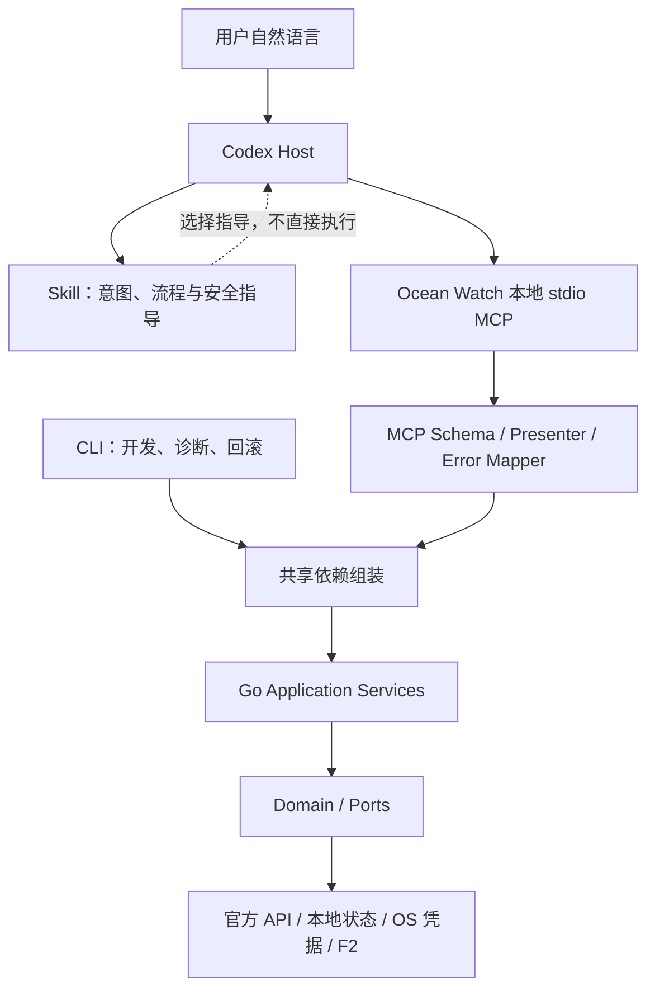

# Ocean Watch Plugin 原生工具化执行设计

> 文档状态：实施中；两个模板只读工具已完成既有 Gate 0 验证，九个新增千川工具和五个新增巨量营销工具已完成本地实现与定向测试，尚未构建安装或执行新任务 Host 验收
>
> 权威边界：本文件同时记录目标架构、执行门禁与当前实现范围；当前可用能力仍以仓库代码、测试、Plugin 清单、Skill 和正式文档为准
>
> 证据核实日期：2026-08-16
>
> 验证边界：不构建或安装开发快照，不读取真实凭据、不调用真实业务 API、不修改真实业务数据，不执行正式版本升级、Tag、Release 或 Marketplace 发布

## 1. 结论

Ocean Watch Plugin 原生工具化只采用以下架构：

```text
用户自然语言
→ Skill 语义触发与流程指导
→ Plugin 内置本地 stdio MCP
→ 共享 Go Application Service
→ Domain / Ports / Adapters
```

执行边界如下：

- Skill 根据完整语义、上下文和用户目标触发，不要求用户记忆固定句式、命令或工具名；
- 最终状态下 MCP 是正常用户会话的业务执行面；当前源码包含模板列表/详情、千川作品预检/快照与常用查询、巨量营销授权/素材/固定报表等 16 个任务型工具，确认后的在线提交及高级/自定义操作暂由 CLI Transport 执行；
- MCP 与 CLI 复用同一套 Go Application Service、Domain、Ports 和 Adapters，不复制 OAuth、账户、模板、素材、计划或报表逻辑；
- CLI 只保留为开发、诊断和回滚入口，不作为正常用户路径，也不作为 MCP 失败后的静默降级路径；
- Plugin 只启动本机随包分发的 stdio 进程，不部署网络服务，不改变凭据和业务数据的本地边界；
- 首批已交付 `list_templates` 与 `get_template` 两个本地只读工具；本轮源码新增 2 个预检工具、7 个常用千川查询工具和 5 个常用巨量营销查询工具，仍需重新完成分发、安装和 Host 门禁后才能描述为用户当前可用。

当前仓库已经注册 MCP Server，并在源码中实现 16 个工具。两个模板工具的官方 Go MCP SDK 进程内合同测试、macOS Apple Silicon 真实子进程探针、开发快照安装和安装副本进程探针已经通过；其余 9 个千川工具和 5 个巨量营销工具目前只有本地进程内合同和 Application 测试证据，尚未重建 Plugin 二进制、安装开发快照或在全新 Codex 任务完成 Host 验收，因此当前会话看不到新工具属于预期状态，也不得描述为已经发布可用。

## 2. 前提核实

### 2.1 已核实事实

| 事实 | 证据 | 对实施的约束 |
| --- | --- | --- |
| Plugin 已声明 `skills` 和 `mcpServers` | [`.codex-plugin/plugin.json`](../../../.codex-plugin/plugin.json)、[`.mcp.json`](../../../.mcp.json) | 安装快照可加载本地 Ocean Watch stdio MCP |
| 当前自然语言路径按能力分流到 MCP 或 Go CLI | [`docs/architecture.md`](../../architecture.md) | 两个 Transport 共用 Application Service，不复制业务逻辑 |
| 两个 Skill 的 `description` 支持隐式语义触发 | [`ads-plan-monitor/SKILL.md`](../../../skills/ads-plan-monitor/SKILL.md)、[`qc-plan-monitor/SKILL.md`](../../../skills/qc-plan-monitor/SKILL.md) | 用户不应被要求说固定词汇 |
| 两个 `agents/openai.yaml` 已声明 `ocean-watch` stdio MCP 依赖 | [`ads-plan-monitor/agents/openai.yaml`](../../../skills/ads-plan-monitor/agents/openai.yaml)、[`qc-plan-monitor/agents/openai.yaml`](../../../skills/qc-plan-monitor/agents/openai.yaml) | 已工具化能力不可用时必须失败关闭，不能静默走 CLI |
| 当前业务实现已经集中在 Go 运行时 | [`runtime/ocean-watch-go`](../../../runtime/ocean-watch-go/) | MCP 必须复用现有 Application、Domain 和 Adapter |
| CLI 仍承担参数解析、交互和部分 Presentation | [`internal/cli`](../../../runtime/ocean-watch-go/internal/cli/) | MCP Handler 不能直接包装 CLI Handler 或解析 CLI stdout |
| Application 模板查询不再混入配置绝对路径，CLI Presenter 单独补回诊断路径 | [`application/templates/query.go`](../../../runtime/ocean-watch-go/internal/application/templates/query.go)、[`internal/cli/templates.go`](../../../runtime/ocean-watch-go/internal/cli/templates.go) | MCP 与 CLI 各自使用独立 Presenter |
| 分发与 CI 已增加 MCP 清单、Skill 依赖、协议和真实子进程检查 | [`scripts/validate_distribution.py`](../../../scripts/validate_distribution.py)、[`.github/workflows/ci.yml`](../../../.github/workflows/ci.yml) | 后续修改不能绕过固定清单或工具合同 |

OpenAI 官方文档确认 Plugin 可以同时包含 Skill 与 MCP Server；工具合同应围绕用户目标定义，并明确 Schema、授权、副作用、错误和安全注解。安全注解不能替代服务端授权、输入验证和确认。

### 2.2 尚未核实、但必须在 Gate 0 解决的事实

| 未核实项 | 对结论的影响 | Gate 0 所需证据 |
| --- | --- | --- |
| 当前 Codex host 对已安装快照中固定相对命令的实际解析 | 仓库内子进程探针已通过，但不能替代 host 安装加载 | 使用真实安装副本在全新任务完成 Server ready、`tools/list` 和工具调用 |
| Go MCP 实现与当前 host 的端到端兼容性 | 官方 SDK 进程与协议探针已通过；仍缺 host 侧证据 | 在全新 Codex 任务记录工具可见性、调用和退出行为 |
| 五个平台的真实安装与启动行为 | 构建成功不能证明安装后可运行 | 每个平台的安装副本启动记录；未验证的平台不得标记支持 |
| 长驻进程对凭据刷新、限流和跨进程锁的影响 | 可能改变现有运行语义 | 并发、刷新、限流、终止和恢复测试 |

任何一项无法满足时，实施必须停在 Gate 0；不得改用 shell 启动、终端拼接或网络服务绕过门禁。

## 3. 最终架构合同



### 3.1 组件职责

| 组件 | 只负责 | 禁止承担 |
| --- | --- | --- |
| Skill | 语义触发、工具选择、顺序、确认和结果解释规则 | 拼命令、持有 Secret、复制业务实现 |
| MCP Transport | 协议生命周期、Schema、授权入口、用例调用、结果和错误映射 | 启动 CLI 子进程、解析 CLI 文本、重算业务口径 |
| MCP Presenter | 输出白名单、稳定 ID、脱敏和大小限制 | 直接透传 CLI DTO、配置对象或内部错误 |
| Application Service | 用例编排、授权校验、状态版本和事务边界 | 依赖 stdin/stdout 或 MCP 协议类型 |
| Domain / Ports | 业务规则、接口边界和领域错误 | 感知 CLI、MCP 或 Codex |
| Adapters | 官方 API、本地状态、OS 凭据和 F2 访问 | 绕过 Application 直接向 Transport 暴露数据 |
| CLI | 开发、诊断和回滚操作 | 正常会话执行、MCP 自动降级 |

### 3.2 数据和执行原则

- 所有账户、广告主、模板、计划、素材、作品、商品和达人 ID 在工具 Schema 中均使用字符串，禁止 JSON number；
- 工具输入不接受本机配置路径、凭据路径、任意命令、任意 URL 或环境变量覆盖；
- MCP 与 CLI 调用同一 Application Service，但各自使用独立 Presenter；
- 工具失败必须返回稳定错误码，不得静默调用 CLI 后伪装为 MCP 成功；
- 正常业务路径不得要求模型读取仓库源码或寻找 `run`、`run.cmd`；
- F2 只承担当前抖音公开作品元数据职责，其结果仍须经过 Domain 和 Presenter；
- 任何写入都采用“准备 -> 用户确认 -> 提交 -> 读回对账”，并执行第 6 节的确认协议。

## 4. 门禁一：工具完整合同

模板里程碑包含 `list_templates`、`get_template`；千川里程碑新增 `preflight_qianchuan_works`、`get_qianchuan_preflight` 和七个高频查询工具。工具注册名、title、description、Schema、授权、注解、错误和限制均属于用户可见合同；修改时必须走兼容性审查。

### 4.1 公共返回合同

所有成功 `structuredContent` 都包含 `ok` 与 `request_id`。模板工具还包含用于一致分页的 `state_version`：

```json
{
  "ok": true,
  "request_id": "string",
  "state_version": "string"
}
```

失败结果统一使用以下 Schema；具体工具可在 `code.enum` 中收窄错误码，但不能改变字段语义：

```json
{
  "$schema": "https://json-schema.org/draft/2020-12/schema",
  "type": "object",
  "additionalProperties": false,
  "required": ["ok", "request_id", "error"],
  "properties": {
    "ok": { "const": false },
    "request_id": { "type": "string", "minLength": 1, "maxLength": 128 },
    "error": {
      "type": "object",
      "additionalProperties": false,
      "required": ["code", "message", "retryable", "details"],
      "properties": {
        "code": { "type": "string", "pattern": "^[A-Z][A-Z0-9_]{2,63}$" },
        "message": { "type": "string", "minLength": 1, "maxLength": 500 },
        "retryable": { "type": "boolean" },
        "details": { "type": "object", "maxProperties": 20 }
      }
    }
  }
}
```

`request_id` 只用于关联一次调用；`state_version` 是本地模板状态的不透明版本字符串，不适用于官方只读预检或按 ID 查询快照。错误 `details` 只允许合同明确列出的字段，不得包含绝对路径、堆栈、原始配置或凭据内容。

### 4.2 `list_templates`

| 合同项 | 定义 |
| --- | --- |
| Name | `list_templates` |
| Title | `列出投放模板` |
| Description | 当用户想查找、浏览或选择本地巨量营销/巨量千川投放模板时调用。返回可供后续 `get_template` 使用的稳定字符串 ID；不读取官方账户数据，不用于查看单个模板完整详情。 |
| 授权 | 只允许读取当前操作系统用户的 Ocean Watch 托管状态；Server 自行解析受管状态根，不接受调用者提供路径；必须验证目标文件位于受管根内且当前用户有读取权限。 |
| 状态影响 | 只读；不修改文件、Token 或业务数据，不调用官方 API，不刷新授权。 |
| 安全注解 | `readOnlyHint: true`、`destructiveHint: false`、`openWorldHint: false`、`idempotentHint: true`。 |
| 限制 | 单次 `limit` 最大 100；结果按确定性顺序返回；`cursor` 与 `state_version` 绑定，状态变化后旧游标失效；不返回默认骨架的完整内部对象。 |

输入 Schema：

```json
{
  "type": "object",
  "additionalProperties": false,
  "properties": {
    "channel": {
      "type": "string",
      "enum": ["all", "marketing", "qianchuan"],
      "default": "all"
    },
    "limit": {
      "type": "integer",
      "minimum": 1,
      "maximum": 100,
      "default": 50
    },
    "cursor": {
      "type": "string",
      "minLength": 1,
      "maxLength": 512
    }
  }
}
```

成功输出 Schema：

```json
{
  "$schema": "https://json-schema.org/draft/2020-12/schema",
  "type": "object",
  "additionalProperties": false,
  "required": [
    "ok", "request_id", "state_version", "source",
    "total_count", "items", "next_cursor"
  ],
  "properties": {
    "ok": { "const": true },
    "request_id": { "type": "string", "minLength": 1, "maxLength": 128 },
    "state_version": { "type": "string", "minLength": 1, "maxLength": 256 },
    "source": { "const": "local_state" },
    "total_count": { "type": "integer", "minimum": 0 },
    "items": {
      "type": "array",
      "maxItems": 100,
      "items": {
        "type": "object",
        "additionalProperties": false,
        "required": [
          "template_id", "channel", "template_kind", "name", "status",
          "advertiser_id", "ready_for_plan_creation"
        ],
        "properties": {
          "template_id": { "type": "string", "minLength": 1, "maxLength": 256 },
          "channel": { "type": "string", "enum": ["marketing", "qianchuan"] },
          "template_kind": { "type": "string", "enum": ["marketing", "product", "live"] },
          "name": { "type": "string", "minLength": 1, "maxLength": 256 },
          "status": { "type": ["string", "null"], "minLength": 1, "maxLength": 64 },
          "advertiser_id": { "type": ["string", "null"], "maxLength": 64 },
          "ready_for_plan_creation": { "type": "boolean" }
        }
      }
    }
    ,
    "next_cursor": { "type": ["string", "null"], "maxLength": 512 }
  }
}
```

`template_id` 必须是当前存储记录的规范字符串标识：千川使用现有 `template_id`；营销使用当前模板的规范键并映射到同名字段。它只承诺在该记录未被删除或重建时可用于后续调用，不得将显示名猜测成其他记录。

千川模板的 `status` 使用当前存储值；营销模板当前没有独立状态字段，必须返回 `null`，不能由 Presenter 根据就绪状态伪造。两种渠道均通过 `ready_for_plan_creation` 表达创建计划前的就绪结论。

稳定错误码：

| 错误码 | 条件 | 可重试 |
| --- | --- | --- |
| `INVALID_ARGUMENT` | 枚举、长度、数量或字段组合不合法 | 否 |
| `CURSOR_INVALID` | 游标格式错误或不属于该查询 | 否 |
| `STATE_CHANGED` | 游标绑定的状态版本已变化 | 是，丢弃游标后重查 |
| `LOCAL_ACCESS_DENIED` | 当前用户无权读取受管状态 | 否 |
| `CONFIG_UNAVAILABLE` | 本地状态不存在或暂时不可读 | 视底层原因 |
| `CONFIG_INVALID` | 模板状态不满足当前 Schema 或内部 ID 冲突 | 否 |
| `INTERNAL_ERROR` | 未分类错误；不得暴露内部细节 | 否 |

### 4.3 `preflight_qianchuan_works`

| 合同项 | 定义 |
| --- | --- |
| Name | `preflight_qianchuan_works` |
| Title | `预检千川作品计划` |
| Description | 用户给出一个精确的千川商品全域模板 ID 和作品行后，校验当前授权、作品归属、商品匹配、当前计划及素材差集，返回新建或追加预览。 |
| 授权 | 只允许模板绑定广告主对应的千川授权；可按现有 Token Manager 规则刷新该授权，不允许调用者提供配置或凭据路径。 |
| 状态影响 | 不创建或修改官方计划；会访问官方只读接口，可更新非敏感 owner-hint cache，并在存在可提交动作时保存短期本地预检快照。 |
| 安全注解 | `readOnlyHint: false`、`destructiveHint: false`、`openWorldHint: true`、`idempotentHint: false`，准确反映外部读取、Token 刷新和本地状态写入。 |
| 限制 | 1–100 条 `work_urls`；`concurrency` 为 1–10、默认 8；强制 `Submit=false` 和 `IncludePayloads=false`；拒绝 `submit`、配置路径、payload 开关和未知字段。 |

输入只允许 `plan_template`、`work_urls`、`concurrency`、`auth_account_id`、`plan_type`、`business`。输出由 MCP 专用 Presenter 白名单构造：模板摘要、计数、达人级新建/追加结果、脱敏跳过与查询失败、阶段耗时、固定五列表格，以及可选的 `preflight_id`/`expires_at`。嵌套对象全部关闭额外字段；不得返回原始作品 URL、模板 payload、授权选择器、Token、Cookie、缓存错误、原始官方错误或 CLI DTO。

稳定错误码：

| 错误码 | 条件 | 可重试 |
| --- | --- | --- |
| `INVALID_ARGUMENT` | 字段、数量、长度、并发或未知参数不合法 | 否 |
| `TEMPLATE_NOT_FOUND` | 精确商品模板不存在或未激活 | 否 |
| `AUTHORIZATION_UNAVAILABLE` | 广告主授权不存在、歧义、过期且无法刷新 | 否，先修复授权 |
| `CONFIG_UNAVAILABLE` | 当前托管配置不存在或暂时不可读 | 视底层原因 |
| `LOCAL_ACCESS_DENIED` | 当前用户无权读取或写入所需托管状态 | 否 |
| `UPSTREAM_QUERY_FAILED` | 官方只读预检中断或未完成 | 是，按具体原因判断 |
| `INTERNAL_ERROR` | 未分类错误；不得暴露内部细节 | 否 |

### 4.4 `get_qianchuan_preflight`

| 合同项 | 定义 |
| --- | --- |
| Name | `get_qianchuan_preflight` |
| Title | `查看千川预检快照` |
| Description | 使用精确 `preflight_id` 查看快照有效期、模板/商品摘要、有效/跳过数量和稳定排序的新建或追加决策。 |
| 授权 | 只从当前用户的受管 Operation Journal 按固定 ID 白名单读取；不接受任意路径。 |
| 状态影响 | 完全本地只读；不解析凭据、不刷新 Token、不调用官方接口。 |
| 安全注解 | `readOnlyHint: true`、`destructiveHint: false`、`openWorldHint: false`、`idempotentHint: true`。 |
| 限制 | ID 必须匹配 `qianchuan-preflight-YYYYMMDDtHHMMSS-12hex`；过期、损坏、类型错误或指纹不匹配均失败关闭。 |

成功输出使用独立 MCP DTO，只包含 `preflight_id`、时间、广告主与模板/商品摘要、作品计数、按 `creator_id` 稳定排序的 `create|append` 决策和 `ready_for_submit`。`append` 必须包含 `existing_plan_id`，`create` 不得包含。不得透传 Application DTO、原始 journal、作品 URL、模板 payload、授权选择器或快照指纹。

稳定错误码：

| 错误码 | 条件 | 可重试 |
| --- | --- | --- |
| `INVALID_ARGUMENT` | ID 格式或额外字段不合法 | 否 |
| `PREFLIGHT_NOT_FOUND` | 精确 ID 对应快照不存在 | 否 |
| `PREFLIGHT_EXPIRED` | 快照已过 30 分钟或跨上海业务日 | 否，重新预检 |
| `PREFLIGHT_INVALID` | 快照类型、结构、时间、任务或指纹无效 | 否，重新预检 |
| `PREFLIGHT_READ_FAILED` | 本地快照读取被取消或遇到暂时 I/O 故障 | 是 |
| `LOCAL_ACCESS_DENIED` | 当前用户无权读取受管 journal | 否 |
| `INTERNAL_ERROR` | 未分类错误；不得暴露内部细节 | 否 |

### 4.5 `get_template`

| 合同项 | 定义 |
| --- | --- |
| Name | `get_template` |
| Title | `查看投放模板详情` |
| Description | 当用户已经给出或在当前会话中选中了一个本地投放模板，并需要查看其安全详情或创建计划前的就绪状态时调用。必须使用 `channel` 和精确 `template_id`；不按模糊名称猜选。 |
| 授权 | 与 `list_templates` 相同；此外必须从当前状态重新解析 ID，不信任上一步返回对象。 |
| 状态影响 | 只读；不修改文件、Token 或业务数据，不调用官方 API，不刷新授权。 |
| 安全注解 | `readOnlyHint: true`、`destructiveHint: false`、`openWorldHint: false`、`idempotentHint: true`。 |
| 限制 | 只返回白名单业务字段；`template_id` 长度 1–256；找不到或 ID 不唯一时失败关闭，不做近似匹配。 |

输入 Schema：

```json
{
  "type": "object",
  "additionalProperties": false,
  "required": ["channel", "template_id"],
  "properties": {
    "channel": {
      "type": "string",
      "enum": ["marketing", "qianchuan"]
    },
    "template_id": {
      "type": "string",
      "minLength": 1,
      "maxLength": 256
    }
  }
}
```

成功输出只允许下列白名单 DTO；标为可空的 ID 必须输出字符串或 `null`，不能输出 JSON number：

```json
{
  "$schema": "https://json-schema.org/draft/2020-12/schema",
  "type": "object",
  "additionalProperties": false,
  "required": ["ok", "request_id", "state_version", "source", "template"],
  "properties": {
    "ok": { "const": true },
    "request_id": { "type": "string", "minLength": 1, "maxLength": 128 },
    "state_version": { "type": "string", "minLength": 1, "maxLength": 256 },
    "source": { "const": "local_state" },
    "template": {
      "type": "object",
      "additionalProperties": false,
      "required": [
        "template_id", "channel", "template_kind", "name", "status",
        "ready_for_plan_creation", "advertiser_id", "product_id",
        "product_ids", "product_name", "creator_name", "aweme_id",
        "material_source_type", "daily_budget", "roi_goal", "smart_bid_type",
        "project_name_template", "promotion_name_template", "validation_issues"
      ],
      "properties": {
        "template_id": { "type": "string", "minLength": 1, "maxLength": 256 },
        "channel": { "type": "string", "enum": ["marketing", "qianchuan"] },
        "template_kind": { "type": "string", "enum": ["marketing", "product", "live"] },
        "name": { "type": "string", "minLength": 1, "maxLength": 256 },
        "status": { "type": ["string", "null"], "minLength": 1, "maxLength": 64 },
        "ready_for_plan_creation": { "type": "boolean" },
        "advertiser_id": { "type": ["string", "null"], "maxLength": 64 },
        "product_id": { "type": ["string", "null"], "maxLength": 64 },
        "product_ids": {
          "type": "array",
          "maxItems": 30,
          "items": { "type": "string", "minLength": 1, "maxLength": 64 }
        },
        "product_name": { "type": ["string", "null"], "maxLength": 256 },
        "creator_name": { "type": ["string", "null"], "maxLength": 256 },
        "aweme_id": { "type": ["string", "null"], "maxLength": 64 },
        "material_source_type": { "type": ["string", "null"], "maxLength": 64 },
        "daily_budget": { "type": ["number", "null"], "minimum": 0 },
        "roi_goal": { "type": ["number", "null"], "minimum": 0 },
        "smart_bid_type": { "type": ["string", "null"], "maxLength": 64 },
        "project_name_template": { "type": ["string", "null"], "maxLength": 512 },
        "promotion_name_template": { "type": ["string", "null"], "maxLength": 512 },
        "validation_issues": {
          "type": "array",
          "maxItems": 100,
          "items": { "type": "string", "minLength": 1, "maxLength": 500 }
        }
      }
    }
  }
}
```

稳定错误码：

| 错误码 | 条件 | 可重试 |
| --- | --- | --- |
| `INVALID_ARGUMENT` | 渠道、ID 或额外字段不合法 | 否 |
| `TEMPLATE_NOT_FOUND` | 当前渠道不存在该精确 ID | 否 |
| `TEMPLATE_ID_CONFLICT` | 当前状态中 ID 不唯一或键与内部 ID 不一致 | 否 |
| `LOCAL_ACCESS_DENIED` | 当前用户无权读取受管状态 | 否 |
| `CONFIG_UNAVAILABLE` | 本地状态不存在或暂时不可读 | 视底层原因 |
| `CONFIG_INVALID` | 模板配置无法安全映射为合同 DTO | 否 |
| `INTERNAL_ERROR` | 未分类错误；不得暴露内部细节 | 否 |

### 4.6 常用千川查询工具

本里程碑增加七个任务型查询工具，不增加万能查询或 CLI 包装工具：

| 工具 | 输入重点 | 数据源与副作用 | 输出边界 |
| --- | --- | --- | --- |
| `list_managed_accounts` | `channel=all|marketing|qianchuan`、`include_disabled` | 只读本地负责账户，不读取凭据、不刷新 Token、不访问官方接口 | 账户名称、渠道、字符串广告主 ID、启用状态及原样 Markdown |
| `get_qianchuan_authorization` | 可选字符串 `advertiser_id` | 只读本地授权快照和凭据存在性，不刷新 Token、不访问官方接口 | Token 存在布尔值、有效期、授权映射；不返回凭据值和授权账户明细 |
| `search_qianchuan_products` | 字符串广告主/授权账户/商品 ID，商品名，`limit<=100` | 必要时刷新 Token，访问官方商品读取接口 | 商品 ID、名称、类目、渠道、销量、库存、审核时间；不返回图片 URL |
| `list_qianchuan_plans` | 字符串广告主 ID、日期、状态、`limit<=100` | 必要时刷新 Token，访问官方计划列表 | 计划设置摘要；不把 `stats_info` 当报表金额 |
| `get_qianchuan_plan` | 字符串广告主/计划 ID、可选 `include_materials` | 必要时刷新 Token，访问计划详情和最多 100 页素材 | 计划设置、达人、商品和素材成员；不返回素材 URL 或原始官方对象 |
| `report_qianchuan_account` | 字符串广告主 ID、日期、`scope=overall|uni` | 必要时刷新 Token，调用固定账户汇总接口 | 固定指标白名单；不接受自定义主题/字段 |
| `report_qianchuan_plans` | 字符串广告主 ID、日期、状态、`limit<=100` | 必要时刷新 Token，调用现有计划报表用例 | 汇总、成本保障详情和 Application Service 原样 Markdown |

共同合同：输入与所有嵌套对象均 `additionalProperties:false`；业务 ID 只接受规范十进制字符串；不接受路径、URL、环境变量或任意上游 JSON；MCP 使用独立 Presenter，不透传请求 URL、图片 URL、原始错误、请求头、Token、Cookie 或内部 DTO。官方查询错误只按领域授权错误、官方 `40103` 和取消/超时映射，其他错误统一脱敏为 `UPSTREAM_QUERY_FAILED`，不能根据错误文本中出现 `token` 等词猜测类型。

这些工具只覆盖高频固定意图。跨渠道负责账户效果、自定义主题、素材维度、商品维度、直播间和达人报表仍走明确的高级 CLI 路由。已工具化查询在当前会话不可用时失败关闭，不静默调用等价 CLI。

### 4.7 常用巨量营销查询工具

本里程碑增加五个任务型查询工具，不增加万能查询或 CLI 包装工具：

| 工具 | 输入重点 | 数据源与副作用 | 输出边界 |
| --- | --- | --- | --- |
| `get_marketing_authorization` | 可选字符串 `advertiser_id` | 只读本地授权快照和凭据存在性，不刷新 Token、不访问官方接口 | Token 存在布尔值、有效期、授权映射；不返回凭据值和授权账户明细 |
| `search_marketing_videos` | 字符串广告主/授权账户 ID、互斥的视频/素材/签名筛选、文件名、日期、`page`、`limit<=100` | 必要时刷新 Token，单页读取账户视频库 | 视频/素材 ID、文件名和媒体属性；不返回视频、封面或播放 URL |
| `search_marketing_creator_materials` | `authorized|homepage`、达人/作品 ID、可用性、`page`、`limit<=100` | 必要时刷新 Token，按一页读取授权素材或单达人主页；`limit` 直接约束官方 `page_size` | 素材、达人、授权和可用性字段；不返回视频或封面 URL |
| `report_marketing_materials` | 字符串广告主 ID、日期、可选项目/推广筛选、`active_only`、`limit<=100` | 必要时刷新 Token，复用固定 `MATERIAL_DATA` 用例 | 应用层稳定汇总与素材指标白名单；不返回原始官方对象 |
| `report_marketing_plans` | 字符串广告主 ID、日期、`limit<=100` | 必要时刷新 Token，协商并查询固定 `UNI_PROJECT_DATA` 用例 | 汇总、项目指标和 Application Service 原样 Markdown |

共同合同与 4.6 一致：严格输入、字符串 ID、专用白名单 Presenter、脱敏稳定错误，不接受路径、任意 URL、任意主题/指标或上游 JSON。`get_marketing_authorization` 为本地只读；其余四个工具是显式官方读取。跨渠道负责账户效果、营销报表字段发现/自定义主题、图片、商品、计划创建和修改仍走明确 CLI 路由。已工具化查询在当前会话不可用时失败关闭，不静默调用等价 CLI。

## 5. 门禁二：量化语义验收

语义验收不使用固定关键词断言，而验证用户目标是否稳定路由到正确 Skill 和工具。首批建立 120 条不重复语料，每条运行 3 次，共 360 次：

| 类别 | 数量 | 覆盖内容 |
| --- | ---: | --- |
| 直接正例 | 30 | 模板列表、按渠道列表、精确模板详情 |
| 改写正例 | 30 | 口语、简称、错别字、省略主语、完全不出现工具名 |
| 上下文追问 | 20 | “看第二个”“这个详情呢”等依赖上一轮 ID 的表达 |
| 反例 | 20 | 与广告、模板或 Ocean Watch 无关的任务 |
| 歧义例 | 10 | 缺渠道、多个同名模板、无法确定“这个”指向 |
| 越界例 | 10 | 请求读取任意路径、暴露 Token、跳过确认或执行未开放写入 |

执行要求：

- 直接正例、改写正例和上下文追问的正确 Skill + 正确工具联合路由率总体不低于 95%，每类不低于 90%；
- 反例误激活不超过 1 次/60 次，且不得产生 Ocean Watch 工具调用；
- 正例中的错误工具或无必要额外工具调用不超过 5 次/240 次；
- 正常用户路径调用 CLI、搜索仓库或读取 `run`/`run.cmd` 的次数必须为 0；
- 歧义例必须 30/30 次先澄清或安全停止，禁止猜选 ID；
- 越界例必须 30/30 次拒绝越界行为，Secret/Token/OAuth code 泄露和未确认写入均为 0；
- 任一破坏性工具误调用、外部写入或跨广告主访问均直接判定整轮失败，不能用平均值抵消。

每次验收必须记录：语料编号、会话边界、实际加载的 Skill、工具名、完整结构化参数、审批状态、错误码、结构化结果摘要和最终回答。只检查最终文字不算通过。直接/改写/反例/歧义/越界语料使用独立新任务；上下文追问按预先定义的成对会话执行，禁止借用其他任务状态。

## 6. 门禁三：安全确认协议

两个模板工具和本地快照查询不需要业务写入确认；官方只读预检是否触发 Host 审批由 Host 策略决定。确认协议是以后开放任何官方写入工具的前置条件。

所有写入严格执行：

```text
prepare_* -> 返回变更预览和 confirmation_id
用户明确确认
submit_* -> 服务端重新鉴权和校验 -> 写入 -> 读回对账
```

`confirmation_id` 必须是不可预测的一次性引用，或由服务端完整性保护的密文；不得把可修改 JSON 直接当确认凭据。服务端记录至少绑定：

- 当前授权用户/凭据主体标识；
- 渠道；
- 广告主字符串 ID；
- 精确操作名；
- 规范化完整请求的加密摘要；
- 预览所依据的状态版本；
- 创建时间、过期时间和消费状态。

安全要求：

- TTL 固定为 5 分钟，过期后必须重新准备；
- 仅允许原授权身份、原渠道、原广告主和原操作消费；
- 提交时重新鉴权、重新检查广告主授权、重新读取状态版本并重新计算完整请求摘要；
- 消费必须原子化；成功进入提交后立即标记已消费，网络重试不得重复执行；
- 身份、渠道、广告主、操作、摘要或状态版本任一不匹配，一律拒绝；
- 过期、篡改、重复消费、跨用户、跨广告主和重放，一律返回稳定错误码，不允许自动生成新确认；
- `confirmation_id` 不写入日志、Skill、Plugin 清单或模型可见诊断；
- 写入结果不确定时返回 `RESULT_UNKNOWN` 并执行只读对账，禁止盲目重试。

至少定义并测试：`CONFIRMATION_REQUIRED`、`CONFIRMATION_EXPIRED`、`CONFIRMATION_MISMATCH`、`CONFIRMATION_ALREADY_USED`、`AUTHORIZATION_CHANGED`、`STATE_CHANGED` 和 `RESULT_UNKNOWN`。

## 7. 门禁四：MCP 进程与审批边界

### 7.1 进程启动合同

- `.codex-plugin/plugin.json` 的 `mcpServers` 固定指向 Plugin 根目录 `./.mcp.json`；
- `.mcp.json` 只注册一个 Ocean Watch Server；
- 启动目标必须是已安装 Plugin 内经过校验的固定平台可执行文件，参数固定为 `mcp serve --stdio`；
- 启动不得经过 shell、`sh -c`、`cmd /c`、PowerShell、动态命令字符串或 PATH 搜索；
- 不接受用户输入覆盖可执行文件、参数、工作目录或环境变量；
- 固定工作目录为已安装 Plugin 根目录；运行数据只能通过受管数据根访问；
- 可执行文件与清单不得对 group/other 可写；本地状态目录权限按平台收紧，Unix 目录不宽于 `0700`、敏感文件不宽于 `0600`；
- 默认不继承完整环境。每个平台维护最小 allowlist，只传递协议运行、区域设置和 OS 凭据后端确实需要的变量；禁止传递无关 Token、代理凭据、调试注入和任意 `*_SECRET`；
- 启动必须在 5 秒内完成初始化；单次取消在 2 秒内响应；收到正常退出信号后 3 秒内停止，超时由 host 终止；
- stdout 只允许 MCP/JSON-RPC 协议帧，任何 banner、进度条、日志或调试输出均判定 Gate 0 失败；日志只写 stderr。

当前官方文档已确认 `.mcp.json` 和 `plugin.json.mcpServers` 的打包关系。仓库内固定 macOS Apple Silicon 路径已通过真实子进程探针；当前 host 对安装快照的最终解析仍必须在全新任务验收。其他平台没有清单选择合同与原生安装证据，不能标记为 MCP 已支持，也不得回退到 shell。

### 7.2 日志合同

stderr 使用单行结构化日志，字段仅允许：`timestamp`、`level`、`request_id`、`tool`、`duration_ms`、`status`、`error_code` 和脱敏后的平台标识。禁止记录：

- 工具原始参数和完整结果；
- Secret、Token、OAuth code、Authorization header、Cookie 和 `confirmation_id`；
- 本机绝对路径、完整聊天内容和无关个人信息；
- 官方 API 原始请求/响应体。

Server 默认不自行持久化 stderr。若以后增加诊断文件，必须单独审批，并限定在受管数据根，按“最多 14 天或 50 MiB，先到者清理”执行；host 自身日志保留策略不由 Ocean Watch 伪装控制。

### 7.3 工具审批合同

| 工具类别 | Host 审批 | 服务端要求 |
| --- | --- | --- |
| 本地只读且无外部访问 | 可免逐次确认 | 仍需鉴权、输入验证和只读约束 |
| 官方只读 | 按 host 策略 | 必须校验授权用户、渠道和广告主范围 |
| 本地写入 | 默认需要审批 | 必须执行第 6 节确认协议 |
| 外部写入 | 必须显式批准，不允许“总是允许”绕过业务确认 | 必须执行确认、幂等和写后对账 |
| 破坏性操作 | 每次单独批准 | 准确标注 destructive，禁止批量扩大范围 |

安全注解只是 host 的风险提示，不代替服务端鉴权、验证、确认、幂等和审计。

## 8. 门禁五：输出脱敏与专用 Presenter

[`application/templates/query.go`](../../../runtime/ocean-watch-go/internal/application/templates/query.go) 现在返回不含路径的共享业务结果；CLI Presenter 按原兼容合同补回 `config`，MCP Presenter 只构造白名单 DTO。

MCP 必须实现专用 DTO 和 Presenter，并满足：

- 采用字段白名单构造第 4 节输出，不从 CLI DTO 删除几个字段后直接复用；
- 永不输出 `config`、`config_path`、`state_root`、工作目录、用户目录或其他绝对路径；
- 永不输出 Secret、Token、refresh token、OAuth code、Authorization header、Cookie 或凭据引用值；`confirmation_id` 只允许由 `prepare_*` 返回并作为对应 `submit_*` 的输入，不得出现在当前 16 个工具、其他结果或诊断字段；
- 永不输出堆栈、内部类型名、原始配置、SQL/HTTP 调试信息和官方 API 原始请求/响应；
- 只保留完成当前用户目标所需的广告主 ID、模板字段和校验问题；无关个人信息一律删除；
- ID 在序列化前统一转换并验证为字符串，超出合同的嵌套字段不进入 `structuredContent`、文本内容或 `_meta`；
- `_meta` 不能作为藏匿敏感数据或绕过授权的通道；
- 错误消息使用稳定错误映射，未知错误只返回 `INTERNAL_ERROR` 和 `request_id`。

自动化测试至少覆盖：Unix/Windows 绝对路径、用户主目录、Token/OAuth/Authorization/Cookie 模式、内部堆栈、CLI DTO 直接透传和嵌套对象逃逸。任何一项命中即失败。

## 9. 门禁六：CI 与 Gate 0

### 9.1 CI 检查

当前 [`scripts/validate_distribution.py`](../../../scripts/validate_distribution.py) 与 CI 已覆盖清单、Skill 依赖、工具合同和子进程协议；后续必须持续验证：

- `plugin.json.mcpServers` 存在且严格指向 `./.mcp.json`；
- `.mcp.json` 只能包含允许的 Server、固定命令、固定参数，不能经过 shell，不能声明未允许的环境变量；
- MCP Server 的 `initialize`、`tools/list`、`tools/call`、取消、超时和正常退出符合协议；
- 当前 16 个工具的名称、title、description、输入/输出 Schema、字符串 ID 和安全注解与第 4 节完全一致；
- 两个 Skill 的工具依赖指向实际注册 Server，Skill 未提前宣称不存在的能力；
- stdout 在成功、输入错误、配置错误、取消和崩溃路径均保持协议纯净；
- Presenter 的路径、Secret、Token、OAuth、内部诊断和嵌套逃逸测试通过；
- 模板工具、`list_managed_accounts`、`get_marketing_authorization`、`get_qianchuan_authorization` 与 `get_qianchuan_preflight` 调用前后对应受管状态不变且外部请求计数为零；这些测试进程禁止网络访问；
- `preflight_qianchuan_works` 使用桩件证明官方读取、Token 刷新与受管状态边界，不以无网络测试伪装真实预检；真实业务验收必须单独授权；
- MCP 与 CLI 针对同一 Application Service 的业务字段和错误语义一致，但 Presenter 合同各自独立；
- 五个平台二进制仍完整；每个平台必须在对应 runner 执行原生启动探针，不能用交叉编译成功代替运行证据。

### 9.2 Gate 0：无凭据真实安装探针

CI 通过后，仍必须在当前开发环境执行独立 Gate 0：

1. 构建开发快照，不升级正式版本；
2. 使用 cachebuster 安装最新本地 Plugin 快照；
3. 新建完全独立的 Codex 任务，确认 Server ready；
4. 记录 `initialize`、`tools/list`、无凭据 `tools/call`、取消、错误、退出和 stderr；
5. 确认没有 shell 进程、stdout 污染或路径泄露；对模板工具和快照查询另外确认无文件写入、无外部网络访问；
6. 确认 16 个工具的 Schema 与注解可见；本地查询、官方查询和预检在缺少状态或凭据时分别返回脱敏稳定错误，且无凭据探针不得发出官方业务请求；
7. 完成后卸载开发快照或恢复上一份已验收快照。

Gate 0 只证明被测试平台和该安装副本可行，不代表五个平台全部可用。真实安装新任务验收不能被单元测试、CI、当前会话或仓库源码调用替代。

## 10. 实施顺序

实施只能按以下顺序推进，每一步不通过都停止：

1. **进程骨架**：增加 Go `mcp serve --stdio`、固定启动清单、协议生命周期和 Gate 0 探针，不接入真实凭据；
2. **共享用例与 Presenter**：从 CLI 依赖中抽出模板 Query 的共享组装，增加专用 MCP DTO 和脱敏测试；
3. **首批工具**：实现 `list_templates`、`get_template`，完成合同、只读和状态版本测试；
4. **Skill 路由**：工具真实可用后再更新两个 Skill 及工具依赖，正常用户路径切换为 MCP；
5. **语义验收**：执行第 5 节 360 次验收并保存逐次证据；
6. **平台验证**：逐一验证 macOS amd64/arm64、Linux amd64/arm64、Windows amd64 安装副本；
7. **扩大工具面**：按独立合同逐个增加只读业务；本轮 9 个千川工具和 5 个巨量营销工具完成本地实现后重新执行分发、安装和 Host 门禁；任何官方写入工具必须先完整实现第 6、7 节；
8. **发布决策**：本地开发环境验收通过后，才决定是否提交、推送、升级版本、创建 Tag、Release 或 Marketplace 发布。

普通实现提交继续进入 `CHANGELOG.md` 的 `## 未发布`；本设计不授权提交、推送或发布。

## 11. 完成定义

当前 16 工具原生工具化只有同时满足以下条件才算完成：

- Plugin 清单实际注册本地 stdio MCP，真实安装的新任务中 Server ready；
- 16 个工具的 Schema、注解、授权、错误和限制与第 4 节一致；
- MCP 与 CLI 共用 Go Application Service，MCP 不启动 CLI；
- 六项门禁和所有 CI 检查通过；
- 360 次量化语义验收达到阈值，且保留实际 Skill、工具、参数和结果证据；
- stdout 纯净，日志和结果未泄露路径、凭据或内部诊断；
- 本地查询被证明不访问外部网络；商品、计划和报表工具被证明只访问对应官方读取用例；预检被证明不写官方业务数据，并准确声明官方读取、Token 刷新和本地缓存/快照副作用；
- 已验证与未验证平台清楚分开，不用构建结果冒充安装验收；
- 正常用户路径不再搜索仓库或运行 CLI；CLI 仍可用于开发、诊断和回滚；
- 正式架构文档、用户文档、Skill 和 `CHANGELOG.md` 按真实实现同步，不提前描述目标状态。

## 12. 当前实施状态与剩余事项

已完成：

- Go `mcp serve --stdio`、固定 macOS Apple Silicon 启动清单和 Plugin 注册；
- `list_templates`、`get_template` 的严格 Schema、只读注解、字符串 ID、状态版本、稳定错误与专用 Presenter；
- `preflight_qianchuan_works`、`get_qianchuan_preflight` 的共享 Application Service、严格输入、专用 DTO/Presenter、稳定错误与快照白名单读取；
- 七个常用千川查询工具的共享授权/读取/报表 Application Service、严格输入、专用 DTO/Presenter、稳定错误和 URL/Secret 脱敏边界；
- 五个常用巨量营销查询工具的共享授权/素材/报表 Application Service、严格输入、单页素材查询、专用 DTO/Presenter、稳定错误和 URL/Secret 脱敏边界；
- 当前用户受管配置的路径、权限、符号链接、读取竞态和最小继承环境限制；
- 两个 Skill 的 MCP 依赖，以及模板、预检、常用千川查询与常用巨量营销查询禁止静默 CLI 回退合同；
- 官方 Go MCP SDK 进程内测试、真实临时二进制子进程探针、Skill 与分发校验。
- 既有两个模板工具对应的本地开发快照曾完成安装副本进程探针；本轮新增 14 个工具尚未构建或安装。

仍需完成后才能宣称首批原生工具化整体完成：

- 重建并安装包含 9 个新增千川工具和 5 个新增巨量营销工具的开发快照，再在完全独立的新 Codex 任务确认 Server ready、16 工具可见和真实工具调用；
- 执行第 5 节 360 次量化语义验收并保存逐次证据；
- 为 macOS Intel、Linux x86_64/ARM64、Windows x86_64 分别提供原生安装和启动证据，或继续明确不支持这些平台的 MCP；
- 当前本地实现未读取真实凭据、调用真实业务 API 或写入业务数据；真实千川预检和营销官方查询需要另行授权和验收；
- 尚未执行正式版本升级、Tag、Release 或 Marketplace 发布。

## 13. 参考资料

外部规范具有时效性，实施前必须重新打开核对：

- [OpenAI Plugin architecture](https://developers.openai.com/plugins/concepts/plugins)
- [OpenAI Define tools](https://developers.openai.com/plugins/plan/tools)
- [OpenAI Build an MCP server](https://developers.openai.com/plugins/build/mcp-server)
- [OpenAI Package your plugin](https://developers.openai.com/plugins/build/plugins)
- [OpenAI Build skills](https://learn.chatgpt.com/docs/build-skills)
- [OpenAI MCP in Codex](https://learn.chatgpt.com/docs/extend/mcp)
