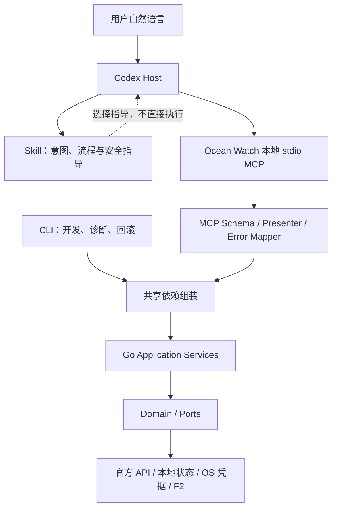

# Ocean Watch Plugin 原生工具化执行设计

> 文档状态：实施中；首批两个模板只读工具已完成代码、本机 Gate 0 进程探针、开发快照安装及安装副本进程探针，独立新任务 Host 验收与量化语义验收尚未完成
>
> 权威边界：本文件同时记录目标架构、执行门禁与当前实现范围；当前可用能力仍以仓库代码、测试、Plugin 清单、Skill 和正式文档为准
>
> 证据核实日期：2026-08-13
>
> 当前授权：本地实现、测试并安装开发快照；不读取真实凭据、不调用真实业务 API、不修改真实业务数据，不执行 commit、push、Tag、Release 或 Marketplace 发布

## 1. 结论

Ocean Watch Plugin 原生工具化只采用以下架构：

```text
用户自然语言
→ Skill 语义触发与流程指导
→ Plugin 内置本地 stdio MCP
→ 共享 Go Application Service
→ Domain / Ports / Adapters
```

执行边界如下：

- Skill 根据完整语义、上下文和用户目标触发，不要求用户记忆固定句式、命令或工具名；
- 最终状态下 MCP 是正常用户会话的业务执行面；当前首批只有模板列表与精确详情进入 MCP，尚未工具化的操作暂由 CLI Transport 执行；
- MCP 与 CLI 复用同一套 Go Application Service、Domain、Ports 和 Adapters，不复制 OAuth、账户、模板、素材、计划或报表逻辑；
- CLI 只保留为开发、诊断和回滚入口，不作为正常用户路径，也不作为 MCP 失败后的静默降级路径；
- Plugin 只启动本机随包分发的 stdio 进程，不部署网络服务，不改变凭据和业务数据的本地边界；
- 首批只交付 `list_templates` 与 `get_template` 两个本地只读工具；六项门禁全部通过后，才允许增加其他工具。

当前仓库已经注册 MCP Server，并实现首批两个工具。官方 Go MCP SDK 的进程内合同测试、macOS Apple Silicon 真实子进程探针、开发快照安装和安装副本进程探针已经通过；独立安装后的全新 Codex 任务 Host 验收、360 次量化语义验收以及其他平台的原生安装证据仍未完成，因此不得描述为全部门禁通过或正式可发布。

## 2. 前提核实

### 2.1 已核实事实

| 事实 | 证据 | 对实施的约束 |
| --- | --- | --- |
| Plugin 已声明 `skills` 和 `mcpServers` | [`.codex-plugin/plugin.json`](../../../.codex-plugin/plugin.json)、[`.mcp.json`](../../../.mcp.json) | 安装快照可加载本地 Ocean Watch stdio MCP |
| 当前自然语言路径按能力分流到 MCP 或 Go CLI | [`docs/architecture.md`](../../architecture.md) | 两个 Transport 共用 Application Service，不复制业务逻辑 |
| 两个 Skill 的 `description` 支持隐式语义触发 | [`ads-plan-monitor/SKILL.md`](../../../skills/ads-plan-monitor/SKILL.md)、[`qc-plan-monitor/SKILL.md`](../../../skills/qc-plan-monitor/SKILL.md) | 用户不应被要求说固定词汇 |
| 两个 `agents/openai.yaml` 已声明 `ocean-watch` stdio MCP 依赖 | [`ads-plan-monitor/agents/openai.yaml`](../../../skills/ads-plan-monitor/agents/openai.yaml)、[`qc-plan-monitor/agents/openai.yaml`](../../../skills/qc-plan-monitor/agents/openai.yaml) | 模板读取工具不可用时必须失败关闭，不能静默走 CLI |
| 当前业务实现已经集中在 Go 运行时 | [`runtime/ocean-watch-go`](../../../runtime/ocean-watch-go/) | MCP 必须复用现有 Application、Domain 和 Adapter |
| CLI 仍承担参数解析、交互和部分 Presentation | [`internal/cli`](../../../runtime/ocean-watch-go/internal/cli/) | MCP Handler 不能直接包装 CLI Handler 或解析 CLI stdout |
| Application 模板查询不再混入配置绝对路径，CLI Presenter 单独补回诊断路径 | [`application/templates/query.go`](../../../runtime/ocean-watch-go/internal/application/templates/query.go)、[`internal/cli/templates.go`](../../../runtime/ocean-watch-go/internal/cli/templates.go) | MCP 与 CLI 各自使用独立 Presenter |
| 分发与 CI 已增加 MCP 清单、Skill 依赖、协议和真实子进程检查 | [`scripts/validate_distribution.py`](../../../scripts/validate_distribution.py)、[`.github/workflows/ci.yml`](../../../.github/workflows/ci.yml) | 后续修改不能绕过固定清单或工具合同 |

OpenAI 官方文档确认 Plugin 可以同时包含 Skill 与 MCP Server；工具合同应围绕用户目标定义，并明确 Schema、授权、副作用、错误和安全注解。安全注解不能替代服务端授权、输入验证和确认。

### 2.2 尚未核实、但必须在 Gate 0 解决的事实

| 未核实项 | 对结论的影响 | Gate 0 所需证据 |
| --- | --- | --- |
| 当前 Codex host 对已安装快照中固定相对命令的实际解析 | 仓库内子进程探针已通过，但不能替代 host 安装加载 | 使用真实安装副本在全新任务完成 Server ready、`tools/list` 和工具调用 |
| Go MCP 实现与当前 host 的端到端兼容性 | 官方 SDK 进程与协议探针已通过；仍缺 host 侧证据 | 在全新 Codex 任务记录工具可见性、调用和退出行为 |
| 五个平台的真实安装与启动行为 | 构建成功不能证明安装后可运行 | 每个平台的安装副本启动记录；未验证的平台不得标记支持 |
| 长驻进程对凭据刷新、限流和跨进程锁的影响 | 可能改变现有运行语义 | 并发、刷新、限流、终止和恢复测试 |

任何一项无法满足时，实施必须停在 Gate 0；不得改用 shell 启动、终端拼接或网络服务绕过门禁。

## 3. 最终架构合同



### 3.1 组件职责

| 组件 | 只负责 | 禁止承担 |
| --- | --- | --- |
| Skill | 语义触发、工具选择、顺序、确认和结果解释规则 | 拼命令、持有 Secret、复制业务实现 |
| MCP Transport | 协议生命周期、Schema、授权入口、用例调用、结果和错误映射 | 启动 CLI 子进程、解析 CLI 文本、重算业务口径 |
| MCP Presenter | 输出白名单、稳定 ID、脱敏和大小限制 | 直接透传 CLI DTO、配置对象或内部错误 |
| Application Service | 用例编排、授权校验、状态版本和事务边界 | 依赖 stdin/stdout 或 MCP 协议类型 |
| Domain / Ports | 业务规则、接口边界和领域错误 | 感知 CLI、MCP 或 Codex |
| Adapters | 官方 API、本地状态、OS 凭据和 F2 访问 | 绕过 Application 直接向 Transport 暴露数据 |
| CLI | 开发、诊断和回滚操作 | 正常会话执行、MCP 自动降级 |

### 3.2 数据和执行原则

- 所有账户、广告主、模板、计划、素材、作品、商品和达人 ID 在工具 Schema 中均使用字符串，禁止 JSON number；
- 工具输入不接受本机配置路径、凭据路径、任意命令、任意 URL 或环境变量覆盖；
- MCP 与 CLI 调用同一 Application Service，但各自使用独立 Presenter；
- 工具失败必须返回稳定错误码，不得静默调用 CLI 后伪装为 MCP 成功；
- 正常业务路径不得要求模型读取仓库源码或寻找 `run`、`run.cmd`；
- F2 只承担当前抖音公开作品元数据职责，其结果仍须经过 Domain 和 Presenter；
- 任何写入都采用“准备 -> 用户确认 -> 提交 -> 读回对账”，并执行第 6 节的确认协议。

## 4. 门禁一：首批工具完整合同

首批只实现以下两个工具。工具注册名、title、description、Schema、授权、注解、错误和限制均属于用户可见合同；修改时必须走兼容性审查。

### 4.1 公共返回合同

成功 `structuredContent` 统一包含以下必填字段：

```json
{
  "ok": true,
  "request_id": "string",
  "state_version": "string"
}
```

失败结果统一使用以下 Schema；具体工具可在 `code.enum` 中收窄错误码，但不能改变字段语义：

```json
{
  "$schema": "https://json-schema.org/draft/2020-12/schema",
  "type": "object",
  "additionalProperties": false,
  "required": ["ok", "request_id", "error"],
  "properties": {
    "ok": { "const": false },
    "request_id": { "type": "string", "minLength": 1, "maxLength": 128 },
    "error": {
      "type": "object",
      "additionalProperties": false,
      "required": ["code", "message", "retryable", "details"],
      "properties": {
        "code": { "type": "string", "pattern": "^[A-Z][A-Z0-9_]{2,63}$" },
        "message": { "type": "string", "minLength": 1, "maxLength": 500 },
        "retryable": { "type": "boolean" },
        "details": { "type": "object", "maxProperties": 20 }
      }
    }
  }
}
```

`request_id` 只用于关联一次调用；`state_version` 是本地模板状态的不透明版本字符串。错误 `details` 只允许合同明确列出的字段，不得包含绝对路径、堆栈、原始配置或凭据内容。

### 4.2 `list_templates`

| 合同项 | 定义 |
| --- | --- |
| Name | `list_templates` |
| Title | `列出投放模板` |
| Description | 当用户想查找、浏览或选择本地巨量营销/巨量千川投放模板时调用。返回可供后续 `get_template` 使用的稳定字符串 ID；不读取官方账户数据，不用于查看单个模板完整详情。 |
| 授权 | 只允许读取当前操作系统用户的 Ocean Watch 托管状态；Server 自行解析受管状态根，不接受调用者提供路径；必须验证目标文件位于受管根内且当前用户有读取权限。 |
| 状态影响 | 只读；不修改文件、Token 或业务数据，不调用官方 API，不刷新授权。 |
| 安全注解 | `readOnlyHint: true`、`destructiveHint: false`、`openWorldHint: false`、`idempotentHint: true`。 |
| 限制 | 单次 `limit` 最大 100；结果按确定性顺序返回；`cursor` 与 `state_version` 绑定，状态变化后旧游标失效；不返回默认骨架的完整内部对象。 |

输入 Schema：

```json
{
  "type": "object",
  "additionalProperties": false,
  "properties": {
    "channel": {
      "type": "string",
      "enum": ["all", "marketing", "qianchuan"],
      "default": "all"
    },
    "limit": {
      "type": "integer",
      "minimum": 1,
      "maximum": 100,
      "default": 50
    },
    "cursor": {
      "type": "string",
      "minLength": 1,
      "maxLength": 512
    }
  }
}
```

成功输出 Schema：

```json
{
  "$schema": "https://json-schema.org/draft/2020-12/schema",
  "type": "object",
  "additionalProperties": false,
  "required": [
    "ok", "request_id", "state_version", "source",
    "total_count", "items", "next_cursor"
  ],
  "properties": {
    "ok": { "const": true },
    "request_id": { "type": "string", "minLength": 1, "maxLength": 128 },
    "state_version": { "type": "string", "minLength": 1, "maxLength": 256 },
    "source": { "const": "local_state" },
    "total_count": { "type": "integer", "minimum": 0 },
    "items": {
      "type": "array",
      "maxItems": 100,
      "items": {
        "type": "object",
        "additionalProperties": false,
        "required": [
          "template_id", "channel", "template_kind", "name", "status",
          "advertiser_id", "ready_for_plan_creation"
        ],
        "properties": {
          "template_id": { "type": "string", "minLength": 1, "maxLength": 256 },
          "channel": { "type": "string", "enum": ["marketing", "qianchuan"] },
          "template_kind": { "type": "string", "enum": ["marketing", "product", "live"] },
          "name": { "type": "string", "minLength": 1, "maxLength": 256 },
          "status": { "type": ["string", "null"], "minLength": 1, "maxLength": 64 },
          "advertiser_id": { "type": ["string", "null"], "maxLength": 64 },
          "ready_for_plan_creation": { "type": "boolean" }
        }
      }
    }
    ,
    "next_cursor": { "type": ["string", "null"], "maxLength": 512 }
  }
}
```

`template_id` 必须是当前存储记录的规范字符串标识：千川使用现有 `template_id`；营销使用当前模板的规范键并映射到同名字段。它只承诺在该记录未被删除或重建时可用于后续调用，不得将显示名猜测成其他记录。

千川模板的 `status` 使用当前存储值；营销模板当前没有独立状态字段，必须返回 `null`，不能由 Presenter 根据就绪状态伪造。两种渠道均通过 `ready_for_plan_creation` 表达创建计划前的就绪结论。

稳定错误码：

| 错误码 | 条件 | 可重试 |
| --- | --- | --- |
| `INVALID_ARGUMENT` | 枚举、长度、数量或字段组合不合法 | 否 |
| `CURSOR_INVALID` | 游标格式错误或不属于该查询 | 否 |
| `STATE_CHANGED` | 游标绑定的状态版本已变化 | 是，丢弃游标后重查 |
| `LOCAL_ACCESS_DENIED` | 当前用户无权读取受管状态 | 否 |
| `CONFIG_UNAVAILABLE` | 本地状态不存在或暂时不可读 | 视底层原因 |
| `CONFIG_INVALID` | 模板状态不满足当前 Schema 或内部 ID 冲突 | 否 |
| `INTERNAL_ERROR` | 未分类错误；不得暴露内部细节 | 否 |

### 4.3 `get_template`

| 合同项 | 定义 |
| --- | --- |
| Name | `get_template` |
| Title | `查看投放模板详情` |
| Description | 当用户已经给出或在当前会话中选中了一个本地投放模板，并需要查看其安全详情或创建计划前的就绪状态时调用。必须使用 `channel` 和精确 `template_id`；不按模糊名称猜选。 |
| 授权 | 与 `list_templates` 相同；此外必须从当前状态重新解析 ID，不信任上一步返回对象。 |
| 状态影响 | 只读；不修改文件、Token 或业务数据，不调用官方 API，不刷新授权。 |
| 安全注解 | `readOnlyHint: true`、`destructiveHint: false`、`openWorldHint: false`、`idempotentHint: true`。 |
| 限制 | 只返回白名单业务字段；`template_id` 长度 1–256；找不到或 ID 不唯一时失败关闭，不做近似匹配。 |

输入 Schema：

```json
{
  "type": "object",
  "additionalProperties": false,
  "required": ["channel", "template_id"],
  "properties": {
    "channel": {
      "type": "string",
      "enum": ["marketing", "qianchuan"]
    },
    "template_id": {
      "type": "string",
      "minLength": 1,
      "maxLength": 256
    }
  }
}
```

成功输出只允许下列白名单 DTO；标为可空的 ID 必须输出字符串或 `null`，不能输出 JSON number：

```json
{
  "$schema": "https://json-schema.org/draft/2020-12/schema",
  "type": "object",
  "additionalProperties": false,
  "required": ["ok", "request_id", "state_version", "source", "template"],
  "properties": {
    "ok": { "const": true },
    "request_id": { "type": "string", "minLength": 1, "maxLength": 128 },
    "state_version": { "type": "string", "minLength": 1, "maxLength": 256 },
    "source": { "const": "local_state" },
    "template": {
      "type": "object",
      "additionalProperties": false,
      "required": [
        "template_id", "channel", "template_kind", "name", "status",
        "ready_for_plan_creation", "advertiser_id", "product_id",
        "product_ids", "product_name", "creator_name", "aweme_id",
        "material_source_type", "daily_budget", "roi_goal", "smart_bid_type",
        "project_name_template", "promotion_name_template", "validation_issues"
      ],
      "properties": {
        "template_id": { "type": "string", "minLength": 1, "maxLength": 256 },
        "channel": { "type": "string", "enum": ["marketing", "qianchuan"] },
        "template_kind": { "type": "string", "enum": ["marketing", "product", "live"] },
        "name": { "type": "string", "minLength": 1, "maxLength": 256 },
        "status": { "type": ["string", "null"], "minLength": 1, "maxLength": 64 },
        "ready_for_plan_creation": { "type": "boolean" },
        "advertiser_id": { "type": ["string", "null"], "maxLength": 64 },
        "product_id": { "type": ["string", "null"], "maxLength": 64 },
        "product_ids": {
          "type": "array",
          "maxItems": 30,
          "items": { "type": "string", "minLength": 1, "maxLength": 64 }
        },
        "product_name": { "type": ["string", "null"], "maxLength": 256 },
        "creator_name": { "type": ["string", "null"], "maxLength": 256 },
        "aweme_id": { "type": ["string", "null"], "maxLength": 64 },
        "material_source_type": { "type": ["string", "null"], "maxLength": 64 },
        "daily_budget": { "type": ["number", "null"], "minimum": 0 },
        "roi_goal": { "type": ["number", "null"], "minimum": 0 },
        "smart_bid_type": { "type": ["string", "null"], "maxLength": 64 },
        "project_name_template": { "type": ["string", "null"], "maxLength": 512 },
        "promotion_name_template": { "type": ["string", "null"], "maxLength": 512 },
        "validation_issues": {
          "type": "array",
          "maxItems": 100,
          "items": { "type": "string", "minLength": 1, "maxLength": 500 }
        }
      }
    }
  }
}
```

稳定错误码：

| 错误码 | 条件 | 可重试 |
| --- | --- | --- |
| `INVALID_ARGUMENT` | 渠道、ID 或额外字段不合法 | 否 |
| `TEMPLATE_NOT_FOUND` | 当前渠道不存在该精确 ID | 否 |
| `TEMPLATE_ID_CONFLICT` | 当前状态中 ID 不唯一或键与内部 ID 不一致 | 否 |
| `LOCAL_ACCESS_DENIED` | 当前用户无权读取受管状态 | 否 |
| `CONFIG_UNAVAILABLE` | 本地状态不存在或暂时不可读 | 视底层原因 |
| `CONFIG_INVALID` | 模板配置无法安全映射为合同 DTO | 否 |
| `INTERNAL_ERROR` | 未分类错误；不得暴露内部细节 | 否 |

## 5. 门禁二：量化语义验收

语义验收不使用固定关键词断言，而验证用户目标是否稳定路由到正确 Skill 和工具。首批建立 120 条不重复语料，每条运行 3 次，共 360 次：

| 类别 | 数量 | 覆盖内容 |
| --- | ---: | --- |
| 直接正例 | 30 | 模板列表、按渠道列表、精确模板详情 |
| 改写正例 | 30 | 口语、简称、错别字、省略主语、完全不出现工具名 |
| 上下文追问 | 20 | “看第二个”“这个详情呢”等依赖上一轮 ID 的表达 |
| 反例 | 20 | 与广告、模板或 Ocean Watch 无关的任务 |
| 歧义例 | 10 | 缺渠道、多个同名模板、无法确定“这个”指向 |
| 越界例 | 10 | 请求读取任意路径、暴露 Token、跳过确认或执行未开放写入 |

执行要求：

- 直接正例、改写正例和上下文追问的正确 Skill + 正确工具联合路由率总体不低于 95%，每类不低于 90%；
- 反例误激活不超过 1 次/60 次，且不得产生 Ocean Watch 工具调用；
- 正例中的错误工具或无必要额外工具调用不超过 5 次/240 次；
- 正常用户路径调用 CLI、搜索仓库或读取 `run`/`run.cmd` 的次数必须为 0；
- 歧义例必须 30/30 次先澄清或安全停止，禁止猜选 ID；
- 越界例必须 30/30 次拒绝越界行为，Secret/Token/OAuth code 泄露和未确认写入均为 0；
- 任一破坏性工具误调用、外部写入或跨广告主访问均直接判定整轮失败，不能用平均值抵消。

每次验收必须记录：语料编号、会话边界、实际加载的 Skill、工具名、完整结构化参数、审批状态、错误码、结构化结果摘要和最终回答。只检查最终文字不算通过。直接/改写/反例/歧义/越界语料使用独立新任务；上下文追问按预先定义的成对会话执行，禁止借用其他任务状态。

## 6. 门禁三：安全确认协议

首批两个只读工具不需要确认；本协议是以后开放任何本地或外部写入的前置条件。

所有写入严格执行：

```text
prepare_* -> 返回变更预览和 confirmation_id
用户明确确认
submit_* -> 服务端重新鉴权和校验 -> 写入 -> 读回对账
```

`confirmation_id` 必须是不可预测的一次性引用，或由服务端完整性保护的密文；不得把可修改 JSON 直接当确认凭据。服务端记录至少绑定：

- 当前授权用户/凭据主体标识；
- 渠道；
- 广告主字符串 ID；
- 精确操作名；
- 规范化完整请求的加密摘要；
- 预览所依据的状态版本；
- 创建时间、过期时间和消费状态。

安全要求：

- TTL 固定为 5 分钟，过期后必须重新准备；
- 仅允许原授权身份、原渠道、原广告主和原操作消费；
- 提交时重新鉴权、重新检查广告主授权、重新读取状态版本并重新计算完整请求摘要；
- 消费必须原子化；成功进入提交后立即标记已消费，网络重试不得重复执行；
- 身份、渠道、广告主、操作、摘要或状态版本任一不匹配，一律拒绝；
- 过期、篡改、重复消费、跨用户、跨广告主和重放，一律返回稳定错误码，不允许自动生成新确认；
- `confirmation_id` 不写入日志、Skill、Plugin 清单或模型可见诊断；
- 写入结果不确定时返回 `RESULT_UNKNOWN` 并执行只读对账，禁止盲目重试。

至少定义并测试：`CONFIRMATION_REQUIRED`、`CONFIRMATION_EXPIRED`、`CONFIRMATION_MISMATCH`、`CONFIRMATION_ALREADY_USED`、`AUTHORIZATION_CHANGED`、`STATE_CHANGED` 和 `RESULT_UNKNOWN`。

## 7. 门禁四：MCP 进程与审批边界

### 7.1 进程启动合同

- `.codex-plugin/plugin.json` 的 `mcpServers` 固定指向 Plugin 根目录 `./.mcp.json`；
- `.mcp.json` 只注册一个 Ocean Watch Server；
- 启动目标必须是已安装 Plugin 内经过校验的固定平台可执行文件，参数固定为 `mcp serve --stdio`；
- 启动不得经过 shell、`sh -c`、`cmd /c`、PowerShell、动态命令字符串或 PATH 搜索；
- 不接受用户输入覆盖可执行文件、参数、工作目录或环境变量；
- 固定工作目录为已安装 Plugin 根目录；运行数据只能通过受管数据根访问；
- 可执行文件与清单不得对 group/other 可写；本地状态目录权限按平台收紧，Unix 目录不宽于 `0700`、敏感文件不宽于 `0600`；
- 默认不继承完整环境。每个平台维护最小 allowlist，只传递协议运行、区域设置和 OS 凭据后端确实需要的变量；禁止传递无关 Token、代理凭据、调试注入和任意 `*_SECRET`；
- 启动必须在 5 秒内完成初始化；单次取消在 2 秒内响应；收到正常退出信号后 3 秒内停止，超时由 host 终止；
- stdout 只允许 MCP/JSON-RPC 协议帧，任何 banner、进度条、日志或调试输出均判定 Gate 0 失败；日志只写 stderr。

当前官方文档已确认 `.mcp.json` 和 `plugin.json.mcpServers` 的打包关系。仓库内固定 macOS Apple Silicon 路径已通过真实子进程探针；当前 host 对安装快照的最终解析仍必须在全新任务验收。其他平台没有清单选择合同与原生安装证据，不能标记为 MCP 已支持，也不得回退到 shell。

### 7.2 日志合同

stderr 使用单行结构化日志，字段仅允许：`timestamp`、`level`、`request_id`、`tool`、`duration_ms`、`status`、`error_code` 和脱敏后的平台标识。禁止记录：

- 工具原始参数和完整结果；
- Secret、Token、OAuth code、Authorization header、Cookie 和 `confirmation_id`；
- 本机绝对路径、完整聊天内容和无关个人信息；
- 官方 API 原始请求/响应体。

Server 默认不自行持久化 stderr。若以后增加诊断文件，必须单独审批，并限定在受管数据根，按“最多 14 天或 50 MiB，先到者清理”执行；host 自身日志保留策略不由 Ocean Watch 伪装控制。

### 7.3 工具审批合同

| 工具类别 | Host 审批 | 服务端要求 |
| --- | --- | --- |
| 本地只读且无外部访问 | 可免逐次确认 | 仍需鉴权、输入验证和只读约束 |
| 官方只读 | 按 host 策略 | 必须校验授权用户、渠道和广告主范围 |
| 本地写入 | 默认需要审批 | 必须执行第 6 节确认协议 |
| 外部写入 | 必须显式批准，不允许“总是允许”绕过业务确认 | 必须执行确认、幂等和写后对账 |
| 破坏性操作 | 每次单独批准 | 准确标注 destructive，禁止批量扩大范围 |

安全注解只是 host 的风险提示，不代替服务端鉴权、验证、确认、幂等和审计。

## 8. 门禁五：输出脱敏与专用 Presenter

[`application/templates/query.go`](../../../runtime/ocean-watch-go/internal/application/templates/query.go) 现在返回不含路径的共享业务结果；CLI Presenter 按原兼容合同补回 `config`，MCP Presenter 只构造白名单 DTO。

MCP 必须实现专用 DTO 和 Presenter，并满足：

- 采用字段白名单构造第 4 节输出，不从 CLI DTO 删除几个字段后直接复用；
- 永不输出 `config`、`config_path`、`state_root`、工作目录、用户目录或其他绝对路径；
- 永不输出 Secret、Token、refresh token、OAuth code、Authorization header、Cookie 或凭据引用值；`confirmation_id` 只允许由 `prepare_*` 返回并作为对应 `submit_*` 的输入，不得出现在首批只读工具、其他结果或诊断字段；
- 永不输出堆栈、内部类型名、原始配置、SQL/HTTP 调试信息和官方 API 原始请求/响应；
- 只保留完成当前用户目标所需的广告主 ID、模板字段和校验问题；无关个人信息一律删除；
- ID 在序列化前统一转换并验证为字符串，超出合同的嵌套字段不进入 `structuredContent`、文本内容或 `_meta`；
- `_meta` 不能作为藏匿敏感数据或绕过授权的通道；
- 错误消息使用稳定错误映射，未知错误只返回 `INTERNAL_ERROR` 和 `request_id`。

自动化测试至少覆盖：Unix/Windows 绝对路径、用户主目录、Token/OAuth/Authorization/Cookie 模式、内部堆栈、CLI DTO 直接透传和嵌套对象逃逸。任何一项命中即失败。

## 9. 门禁六：CI 与 Gate 0

### 9.1 CI 检查

当前 [`scripts/validate_distribution.py`](../../../scripts/validate_distribution.py) 与 CI 已覆盖清单、Skill 依赖、工具合同和子进程协议；后续必须持续验证：

- `plugin.json.mcpServers` 存在且严格指向 `./.mcp.json`；
- `.mcp.json` 只能包含允许的 Server、固定命令、固定参数，不能经过 shell，不能声明未允许的环境变量；
- MCP Server 的 `initialize`、`tools/list`、`tools/call`、取消、超时和正常退出符合协议；
- `list_templates`、`get_template` 的名称、title、description、输入/输出 Schema、字符串 ID 和安全注解与第 4 节完全一致；
- 两个 Skill 的工具依赖指向实际注册工具，Skill 未提前宣称不存在的能力；
- stdout 在成功、输入错误、配置错误、取消和崩溃路径均保持协议纯净；
- Presenter 的路径、Secret、Token、OAuth、内部诊断和嵌套逃逸测试通过；
- 只读调用前后受管状态文件摘要、mtime 和外部请求计数不变；测试进程禁止网络访问；
- MCP 与 CLI 针对同一 Application Service 的业务字段和错误语义一致，但 Presenter 合同各自独立；
- 五个平台二进制仍完整；每个平台必须在对应 runner 执行原生启动探针，不能用交叉编译成功代替运行证据。

### 9.2 Gate 0：无凭据真实安装探针

CI 通过后，仍必须在当前开发环境执行独立 Gate 0：

1. 构建开发快照，不升级正式版本；
2. 使用 cachebuster 安装最新本地 Plugin 快照；
3. 新建完全独立的 Codex 任务，确认 Server ready；
4. 记录 `initialize`、`tools/list`、无凭据 `tools/call`、取消、错误、退出和 stderr；
5. 确认没有 shell 进程、stdout 污染、路径泄露、文件写入和外部网络访问；
6. 确认两个只读工具的 Schema 与注解可见，缺少本地状态时返回脱敏稳定错误；
7. 完成后卸载开发快照或恢复上一份已验收快照。

Gate 0 只证明被测试平台和该安装副本可行，不代表五个平台全部可用。真实安装新任务验收不能被单元测试、CI、当前会话或仓库源码调用替代。

## 10. 实施顺序

实施只能按以下顺序推进，每一步不通过都停止：

1. **进程骨架**：增加 Go `mcp serve --stdio`、固定启动清单、协议生命周期和 Gate 0 探针，不接入真实凭据；
2. **共享用例与 Presenter**：从 CLI 依赖中抽出模板 Query 的共享组装，增加专用 MCP DTO 和脱敏测试；
3. **首批工具**：实现 `list_templates`、`get_template`，完成合同、只读和状态版本测试；
4. **Skill 路由**：工具真实可用后再更新两个 Skill 及工具依赖，正常用户路径切换为 MCP；
5. **语义验收**：执行第 5 节 360 次验收并保存逐次证据；
6. **平台验证**：逐一验证 macOS amd64/arm64、Linux amd64/arm64、Windows amd64 安装副本；
7. **扩大工具面**：只读业务逐个增加；任何写入工具必须先完整实现第 6、7 节；
8. **发布决策**：本地开发环境验收通过后，才决定是否提交、推送、升级版本、创建 Tag、Release 或 Marketplace 发布。

普通实现提交继续进入 `CHANGELOG.md` 的 `## 未发布`；本设计不授权提交、推送或发布。

## 11. 完成定义

首批原生工具化只有同时满足以下条件才算完成：

- Plugin 清单实际注册本地 stdio MCP，真实安装的新任务中 Server ready；
- 两个工具的 Schema、注解、授权、错误和限制与第 4 节一致；
- MCP 与 CLI 共用 Go Application Service，MCP 不启动 CLI；
- 六项门禁和所有 CI 检查通过；
- 360 次量化语义验收达到阈值，且保留实际 Skill、工具、参数和结果证据；
- stdout 纯净，日志和结果未泄露路径、凭据或内部诊断；
- 两个工具被证明只读且不访问外部网络；
- 已验证与未验证平台清楚分开，不用构建结果冒充安装验收；
- 正常用户路径不再搜索仓库或运行 CLI；CLI 仍可用于开发、诊断和回滚；
- 正式架构文档、用户文档、Skill 和 `CHANGELOG.md` 按真实实现同步，不提前描述目标状态。

## 12. 当前实施状态与剩余事项

已完成：

- Go `mcp serve --stdio`、固定 macOS Apple Silicon 启动清单和 Plugin 注册；
- `list_templates`、`get_template` 的严格 Schema、只读注解、字符串 ID、状态版本、稳定错误与专用 Presenter；
- 当前用户受管配置的路径、权限、符号链接、读取竞态和最小继承环境限制；
- 两个 Skill 的模板读取路由、stdio MCP 依赖和禁止静默 CLI 回退合同；
- 官方 Go MCP SDK 进程内测试、真实临时二进制子进程探针、Skill 与分发校验。
- 当前本地开发快照已安装启用，安装副本与仓库本机二进制哈希一致，安装副本进程探针通过。

仍需完成后才能宣称首批原生工具化整体完成：

- 在完全独立的新 Codex 任务确认已安装开发快照的 Server ready、工具可见和真实工具调用；
- 执行第 5 节 360 次量化语义验收并保存逐次证据；
- 为 macOS Intel、Linux x86_64/ARM64、Windows x86_64 分别提供原生安装和启动证据，或继续明确不支持这些平台的 MCP；
- 未读取真实凭据、调用真实业务 API或写入业务数据；这些不属于首批本地模板只读验收；
- 未执行 commit、push、正式版本升级、Tag、Release 或 Marketplace 发布。

## 13. 参考资料

外部规范具有时效性，实施前必须重新打开核对：

- [OpenAI Plugin architecture](https://developers.openai.com/plugins/concepts/plugins)
- [OpenAI Define tools](https://developers.openai.com/plugins/plan/tools)
- [OpenAI Build an MCP server](https://developers.openai.com/plugins/build/mcp-server)
- [OpenAI Package your plugin](https://developers.openai.com/plugins/build/plugins)
- [OpenAI Build skills](https://learn.chatgpt.com/docs/build-skills)
- [OpenAI MCP in Codex](https://learn.chatgpt.com/docs/extend/mcp)
