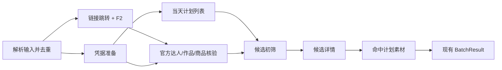

# 千川计划创建快速工作流设计

> 文档状态：Phase 1/2 与 P0 MCP 入口的源码实现和本地验证已完成；尚未正式发布、安装或完成真实 Host/业务 API 验收
>
> 文档属性：AI 辅助架构设计，用于评审、实施和验收，不是当前产品行为的权威来源
>
> 权威边界：当前行为仍以仓库代码、测试、Plugin 清单、`qc-plan-monitor` Skill 和正式文档为准；本文记录未发布实现，不代表已进入线上或已安装 Plugin
>
> 证据核实日期：2026-08-16
>
> 验证边界：本轮不读取真实凭据、不调用官方业务 API、不构建或安装 Plugin、不创建 Tag 或 GitHub Release

## 1. 结论

重构目标只有一个：让用户更快拿到可确认的预检结果，并在确认后尽快完成创建或素材追加。

当前方案不需要统一单双入口的领域模型、通用工作流引擎、跨进程缓存、资源级锁管理器、影子决策系统或官方 QPS 调度器。单个创建保持现状；批量只增加两个能力：并行预检和确认快照。

```text
单个入口 ──本地校验 ─────────────────────────────────────────────→ 现有 CreateExecutor

批量入口 ──并行预检 ─→ 现有 BatchResult + 最小快照 ─→ 用户确认
                                                     └─ preflight_id ─→ 增量复核 ─→ 现有写执行器
```

1. **单个创建保留快路径**：Payload 或模板只做本地规范化和校验，dry-run 不调用官方 API。
2. **批量预检只并行独立工作**：链接解析与 F2、凭据准备同时开始；凭据就绪后启动当前计划列表，获得作品身份后执行官方核验，两个分支汇合后再确认候选详情和已有素材。
3. **不统一单双入口模型**：单个继续使用现有结果和 `CreateExecutor`，批量继续使用现有 `BatchResult`；避免没有速度收益的领域重构。
4. **移除批量读取的全接口 250ms 间隔**：官方读取由一次命令内唯一的 `ReadPool` channel semaphore 处理，Go 实现直接复用现有 `--concurrency`（默认 8、现有上限 10）；不再增加调度参数，不为分页、详情、素材分别设计并发器，也不维护 QPS 表、令牌桶、App 熔断或跨进程调度状态。其他命令保留原请求控制行为。
5. **确认后直接复用批量预检**：dry-run 把最小准备快照写入现有 Operation Journal 并返回 `preflight_id`；提交在现有广告主锁内只重扫当前计划和必要素材差集，不重新运行链接解析、F2 或作品核验。

这是按用户耗时目标收敛后的最小方案。任何新增组件都必须证明能减少关键路径时长、减少官方请求，或防止重复写入；否则不进入 V2。

## 2. 当前事实与根因

### 2.1 已核实事实

| 事实 | 当前证据 | 对用户耗时的影响 |
| --- | --- | --- |
| 单个创建由 `CreateExecutor` 执行 | [`create.go`](../../../runtime/ocean-watch-go/internal/application/plans/qianchuan/create.go) | 已有本地 Payload 校验和安全写执行，不需要重建 |
| 批量创建最终也调用 `CreateExecutor` | [`batch.go`](../../../runtime/ocean-watch-go/internal/application/plans/qianchuan/batch.go) | 写执行能力可继续复用，不需要统一单双入口模型 |
| 单个 dry-run 是本地 Payload 预览 | [`create.go`](../../../runtime/ocean-watch-go/internal/application/plans/qianchuan/create.go) | 这是应保留的零网络快路径 |
| 批量预检包含链接/F2、作品核验、计划列表、详情和已有素材 | [`commands.go`](../../../runtime/ocean-watch-go/internal/application/plans/qianchuan/commands.go)、[`verify.go`](../../../runtime/ocean-watch-go/internal/application/plans/qianchuan/verify.go)、[`reconcile.go`](../../../runtime/ocean-watch-go/internal/application/plans/qianchuan/reconcile.go) | 可按依赖关系并行，而不是全程串行 |
| V1 所有广告主级千川请求共享至少 250ms 间隔 | [`qianchuan_request_control.go`](../../../runtime/ocean-watch-go/internal/adapters/filesystem/qianchuan_request_control.go) | V2 批量读取已绕开该固定间隔；其他命令仍保留 |
| V1 的 `40100` 会触发共享默认 5 秒冷却 | [`qianchuan_request_control.go`](../../../runtime/ocean-watch-go/internal/adapters/filesystem/qianchuan_request_control.go) | V2 批量读取只对失败请求执行有界重试；其他命令仍保留原行为 |
| 当前已有进程内 `OnceDispatcher` 和通用 Operation Journal | [`write_safety.go`](../../../runtime/ocean-watch-go/internal/application/plans/write_safety.go)、[`journal.go`](../../../runtime/ocean-watch-go/internal/domain/plans/journal.go) | 写入安全基础已有，不需要 V2 再造状态系统 |

### 2.2 QPS 不是本次架构变量

用户提供的三个读取接口上限是：

| Endpoint | 用户提供的 QPS |
| --- | ---: |
| `GET https://api.oceanengine.com/open_api/v1.0/qianchuan/uni_promotion/list/` | 200 |
| `GET https://api.oceanengine.com/open_api/v1.0/qianchuan/uni_promotion/ad/detail/` | 50 |
| `GET https://api.oceanengine.com/open_api/v1.0/qianchuan/uni_promotion/ad/material/get/` | 50 |

这些数字未在仓库内独立核实，但不影响本方案：常见 25 条批次目标路径约 5 至 6 次官方读取，全部官方读取共享最多 8 个 worker，明显不会接近上述数字。因此：

- 不实现 QPS 策略表、利用率、令牌桶或动态并发算法；
- 不把配额核实设为实施或上线 Gate；
- 如果单次读取收到 `40100`，记录真实 endpoint 和 `request_id`，只重试该请求；
- 写请求可能已经送达时仍禁止自动重发，先执行现有读回对账。

### 2.3 真正的耗时根因

按当前代码和既有诊断，用户等待主要来自：

1. 固定代码顺序和 250ms 全接口间隔把本可重叠的读取串行化；
2. 批量预检没有让链接/F2分支和“凭据完成后的计划列表”充分重叠；
3. 候选详情和素材分页逐个等待；
4. 用户从 dry-run 改为 submit 时，批量流程可能重复昂贵准备步骤；
5. 错误只展示整段失败，难以区分执行器等待、网络等待和官方异常。

本次重构只解决这五项，不扩大到通用任务编排平台。

## 3. 用户路径

### 3.1 单个创建

```text
输入 Payload/模板
→ 本地规范化与校验
→ 展示确认
→ CreateExecutor
→ 返回 ad_id 或明确失败
```

要求：

- dry-run 为纯本地操作，目标是用户体感即时完成；
- 不为了“与批量统一”增加作品、计划或素材查询；
- 模板和 Payload 错误在凭据解析前返回；
- submit 继续使用现有写入安全、operation key 和读回对账。

### 3.2 批量预检



固定规则：

- 链接/F2 与凭据准备同时开始；凭据就绪后立即启动当天计划列表，不等待 F2；
- 作品 ID 按官方每 50 条一组；不同达人或分组在工作流并发池内执行；
- 计划列表只扫描一次；第一页、后续页、候选详情和已有素材都使用同一个读取池；
- 候选详情按 `ad_id` 去重；只有精确命中的计划才查询已有素材；
- 生成请求任务前按完整请求键去重，不引入 `singleflight` 或跨运行缓存；
- 一个 Job 的独立业务失败只阻塞该 Job；只有无法建立全局对账事实时才阻断整批预检，具体边界见 5.4。

### 3.3 批量提交

当前 dry-run 和后续 `--submit` 是两个独立 CLI 进程，千川批量入口没有现成 `run_id/fingerprint` 复用合同。因此只保存在内存里不能缩短真实确认流程。

批量 dry-run 成功后应：

1. 把不可变 `PreparedBatchSnapshot` 写入现有 `OperationJournalStore`；
2. 返回 `preflight_id`、`expires_at` 和快照摘要供用户确认；
3. 后续使用 `plans batch-qianchuan-works --submit --preflight-id ID`，不再要求重新传入和解析全部作品链接；
4. 快照只在当前业务日内短期有效；`expires_at = min(created_at + 30m, command_local_business_day_end)`，沿用当前命令的本地业务日口径，不新增广告主时区配置；过期后重新预检。

`--preflight-id` 是 submit 的独立输入方式，与 `--plan-template`、`--work-url`、`--plan-type` 和 `--business` 互斥；这些值全部来自已确认快照，避免用户二次输入造成漂移。

提交时：

1. 加载并校验 `preflight_id`、有效期、快照指纹和模板摘要；
2. 获取现有 `qianchuan-advertiser-{advertiser_id}.lock`；
3. 重新扫描一次当天计划；
4. 对原判定为 `create` 的达人确认仍无匹配计划；
5. 对原判定为 `append` 的计划重新查询素材并计算差集；
6. 如果动作或目标发生变化，停止该 Job 并要求重新确认；
7. 其余 Job 通过现有 `CreateExecutor` 或追加执行器串行写入；
8. 写入返回未知结果时，沿用现有官方读回对账。

不重新执行链接跳转、F2、达人授权或作品/商品核验。这样既缩短确认后的等待，又避免预检到提交之间出现重复计划或重复素材。

快照只解决“预检进程结束后，用户确认提交”的正常路径，不实现节点 checkpoint、失败节点恢复或任意时长断点续跑。过期、模板变化、结构损坏或指纹不一致时直接要求重新预检。

## 4. 最小快照

不新增跨入口结果模型。单个创建保持现有 `CreateResult`，批量保持现有 `BatchResult`。只为跨 CLI 确认保存一个最小快照：

```go
type PreparedBatchSnapshot struct {
    SchemaVersion  int
    CreatedAt      time.Time
    ExpiresAt      time.Time
    TemplateID     string
    TemplateDigest string
    AdvertiserID   string
    TemplatePayload json.RawMessage
    Works          []VerifiedWork
    Expected       map[string]ExpectedDecision
}
```

约束：

- `Works` 只保留可提交达人组所需的达人 ID、可见抖音号、昵称、作品 ID、标题、素材类型、匹配商品和计划命名字段；`Expected` 只保存 `create` 或 `append` 及后者目标 `ad_id`；
- 快照不保存 Token、Cookie、完整官方响应或链接/F2 原始结果；
- 快照指纹和按达人索引的 prepared Job 保存在现有 Journal 外层；快照本体复用 Journal 的 `Extra`、私有原子写入和托管文件校验，不新增存储系统；
- 快照不保存节点状态，不承担写入 checkpoint；
- 不新增 `CreationIntent`、`PreparedCreation`、通用 `PreflightArtifact`、`MutationPlan`、`ExecutionJournal` 或工作流状态机；
- 继续复用现有批量结果、Mandatory Presentation、operation key 和 Journal 合同。

## 5. 并发和异常规则

### 5.1 固定并发边界

| 范围 | 初始并发 | 理由 |
| --- | ---: | --- |
| 单次批量预检全部官方读取 | 复用 `--concurrency`，默认 8、最大 10 | 一个命令内的共享 semaphore；控制连接数和 goroutine，不代表 QPS |
| 写入 | 1 | 首期在广告主锁内串行，避免改变写安全语义 |

分页、达人核验、候选详情和已有素材都共享现有 `--concurrency` semaphore；任务生成前按请求键去重。不增加新的并发参数，也不需要官方 QPS 配置。

### 5.2 读取异常

- `40100`、`51010`、RPC 超时和可重试传输错误只重试失败请求，不重启整个预检；
- 有 `Retry-After` 时采用官方值，否则使用现有有界退避；
- 达到重试上限后，该 Job 返回 `PREFLIGHT_INCOMPLETE`，不能误报为未授权或不匹配；
- 一个 Job 级 endpoint 失败不暂停其他 Job；当天计划列表等全局读取失败按 5.4 整批阻断；
- 每次 attempt 记录脱敏 URL、阶段、耗时、HTTP 状态、业务码和官方 `request_id`。

### 5.3 分页一致性

- 先读取第一页，再并发读取声明的后续页；
- 固定查询参数，校验每页页码和总页数；
- 按业务主键去重；
- 分页总数变化时返回 `SNAPSHOT_CHANGED`，不拼接成成功快照；
- 首期直接让用户重试，不引入 generation、短租约或跨进程快照缓存。

### 5.4 部分失败边界

批量按 Job 隔离独立业务失败，但前提是整批共享事实已经完整建立。首期采用以下固定分类：

| 失败类型 | 处理 | 典型情况 |
| --- | --- | --- |
| Job 级业务失败 | 只把该 Job 标记为 `blocked` 或 `PREFLIGHT_INCOMPLETE`；其余成功 Job 可进入确认和提交 | 非法链接、达人不可用、作品与达人不匹配、商品不匹配、单达人多计划冲突、针对单个达人的官方核验在有界重试后仍失败 |
| 全局阻断失败 | 整批不生成可提交快照，不允许任何写入 | 凭据或广告主授权无效、模板无效、当天计划列表任一页不完整、分页快照变化、计划主键冲突或其他原因导致无法建立完整的全局计划对账事实 |

约束：

- 部分成功不是静默忽略失败；确认结果必须同时展示成功 Job、被阻塞 Job 和可操作原因；
- 成功且动作已确定的 Job 进入 `PreparedBatchSnapshot` 的可提交集合；被阻塞 Job 只保留结果摘要，submit 必须忽略；没有任何可提交 Job 时不返回可提交的 `preflight_id`；
- submit 增量复核发现某个 Job 的动作或目标变化时，只阻塞该 Job 并要求重新预检；如果当天计划扫描不完整，则在任何写入前阻断整批；
- V2 不改变现有写请求失败后的执行语义；写入未知结果仍必须先读回对账，不能当作 Job 级业务失败直接跳过。

## 6. 预期收益和验收

### 6.1 常见 25 条批次

假设：1 个达人、1 个商品、计划列表 1 页、1 个候选计划、1 个已有素材页。

| 读取 | 请求数 | 依赖轮次 |
| --- | ---: | ---: |
| 达人授权 | 1 | F2 和凭据完成后的第 1 轮；可与计划列表重叠 |
| 作品归属 | 1 | 官方身份确认后的第 2 轮 |
| 商品匹配 | 1 | 第 2 轮，可与作品归属并行 |
| 计划列表 | 1 | 凭据完成后立即启动，不等待 F2 |
| 计划详情 | 1 | 计划列表与作品核验汇合后的第 3 轮 |
| 已有素材 | 1 | 第 4 轮，仅存在计划时需要 |
| 合计 | 6 | 最多 4 轮网络依赖 |

如果官方合同证明按商品过滤的作品返回可同时证明归属，作品归属和商品匹配可以合并为 1 次请求，总数降为 5、依赖轮次不变。该优化不是首期上线前提。

速度收益主要来自并行依赖轮次和取消每请求 250ms 人工等待，而不是少请求 1 次。设计阶段不承诺固定秒数，必须用同一模拟延迟集比较 V1 与 V2。

### 6.2 验收指标

| 指标 | 必须达到 |
| --- | --- |
| 单个 dry-run | 0 次官方 API 调用；相对 V1 无性能回退 |
| 批量计划列表 | 每个命令恰好 1 次完整逻辑扫描 |
| 批量官方读取 | 最大同时在途不超过命令 `--concurrency`；默认 8、硬上限 10；独立阶段确实重叠执行 |
| 25 条常见批次 | P50/P95 均快于 V1；具体阈值由基准首轮结果设定 |
| submit 二次等待 | 通过 `preflight_id` 加载快照；不重复链接、F2、达人和作品核验 |
| 正确性 | create/append/noop/conflict 决策与 V1 合同测试一致 |
| 写安全 | 无重复计划、无重复素材、未知写入先对账 |
| 可诊断性 | 每个官方失败可定位 endpoint、阶段和 `request_id` |

必须测试：

- 单个 Payload/商品模板/直播模板的本地 dry-run；
- 25 条单达人、50 条多达人、10 页计划和多个候选；
- 慢 F2、慢计划页、详情失败、素材失败和单请求 `40100`；
- Job 级业务失败不阻塞其他 Job，以及凭据失败、计划列表不完整、分页变化会整体阻断；
- 分页变化、重复 ID、多计划冲突和已有素材 noop；
- dry-run 后提交期间出现新计划或新素材；
- `preflight_id` 正常加载、30 分钟过期、跨日过期、模板变化、指纹不匹配和文件损坏；
- 写请求成功、明确未发送和结果未知三种情况。

## 7. 最小实施顺序

### Phase 1：先交付预检加速

1. 已将现有 `--concurrency` 复用为命令内 `ReadPool` channel semaphore；
2. 已并行启动链接/F2和凭据，并在凭据完成后立即启动计划列表；
3. 已并发后续分页、候选详情和已有素材；
4. 已移除批量预检读取的全接口 250ms 间隔和跨 endpoint 冷却；
5. 已保留现有输出、广告主锁、写执行和 Journal；
6. 已用专项测试验证最大在途、分支重叠和决策结果；真实 P50/P95 仍需发布后观测。

**状态：本地实现完成，专项测试通过。** Phase 1 直接缩短用户预检时间，不依赖领域模型重构。

### Phase 2：确认快照和快速提交

1. 已复用现有 Operation Journal 保存短期 `PreparedBatchSnapshot`，dry-run 返回 `preflight_id`；
2. submit 已按 `preflight_id` 加载准备结果，只重扫计划和必要素材；
3. 单个创建代码和输出合同保持不变；
4. 已同步 `qc-plan-monitor` Skill 中“官方请求单在途 + 250ms 间隔”的旧合同；
5. 已更新正式文档和 `CHANGELOG.md` 的 `## 未发布`。

**状态：源码实现与全量本地验证完成；文档和 `CHANGELOG.md` 已同步，尚未正式发布、安装或完成真实 Host/业务 API 验收。**

不在 V2 首期实施：

- 通用 DAG/工作流引擎；
- 通用持久化预检产物、节点 checkpoint 和断点恢复；
- 新的 Journal 或写入状态机；
- target/plan 多级锁和并发写；
- 运行间/跨进程缓存、租约、generation 或 singleflight；
- QPS 策略表、令牌桶、AIMD 或 App 熔断器；
- 影子执行平台；
- 把 MCP 当成预检执行加速核心或另建一套业务运行时。

这些能力只有在上线后的真实指标证明存在对应瓶颈时，才单独立项。

## 8. 过度设计审计

| 能力 | 是否保留 | 与用户速度目标的关系 |
| --- | --- | --- |
| 单个创建现有本地快路径 | 保留 | 已经是 0 次官方读取，重构只会增加风险 |
| 批量单一有界执行器 | 保留 | 直接减少独立读取的排队时间；仅复用现有 `--concurrency` |
| 链接/F2、凭据和计划分支并行 | 保留 | 直接缩短预检关键路径 |
| `PreparedBatchSnapshot` | 保留 | dry-run 与 submit 是两个进程；没有它就会重复全部预检 |
| 提交时计划/素材增量复核 | 保留 | 防止确认期间产生重复计划或重复素材，是快照复用的必要安全条件 |
| 现有广告主写锁和写执行器 | 保留 | 已存在且保护写入，不增加新架构 |
| 统一单双入口领域模型 | 排除 | 不缩短任何用户路径，反而扩大改动面 |
| 通用 DAG/状态机/节点 checkpoint | 排除 | 当前固定流程可用普通并发组合表达 |
| 多层并发器、QPS 调度和动态算法 | 排除 | 当前请求规模不需要，单一 worker pool 足够 |
| 跨进程缓存、租约和 generation | 排除 | 确认快照已经解决真实重复等待问题 |
| target/plan 多级锁和并发写 | 排除 | 首期写入量不是主要瓶颈，改变写安全收益低、风险高 |
| 影子执行平台或 MCP 内重写业务 | 排除 | 不直接缩短预检或创建时间，并会复制业务逻辑 |
| P0 MCP transport 工具 | 保留 | 缩短意图到现有 Application Service 的路径，稳定结构化结果；不声称减少官方读取耗时 |

按这项审计，方案没有保留仅为“架构完整性”服务的新增组件。新增代码应集中在批量命令编排、一个命令内 semaphore 和现有 Journal 的一个快照扩展中。

### 8.1 后续 P0 Transport

V2 速度优化完成后，正常用户路径仍需要模型把自然语言转换为 CLI 参数并解析 stdout。为缩短这段非业务路径，后续新增两个很薄的 MCP transport：`preflight_qianchuan_works` 调用同一个 `CommandService.BatchWorks` 且强制 `Submit=false`，`get_qianchuan_preflight` 只读同一个 Operation Journal 白名单摘要。MCP 与 CLI 通过共享组合根装配同一 Application/Adapter，不启动 CLI 子进程、不解析 CLI 输出，也不复制预检规则。

这两个工具不改变 V2 的性能判断：预检仍需真实官方授权、归属、商品和计划核对；MCP 只减少意图路由与传输转换开销。确认提交暂不工具化，继续使用显式 CLI `--submit --preflight-id`，避免在尚无独立确认设计时扩大写入面。

## 9. 已确认架构决策

以下三项作为 V2 实施和验收的固定边界，不再作为开放问题：

### D1：单个创建不进入本次运行代码重构

**决定：接受。** 单个 dry-run 保持现有纯本地路径，submit 继续使用现有 `CreateExecutor`、operation key、Journal 和读回对账。

理由：单个 dry-run 已是 0 次官方 API 调用；统一单双入口不会缩短用户等待，反而扩大回归面。只有后续证据证明单个创建存在独立性能或正确性问题时，才另行立项。

### D2：允许独立 Job 部分失败后继续

**决定：有条件接受。** Job 级独立业务失败只阻塞对应 Job，其余成功 Job 可以继续确认和提交；全局事实不完整时整批阻断，分类以 5.4 为准。

理由：不同达人 Job 之间没有必要因独立业务错误相互等待，但创建和追加决策依赖完整的当天计划扫描。无法确认全局计划事实时继续写入，会引入重复计划或错误追加风险，不能以“部分成功”为由降级安全条件。

### D3：快照最多有效 30 分钟且不跨业务日

**决定：接受。** `expires_at = min(created_at + 30m, command_local_business_day_end)`，沿用当前命令的本地业务日口径，不新增广告主时区配置；广告主、模板摘要、指纹不一致或快照损坏时立即失效。

理由：快照只用于连接相邻的预检与人工确认，不承担长期缓存或断点恢复。短期有效期足以避免重复预检，同时限制预检事实过旧；过期后重新预检，不设计续期或后台刷新。
