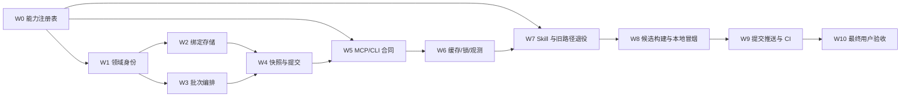

# Ocean Watch Plugin V3 架构整改实施计划

> 文档状态：实施中；W0–W7 已完成；W8 候选构建安装已完成且等待新任务 Host 加载检查；W9 提交推送和 W10 真实验收仍未授权
>
> 文档属性：AI 辅助实施计划与交付 Gate
>
> 权威边界：本文规定 V3 的实施顺序和验收门禁，不代表功能已经实现；目标合同以 [`../designs/ocean-watch-plugin-target-architecture-v3.md`](../designs/ocean-watch-plugin-target-architecture-v3.md) 为准，当前行为以代码、测试、Plugin 清单、Skill 和正式文档为准
>
> 证据核实日期：2026-08-18
>
> 分支约束：仅使用现有 `main`，不创建其他分支
>
> 当前授权：W0–W7 代码与文档、W8 候选构建和本地安装已获授权并执行；不创建其他分支。提交、推送、真实业务验收、Release 和 Marketplace 发布仍分别需要明确授权

## 1. 实施准入结论

目标架构、当前架构审计、业务身份、已有计划匹配、Host 兼容边界、状态所有权、迁移、回滚和验收口径已经确定，可以进入代码实施。

进入实施前只需用户给出明确的“开始按 V3 修改代码”授权，不再需要重新讨论以下已定事项：

- MCP 使用结构化 `items[]` 保留逐行 `plan_type` 和 `business`；
- `plan_type` 与 `business` 都参与计划组身份；
- `group_id` 取代 creator ID 成为稳定分组和快照身份，`business_date + group_id` 成为每日计划绑定身份；
- 无本地绑定的历史计划不自动追加；
- 兼容 Runtime 当前任务热切换，Host 合同变化只需新建任务、不退出客户端；
- MCP 保持本地 stdio，不发布公网。

任何实施中发现的新证据若反证上述合同，必须停止对应工作包，更新 V3 设计并获得重新确认；不能在代码中静默折中。

## 2. 实施原则

1. 一次只推进一个工作包；前一包 Gate 通过后才能进入下一包。
2. 先建立新模型和测试，再切入口，最后删除旧路径。
3. 每个工作包只提交与其目标相关的文件；保留用户已有无关改动。
4. 生产源码是修复主体，测试用于证明，不通过改测试掩盖错误实现。
5. 本地验证、安装验收、提交、推送、Release 和 Marketplace 发布分别授权。
6. 每次推送前执行 `AGENTS.md` 要求的完整差异、Changelog、线上 Release 和版本关系检查。
7. 推送后以精确 SHA 的全部 CI 为准；CI 未全绿不得进入用户验收。

## 3. 工作包依赖图



W0–W7 是代码实现；W8 需要构建和本地安装授权；W9 需要分别授权提交和推送；W10 在精确 SHA 的 CI 全绿后进行最终验收。正式 Release/Marketplace 不属于 W9 或 W10。

## 4. W0：统一能力注册表与路由 Gate

### 4.1 修改范围与落点

- 新建 `runtime/ocean-watch-go/internal/contracts/capabilities.go`，定义稳定 `CapabilitySpec` 和注册表，统一 capability ID、渠道、副作用、提交要求、MCP tool、CLI command、主表面和高频标记；现有 `commands.go` 只保留 CLI 身份与兼容查询。
- `contracts.Commands`、`get_capabilities` 和 MCP 工具元数据从注册表派生或受注册表静态校验。
- `runtime/ocean-watch-go/internal/mcpserver/server.go` 注册工具时必须给出 capability ID；测试用实际 `tools/list` 反查注册表，不把 Handler 或 JSON Schema 搬进注册表。
- 两个 `skills/*/SKILL.md` 的 Fast Routing 表使用固定 HTML 标记区；`scripts/validate_distribution.py` 与 Go fixture 逐项比对，不增加运行时动态发现，也不自动重写人工规则。
- MCP Schema/Handler 仍在 Transport 层实现；注册表不演变为动态 Handler 容器或运行时工作流引擎。

### 4.2 必须测试

- 所有 CLI 命令和 MCP 工具恰好映射一个 capability；
- ID、工具名和命令名无重复；
- channel/effect/requires-submit 与当前安全合同一致；
- online write 全部要求 submit；
- Skill 高频路由与 registry fixture 一致；
- `get_capabilities` 返回主表面和精确 route；
- 高频意图测试证明不调用 `get_capabilities`，未知意图最多调用一次。

聚焦验证命令：

```bash
GOTOOLCHAIN=go1.26.5 go -C runtime/ocean-watch-go test ./internal/contracts ./internal/mcpserver
python3 scripts/validate_distribution.py
```

### 4.3 Gate

- 注册表只统一元数据，不引入每请求动态发现；
- Marketing/Qianchuan 相同表面仍保持独立业务能力 ID；
- 现有高频业务外部行为不变；
- W1/W5/W7 后续修改必须先更新注册表，再由 Gate 驱动其他目录同步。

## 5. W1：领域身份与确定性分组

### 5.1 修改范围与落点

- 在 `runtime/ocean-watch-go/internal/domain/qianchuan/` 新增批次身份文件，定义 `BatchItem`、`VerifiedBatchItem`、`PlanGroupIdentity` 和 `group_id` 生成器。
- 在 `runtime/ocean-watch-go/internal/application/plans/qianchuan/batch.go` 将 `batchGroup` 改为显式 `GroupID + Identity + Works`。
- 把商品集合排序去重、空值语义、重复作品冲突和规范化放入纯函数。
- `BatchGroupResult` 增加 `group_id`、`plan_type`、`business`。
- 在该包 `testdata/` 新增不含真实链接或生产数据的 25 行结构夹具：22 行“随手po”、3 行“真人口播营销”、商务均为“刘岛”；真实链接只在 W10 用户验收时由原始输入提供，不提交仓库。

### 5.2 必须测试

- 同输入不同顺序生成相同 `group_id`；
- 同达人同商品不同类型生成不同组；
- 同达人同商品不同商务生成不同组；
- 空值与非空值不合并；
- 商品输入顺序和重复不影响身份；
- canonical JSON golden fixture 在 Go 版本升级后仍生成相同 `group_id`；
- 相同作品相同字段去重，冲突字段返回 `DUPLICATE_ITEM_CONFLICT`；
- 原 25 条夹具生成至少两个组，22/3 行归属正确。

聚焦验证命令：

```bash
GOTOOLCHAIN=go1.26.5 go -C runtime/ocean-watch-go test ./internal/domain/qianchuan ./internal/application/plans/qianchuan
```

### 5.3 Gate

- 领域测试不依赖文件、网络或时间；
- 代码中没有以 creator ID 作为新组唯一键的新增路径；
- 尚不切 MCP/CLI 入口，现有外部行为保持不变。

## 6. W2：PlanBindingStore 与历史计划政策

### 6.1 修改范围与落点

- 新建 `runtime/ocean-watch-go/internal/application/plans/qianchuan/bindings.go`，定义 `PlanBindingReader/Writer` port、`PlanBinding` Schema v1 和 `binding_key = group_id/business_date`。
- 新建 `runtime/ocean-watch-go/internal/adapters/filesystem/qianchuan_plan_bindings.go`：固定托管路径、0600 文件、0700 目录、原子写、锁、symlink 防护、严格 JSON 解码。
- 修改 `runtime/ocean-watch-go/internal/bootstrap/qianchuan.go` 注入 binding store。
- Reconciler 分离为：完整库存扫描、绑定目标复核、历史候选提示。
- 新建计划成功并读回一致后，在广告主写锁内保存绑定。
- 在 `runtime/ocean-watch-go/internal/cli/qianchuan_plans.go` 和 `runtime/ocean-watch-go/internal/contracts/` 增加 `qc-plans binding-audit` 与 `qc-plans bind --submit`；两者都不得调用官方写接口，后者只写本地状态但会改变后续计划选择，因此必须精确确认。本次不为迁移命令新增 MCP 工具。

### 6.2 历史候选规则

- 当天无绑定无当天候选：允许 `would_create`；
- 当天无绑定但存在当天候选：只返回 `legacy_binding_required`；
- 当天有绑定且官方身份一致：允许 append/noop；
- 当天有绑定但目标漂移：返回 `binding_drift`，不得重定向；
- 历史日期绑定只保留审计，不可用于今天的计划选择。

### 6.3 必须测试

- 权限、原子写、并发锁、损坏 JSON、unknown field、symlink 文件/目录；
- 同 `business_date + group_id` 只能有一个 binding，不同日期可以保留不同 `ad_id`；
- 不同 advertiser/template 不能串用；
- 本地绑定的达人、商品、类型或商务与当前完整身份任一不一致时阻断；
- 历史唯一候选也不自动绑定；
- 新建成功读回后绑定，未知写入未对账成功时不绑定；
- 绑定漂移不自动寻找替代计划。

聚焦验证命令：

```bash
GOTOOLCHAIN=go1.26.5 go -C runtime/ocean-watch-go test ./internal/adapters/filesystem ./internal/application/plans/qianchuan ./internal/bootstrap ./internal/cli ./internal/contracts
```

### 6.4 Gate

- Store 不保存秘密、URL 或原始响应；
- 迁移命令默认为只读或 dry-run；
- 没有任何达人+商品直接产生 append 的路径。

## 7. W3：统一批次 Application Service

### 7.1 修改范围与落点

- `BatchWorksCommand` 接收 `[]BatchItem`；Transport 之外不接受平铺 URL + 整批类型/商务。
- 固定执行顺序：规范化 → 短链 → owner hint/F2 → 官方核验 → group → 一次计划库存 → binding/历史候选 → 素材差集 → snapshot。
- 一个批次解析一次凭据、扫描一次完整计划库存。
- 同请求键命令内去重；分页/详情/素材共享一个有界读取池。
- 独立行/组失败不阻断其他组；全局库存不完整则任何组都不可提交。
- 主要修改限于 `runtime/ocean-watch-go/internal/application/plans/qianchuan/{commands,batch,verify,reconcile,read_pool}.go`，Transport 不得复制编排。

### 7.2 必须测试

- 单批与等价拆批的 group 和 decision 集合完全一致；
- 输入顺序变化不影响结果；
- 一个坏链接不阻断其他组；
- 凭据、模板或计划库存失败整批阻断；
- 计划库存逻辑扫描恰好一次；
- 官方详情和素材请求按 key 去重；
- 预检 Writer 调用次数为 0。

聚焦验证命令：

```bash
GOTOOLCHAIN=go1.26.5 go -C runtime/ocean-watch-go test ./internal/application/plans/qianchuan
```

### 7.3 Gate

- Application Service 不读取 CLI flags、MCP JSON 或文件路径；
- MCP 和 CLI 后续可以直接调用同一个入口；
- 原 25 条夹具不发生跨类型合并。

## 8. W4：Snapshot V2 与确认提交

### 8.1 修改范围与落点

- Snapshot Schema 升级到 v2，`Groups map[group_id]PreparedGroup`。
- `runtime/ocean-watch-go/internal/application/plans/qianchuan/preflight.go` 保存固定上海业务日；跨日提交失败关闭。
- `get_qianchuan_preflight` 摘要返回 group_id、类型、商务和动作。
- V1 快照可读取脱敏摘要但禁止提交，返回 `PREFLIGHT_SCHEMA_OBSOLETE`。
- 提交重新解析凭据，在广告主写锁内扫描一次计划、复核绑定和素材差集。
- 某组漂移只阻断该组；库存不完整在首次写入前阻断整批。
- operation key 使用 business_date + group_id + action + target + item set，防止跨日误去重。
- 提交在广告主锁内先复核全部组并冻结执行列表，读取阶段完整成功后才允许第一个官方写请求。

### 8.2 必须测试

- v2 编解码、指纹、30 分钟/业务日过期、损坏、unknown field；
- 同达人多个组完整保存并稳定排序输出；
- v1 不可提交且不被改写；
- 模板、绑定、计划目标、素材集合漂移；
- `TemplateDigest`、`InputDigest`、有/无绑定 `BindingDigest` 的 canonical golden fixture；
- 提交不重复链接、F2、授权/作品/商品核验；
- 后一组读取失败时前面组也尚未写入；冻结执行列表后单组写失败按 Journal 记录且不重复已成功写入；
- 未变化组继续、变化组阻断；
- 未确认、过期或损坏快照不发送任何写请求；
- unknown write 继续先读回对账。

聚焦验证命令：

```bash
GOTOOLCHAIN=go1.26.5 go -C runtime/ocean-watch-go test ./internal/application/plans/qianchuan ./internal/domain/plans ./internal/adapters/filesystem
```

### 8.3 Gate

- 快照不含 URL、Token、Cookie、完整 F2/官方响应；
- creator-keyed `Expected` 已无运行入口；
- 写入安全测试全部通过。

## 9. W5：MCP Schema V2 与 CLI 兼容层

### 9.1 MCP

- `preflight_qianchuan_works` 改为 `items[]`；删除 MCP 顶层 `work_urls/plan_type/business`。
- 输出 group 增加 `group_id/plan_type/business/error_code`。
- Schema 明确 `additionalProperties=false`、长度、数量和 enum/pattern。
- 工具仍不接受 submit、配置路径或任意 payload。
- `get_qianchuan_preflight` 同步 Snapshot v2 摘要。

### 9.2 CLI

- 新增结构化批次输入或沿用行文本解析，统一转换到 `[]BatchItem`。
- `--work-url` + 整批 `--plan-type/--business` 只保留一个发布周期并输出弃用提示。
- MCP 不保留旧 Schema；Host 合同变化通过新任务加载。

### 9.3 必须测试

- MCP Schema 接受逐行混合类型并保序；
- 拒绝旧 `work_urls` 和未知字段；
- MCP 与 CLI 同输入领域结果字节级规范化等价；
- MCP 预检不能构造 submit；
- 结构化错误不泄露内部路径或秘密；
- mandatory Presentation 保持五列顺序，组详情完整输出。

聚焦验证命令：

```bash
GOTOOLCHAIN=go1.26.5 go -C runtime/ocean-watch-go test ./internal/mcpserver ./internal/cli
GOTOOLCHAIN=go1.26.5 go -C runtime/ocean-watch-go run ./cmd/mcp-probe
```

### 9.4 Gate

- `tools/list` 中稳定工具合同与预期 fixture 一致；
- 规范化工具目录 digest 发生预期变化；Runtime manifest 本轮保持 Schema v1 且不增加未知字段，避免旧 Proxy 拒绝候选；
- 旧任务继续旧 Runtime，新任务能加载新工具 Schema 的测试路径明确。

## 10. W6：缓存、请求控制、锁与观测

### 10.1 Owner hint/F2

- owner hint 在短链拿到 item ID 后立即读取；命中时只对缺失项调用 F2。
- 无论缓存是否命中，都执行当前官方授权、归属和商品核验。
- 官方与缓存冲突使提示失效；缓存损坏不得自动覆盖。

### 10.2 请求控制

- 明确批量与普通 Qianchuan 请求共用的跨调用限流/冷却策略；禁止一个路径绕过全局 `Retry-After`。
- 命令内并发池只控制在途数；写请求永不自动重试。
- 分页变化、超限和取消保持 fail-closed。

### 10.3 锁

- 移除只读预检对广告主写锁的全程占用；
- Snapshot 和 binding 只持短时本地锁；
- submit/删除/计划设置继续共享广告主写锁。

### 10.4 观测

- 实现 V3 定义的独立组件耗时和请求计数；
- Proxy `_meta` 保留实际 Runtime 版本和代理耗时；
- 日志只写脱敏 endpoint、阶段、业务码和 request_id。

### 10.5 必须测试

- 热缓存不调用 F2但官方核验次数不减少；
- 冷缓存只调用缺失项；
- 缓存错误降级且不改业务结果；
- 两个只读预检不因广告主写锁串行；
- submit 与设置/移除仍互斥；
- 所有组件耗时非负；并行组件允许重叠，总墙钟只取端到端计时且不由组件相加伪造；
- `Retry-After` 在批量和普通读取均生效。

聚焦验证命令：

```bash
GOTOOLCHAIN=go1.26.5 go -C runtime/ocean-watch-go test ./internal/application/plans/qianchuan ./internal/adapters/filesystem ./internal/platform/requestcontrol ./internal/performance
```

### 10.6 Gate

- 正确性测试先通过，再看速度；
- 性能改动没有放宽官方校验；
- 无重复缓存、锁或请求控制实现。

### 10.7 当前核验记录（2026-08-18）

- owner hint 分层解析已先完成短链解析和缓存读取，热缓存跳过对应 F2，冷缓存/缓存错误只对缺失项回退 F2；官方核验路径保持不变。
- dry-run 不再调用广告主写锁；submit、删除和计划设置仍使用同一广告主锁族。批量读取工厂已注入与普通千川读取相同的跨调用请求控制和 `Retry-After` 冷却。
- 结果新增独立组件 `stages` 与 `requests` 观测；并行组件允许重叠且不相加伪造总墙钟。解析结果进入缓存/F2 分层前复制切片，定向 race 已覆盖并通过。
- 本地验证已通过：`go test ./...`、`go vet ./...`、MCP stdio probe、分发校验和定向 `go test -race`。尚未执行构建、安装、提交、推送或远端 CI。

## 11. W7：Skill、正式文档与旧路径退役

### 11.1 Skill

- `qc-plan-monitor` 明确一次调用传完整 `items[]`，禁止按类型/商务拆批。
- 高频路由保持首命中；不得增加预检前的工具枚举、Memory、仓库或缓存搜索。
- 合同不可用时报告 Host 错误并停止，不回退 CLI 预检。
- `ads-plan-monitor` 只做跨渠道边界回归，不扩大变更。

### 11.2 正式文档

- 更新 `docs/configuration.md`、`docs/cli.md`、`docs/architecture.md` 和用户工作流说明。
- 更新 `CHANGELOG.md` `## 未发布`，准确记录 Schema 变化、分组修复、历史计划绑定和升级动作。
- 对用户说明：安装/升级后新建任务加载合同，不需要退出客户端。

### 11.3 允许删除的旧实现

满足调用已迁移、测试已覆盖后删除：

- MCP 旧 `work_urls + top-level plan_type/business` Schema；
- creator-only `batchGroup`、creator-keyed `Expected` 和快照 v1 提交路径；
- 达人+商品直接自动追加路径；
- CLI 兼容参数在约定发布周期结束后的解析分支；
- 已由独立组件指标替代的旧累计窗口字段。

不得删除：

- F2 Python Resolver；
- owner hint cache 基础设施；
- Operation Journal、广告主写锁、request controller；
- stable launcher/proxy、Runtime 版本槽和租约；
- unknown-write 对账和 `OnceDispatcher`。

### 11.4 Gate

- MCP Schema/Handler 静态搜索无旧顶层字段，Application 无 creator-keyed 决策运行引用；允许 CLI 兼容解析在约定窗口内保留；
- import boundary、全量 Go 测试、静态检查和文档链接检查通过；
- Skill 语义路由 fixture 覆盖营销/千川全部高频意图。

### 11.5 当前核验记录（2026-08-18）

- MCP 预检只接受结构化 `items[]`；CLI 旧参数仅保留带弃用提示的 Transport 兼容层；Snapshot v1 只读摘要、禁止提交。
- 旧累计窗口性能字段已从 Application、MCP 输出和 JSON Schema 删除；`stages` 记录允许并行重叠的独立组件耗时，`total_runtime_seconds` 保持唯一端到端 Runtime 墙钟。
- 正式文档、Skill、`CHANGELOG.md` 和 AI 文档状态已同步；完整本地验证结果以本次重新执行的 W7 Gate 为准。

工作包总验证命令：

```bash
GOTOOLCHAIN=go1.26.5 go -C runtime/ocean-watch-go test ./...
GOTOOLCHAIN=go1.26.5 go -C runtime/ocean-watch-go vet ./...
python3 scripts/version_tag.py check
python3 scripts/validate_distribution.py
python3 -m unittest discover -s f2 -p "test_resolve.py" -v
```

## 12. W8：候选构建、安装与本地冒烟

此工作包的构建和安装已获用户单独授权；新任务 Host 加载检查仍待执行。

### 12.0 当前核验记录（2026-08-18）

- 已用标准 cachebuster 生成候选并完成五平台构建；`build-runtime --all --verify` 对五个平台产物及 Runtime manifest 逐字节验证通过。
- repo-local Marketplace 已注册，候选已通过 Skill、Plugin、版本、分发、launcher 和 MCP stdio probe 后安装；Codex 不需要退出或重启。
- 安装命令已自动清理旧 Plugin 缓存槽；另一个指向历史仓库的全局 `ads-plan-monitor` Skill 符号链接已移入废纸篓，目标仓库未删除。
- 当前安装前任务按预期不热加载新的 Host 工具合同；仍需在新任务中确认 namespaced Skill 和 `items[]` Schema 的 Host 加载，之后才能完成 W8。
- MCP probe 已增加输入 Schema 断言并移除内部旧 `work_urls` 调用，安装冒烟现在会阻止旧顶层预检字段回归。

### 12.1 构建门禁

- 五平台 Runtime 构建；
- launcher Unix executable bit 和 Windows CRLF/hash 一致性；
- clean checkout 重新生成 manifest 并验证确定性；
- MCP probe 校验完整工具目录和 Schema；
- Plugin 包不含凭据、状态、缓存、Journal 或环境配置。

执行命令以 `docs/releasing.md` 当前规则为准，至少包括：

```bash
GOTOOLCHAIN=go1.26.5 go -C runtime/ocean-watch-go run ./cmd/build-runtime --all
GOTOOLCHAIN=go1.26.5 go -C runtime/ocean-watch-go run ./cmd/build-runtime --all --verify
python3 scripts/validate_distribution.py
```

### 12.2 本地升级冒烟

1. 在一个旧任务保持现有工具合同；
2. 安装新 Plugin，不退出客户端；
3. 旧任务继续稳定服务旧 Runtime；
4. 新建任务加载 V2 MCP Schema 和新 Skill；
5. 在这个新任务中安装后续合同不变 Runtime build，确认当前任务自动热切换；
6. 注入坏候选证明拒绝和旧 Runtime 连续服务；
7. 无租约旧槽最终清理。

### 12.3 本阶段完成边界

- 只证明候选包可构建、可安装、合同加载和回滚链成立；
- 可以运行无业务写入的合成 fixture 冒烟，但不把本阶段称为最终用户验收；
- 不因本地安装成功推断远端 CI、Release 或 Marketplace 状态。

## 13. W9：提交、推送与 CI

此工作包需要用户分别授权提交和推送；用户只授权其中一个阶段时不得越界。

### 13.1 提交前

- 审查工作树并排除用户无关改动；
- 相对 `origin/main` 审查全部待提交差异；
- 运行聚焦测试、全量测试、静态检查、分发验证和文档检查；
- 确认 `CHANGELOG.md` `## 未发布` 覆盖全部行为/兼容/安全变化；
- 确认无秘密、真实验收输入、状态、缓存、Journal 或构建临时文件。

### 13.2 推送前强制检查

- 相对目标远端分支审查全部待推送提交和差异；
- 实时查询 GitHub 最新非草稿、非预发布 Release，报告版本、时间和 Tag；
- 核对线上版本、`CHANGELOG.md`、`pyproject.toml`、Python 包版本和 Plugin 版本；
- 普通推送继续归入 `## 未发布`，不自动升级正式版本；
- 任一检查失败则停止推送并报告。

### 13.3 推送后

- 报告实际分支和提交 SHA；
- 监控该精确 SHA 的全部 GitHub Actions；
- Linux、macOS、Windows Go matrix、F2 matrix 和 Plugin contracts 必须全部成功；
- CI 未全绿不得进入 W10，也不得声称“可以验收”；
- Tag、GitHub Release 和 Marketplace 仍需独立授权。

## 14. W10：最终用户验收

W10 只在 W9 精确 SHA 的全部 CI 成功后开始；验收安装物必须能追溯到该 SHA。

### 14.1 业务验收

- 用普通自然语言发起账户、模板、素材、计划、报表和运行记录高频请求，确认首调用唯一工具；
- 用原 25 条输入执行只读预检；禁止创建或修改计划；
- 验证至少两个 group_id、22/3 类型归属、商务均为刘岛、无跨类型追加；
- 冷/热各至少 20 次，报告 P50/P95、最慢阶段、请求数和外部退化；
- `get_qianchuan_preflight` 本地读取至少 50 次；
- 绑定缺失历史计划必须阻断自动追加；
- 只有用户另行明确授权才执行确认提交验收。

真实 25 条链接只作为现场输入，不写入日志、fixture 或 Git；可持久化证据仅保留脱敏 request ID、输入 digest、22/3 计数、group_id、阶段耗时和结论。

### 14.2 可验收定义

只有同时满足以下条件才可说“现在可以验收”：

- 目标业务正确性和只读边界已通过；
- 性能达到 V3 阈值或用户接受有证据的新阈值；
- 安装包与新任务工具合同已验证；
- 精确待验收提交的 CI 全绿；
- 没有未解释的部分失败、缓存漂移或绑定歧义。

单独满足工具可调用、本地测试成功、一次耗时好看或 CI 成功，都不构成可验收。

## 15. 性能基线与通过标准

历史基线只用于比较，不代表通过：

| 基线 | 结果 |
| --- | --- |
| 22+3 拆批 | 约 21.6s，重复且串行，不通过 |
| 25 条单批 | 墙钟 8.381s / Runtime 8.308s，但分组错误，不通过 |

V3 初始标准：

- 热 owner hint：P50 ≤ 4s、P95 ≤ 6s；
- 冷 owner hint/F2：P50 ≤ 7s、P95 ≤ 10s；
- 本地快照读取：P50 ≤ 100ms、P95 ≤ 250ms；
- 每种真实路径至少 20 次，快照读取至少 50 次；
- 任何性能通过都以正确性先通过为前提。

如果真实外部 API 延迟使阈值不可达，必须用独立组件耗时、请求计数和对照证明瓶颈；并行组件不可求和；调整阈值需要用户明确接受，不能由实施者自行放宽。

## 16. 完成定义

V3 整改完成必须同时具备：

- 代码：唯一领域模型、无旧运行入口、无静默回退；
- 数据：Snapshot v2、binding Schema、显式迁移与可回滚；
- 测试：Domain/Application/Adapter/MCP/CLI/Proxy/Skill/安全/性能全覆盖；
- 文档：正式文档、Changelog、AI 设计状态同步；
- 包：五平台一致、manifest 可复现、安装 probe 通过；
- 运行：新任务加载合同、兼容 Runtime 热切换、坏版本拒绝；
- 业务：原 25 条正确分组且预检零官方写；
- 交付：精确 SHA CI 全绿，提交/推送/发布边界准确报告。

## 17. 当前下一步

W0–W7 的代码、测试、Skill 和文档实施已经完成本地验证。下一阶段是 W8 候选构建与本地安装，必须取得单独授权；不得把 W8 授权推定为 W9 提交/推送、W10 真实业务验收或正式发布授权。
