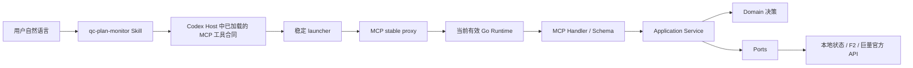

# Ocean Watch Plugin 当前架构审计

> 文档状态：已完成，可作为目标架构设计的现状基线
>
> 文档属性：AI 辅助调研与审计记录
>
> 权威边界：本文描述 2026-08-18 核实到的仓库代码、已安装 Plugin 结构和官方 Codex Plugin 文档；运行状态、版本和性能数据在后续引用时仍须重新核对
>
> 证据核实日期：2026-08-18
>
> 执行边界：本审计不读取凭据、不调用巨量官方业务 API、不修改业务代码、不构建、不安装、不提交、不推送或发布

## 1. 审计结论

Ocean Watch 当前并不是“旧 Python Runtime 与新 Go Runtime 混跑”。生产命令路由已经全部指向 Go；Python 仅是 F2 公共作品元数据解析依赖。当前需要整改的根因是合同与领域边界，而不是删除一个仍在抢占请求的旧 Runtime。

已核实的核心问题是：

1. MCP `preflight_qianchuan_works` 只接收 `work_urls[]`，`plan_type` 和 `business` 是整批共用字段；它无法无损表达用户逐行输入。
2. Skill 为保留逐行类型而在模型层拆批，导致重复准备、重复官方读取和同广告主锁串行。
3. Runtime 又只按达人 ID 建组、匹配和索引快照，无法表示“同一达人、不同类型或商务”的多个计划组。
4. 已有计划主要按达人和商品相交匹配，会把不同计划身份的素材错误追加到同一计划。
5. 当前 Runtime 热切换机制只能接管工具目录完全一致的兼容版本；Skill、工具名称、Schema 或注解发生变化时，Host 必须在新任务加载新合同。
6. 现有缓存、请求控制、Journal、广告主锁、Runtime 版本槽和租约都有现行调用。未证明不可达前不能直接删除。
7. CLI 命令目录、MCP 工具注册和两个 Skill 高频路由表由三处人工维护；`get_capabilities` 当前只从 CLI 命令目录生成，不能证明 Skill、MCP 和 CLI 的语义路由始终一致。

## 2. 核实方法与范围

本审计读取并交叉核对：

- `.codex-plugin/plugin.json`、`.mcp.json`、Runtime manifest 与 launcher；
- 两个 Skill 的快速路由合同及千川工作流参考；
- MCP Schema、Handler、Application Service、Domain、Adapter、CLI 和 Bootstrap；
- Runtime 发现、完整性验证、版本槽、租约、切换、拒绝和清理逻辑；
- 当前工作树、`main` 精确提交及对应 GitHub Actions 状态；
- 官方 OpenAI Plugin 文档中安装后新任务加载规则；
- 本机已安装的 GitHub、Computer Use、Browser 和 Spreadsheets Plugin 结构，作为有限的架构对标样本。

没有核实：

- 巨量官方接口在所有广告主下的字段稳定性和实际 QPS；
- Host 是否会在未来版本支持任务内刷新 Skill 或工具合同；
- 25 条批次在不同网络、达人数量和计划分页规模下的性能分布；
- 历史计划名称是否始终能可靠反推出计划类型和商务。

以上未核实项不阻断目标架构定义，但决定实现时必须保留的失败边界和真实验收条件。

## 3. 当前端到端责任链



### 3.1 Host 与升级

- `.mcp.json` 固定启动 `./bin/ocean-watch-launcher mcp proxy --stdio --plugin-root .`。
- `mcpserver.Proxy` 每 250ms 观察已安装版本目录指纹；目录变化后才执行完整候选验证，普通工具调用不扫描 Plugin 缓存。
- 候选 Runtime 必须通过 manifest、资源 hash、平台二进制 hash、自报版本和 MCP 工具目录校验。
- 工具目录与当前 Host 合同完全一致时，Proxy 切换到新 Runtime；旧会话有在途请求时依靠租约延迟关闭和清理。
- 工具名称、输入/输出 Schema 或注解变化时，Proxy 记录 `host_contract_deferred/new_task` 并继续服务旧 Runtime。
- 官方 OpenAI Plugin 文档明确：安装后需要开始新任务或新 CLI 会话，Bundled Skill 才可用；文档没有要求退出或重启客户端。

因此，用户要求应被准确表达为：**兼容 Runtime 更新在当前任务热切换；Host 合同更新只需新建任务，不需要退出或重启客户端。**

### 3.2 意图路由

- 两个 Skill 已有首命中路由表，普通高频意图应直接调用指定 MCP 工具。
- Skill 已禁止为决定工具是否存在而扫描 Memory、仓库、Plugin 缓存或工具目录。
- 未命中已知高频工具时，才允许调用一次 `get_capabilities`。
- 千川与营销使用独立 Skill 和独立授权上下文，不能跨渠道借用凭据、模板或 API。

该方向正确，但它不能补偿下游输入 Schema 无法表示逐行语义的问题。

### 3.3 能力目录漂移风险

- `runtime/ocean-watch-go/internal/contracts/commands.go` 维护完整 CLI 命令、副作用和渠道。
- `runtime/ocean-watch-go/internal/mcpserver/server.go` 独立维护 MCP 工具名称、描述、Schema、注解和 Handler。
- 两个 `SKILL.md` 又独立维护高频意图到 MCP/CLI 的路由表。
- `get_capabilities` 只遍历 CLI `contracts.Commands`，不包含 MCP 工具和 Skill 的主路由关系。

这不表示当前已经发生具体错路由，但三套人工目录缺少自动一致性门禁，属于高影响架构风险。目标架构需要一个类型化能力注册表作为元数据单一来源，并由生成/验证 Gate 保证 Skill、MCP 和 CLI 不漂移；高频意图仍在 Skill 内静态直达，不能把统一注册表误做成每次请求都先动态发现。

## 4. 千川批次当前行为

### 4.1 输入合同缺口

当前 MCP 输入为：

```text
plan_template
work_urls[]
concurrency?
auth_account_id?
plan_type?      # 整批一个值
business?       # 整批一个值
```

而用户真实输入是一组行，每行都有：

```text
work_url | plan_type | business
```

CLI 文本解析路径能够从每一行提取类型和商务，MCP 路径却先把输入压缩成纯 URL 数组。模型若把 22 条“随手po”和 3 条“真人口播营销”拆成两次 MCP 调用，只是在 Host 外部弥补 Schema 缺陷，并非正确架构。

### 4.2 当前领域模型

- `BatchRequest` 只有整批 `PlanType`、`Business` 和 `Works`。
- `normalizeBatchRequest` 按 `work.Creator.AwemeID` 建立 `batchGroup`。
- `batchGroupPlanNameFields` 会发现同组作品类型或商务不一致并报错，但分组时并未把这些字段纳入身份。
- `CurrentDayReconciler` 使用达人与商品相交筛选候选；`CreatorTarget.PlanName` 当前批量路径没有作为稳定身份传入。
- `preparedBatchSnapshot.Expected` 以达人 ID 为 map key。
- `get_qianchuan_preflight` 返回的决策同样只标识 creator ID。

这套模型最多表达“一名达人对应一个计划组”，与真实逐行输入不一致。

### 4.3 当前执行顺序

当前 Application Service 大体执行：

1. 读取模板并校验；
2. 并行启动短链/F2和凭据解析；
3. 凭据完成后扫描当天计划；
4. 读取 owner hint，执行官方达人、作品、商品核验；
5. 按达人建组并匹配已有计划；
6. 查询命中计划素材；
7. 保存预检快照；
8. 确认提交时重新扫描计划、计算素材差集并串行写入。

并行结构本身可以保留，但领域身份、匹配规则、锁范围和观测口径需要调整。

### 4.4 真实结果证据

2026-08-18 已记录的同一 25 条输入：

| 场景 | 墙钟或 Runtime 时间 | 结果含义 |
| --- | ---: | --- |
| 模型拆成 22+3 两批 | 约 14.785s + 6.709s，合计约 21.6s | 重复工作且同广告主锁实际串行，不可验收 |
| 一次输入 25 条 | 墙钟 8.381s，Runtime 8.308s | 更快但业务结果错误，不可验收 |

单批结果把匹配成功的不同计划类型作品放进同一达人组，并预判追加到“随手po”计划。该结果反证了“只按达人分组”和“达人+商品即可匹配”的前提。

## 5. 状态、缓存与锁所有权

| 状态 | 当前所有者 | 当前用途 | 审计结论 |
| --- | --- | --- | --- |
| `$CODEX_HOME/ads-plan-monitor/config.json` | ConfigStore | 负责账户、模板和非秘密配置 | 保留；是业务配置权威来源 |
| OS credential backend / 受控凭据存储 | Credential Store | App Secret、Token 等 | 保留；禁止进入 Plugin 文件和日志 |
| `state/` 授权记录 | AuthorizationStore | 授权身份、广告主映射和 Token 元数据 | 保留；官方调用前重新解析 |
| `state/cache/qianchuan-work-owners.json` | OwnerHintCache | 作品到达人 ID 的非权威提示 | 保留但重定义为纯提示；不能证明授权或归属 |
| `state/request-control/` | QianchuanRequestController | 跨调用最小间隔和限流冷却 | 现行普通官方请求使用；批量读取路径另有并发工厂，实施时统一策略 |
| `state/locks/` | AdvertiserLockStore | 同广告主写入串行化 | 写入保留；只读预检不应全程占写锁 |
| `state/runs/` | OperationJournalStore / RunStore | 执行 Journal 和预检快照 | 保留；快照升级为 group_id 索引 |
| `$CODEX_HOME/ocean-watch/runtime/` | Runtime Manager | 当前/上一候选、不可变版本槽和租约 | 保留；是当前任务兼容热切换基础 |
| Plugin cache | Codex Host / Runtime Manager | 安装包与候选发现 | Host 所有；普通业务路径不得扫描 |

## 6. 旧路径与删除审计

| 对象 | 可达性证据 | 结论 |
| --- | --- | --- |
| Python 业务 Runtime | `application.RouteManifest` 只允许 `RuntimeGo`，全部命令均路由 Go | 不存在可删除的生产 Python 业务路径 |
| F2 Python Resolver | Bootstrap 在作品链接流程中装配 | 现行依赖；目标架构允许热缓存时跳过，但不能直接删除 |
| Owner hint cache | `CommandService` 和 Bootstrap 直接装配 | 现行路径；需改 Schema/读取时机，不是死代码 |
| Qianchuan request controller | ClientFactory 直接装配 | 现行路径；需统一批量与普通请求策略 |
| Operation Journal | 预检、提交和 Runs 直接读写 | 现行路径；需 Schema v2 迁移 |
| 广告主锁 | 批量、移除、计划设置共享 | 现行写安全边界；只缩小只读持锁范围 |
| Stable launcher/proxy | `.mcp.json` 唯一 MCP 启动入口 | 现行升级基础；保留 |
| Runtime 版本槽与租约 | Proxy 切换和清理直接使用 | 现行升级基础；保留 |
| 千川 V2 设计文档 | 仅过程文档，不影响运行 | 标记为历史且被 V3 取代 |

删除规则：只有同时满足“静态无引用、运行探针不可达、兼容矩阵无职责、迁移窗口已结束、回滚不依赖、专项测试证明删除后无入口”才允许删除。名称包含 `legacy`、`cache` 或 `python` 不能作为删除依据。

## 7. 成熟 Plugin 对标

本机样本只能证明其安装包结构和当前 Skill 约束，不能代表所有成熟 Plugin 的唯一最佳实践。

| 样本 | 观察 | Ocean Watch 采用 | Ocean Watch 拒绝 |
| --- | --- | --- | --- |
| GitHub | 按用户目标拆成多个窄 Skill；Connector 优先，CLI 仅补覆盖缺口 | 高频意图明确唯一入口；复杂流程按职责拆 Skill | 不采用公网 MCP；Ocean Watch MCP 保持本地 stdio |
| Computer Use | Skill 定义唯一运行表面和严格操作顺序；MCP launcher 固定 | Skill 只做路由和安全边界；固定 launcher | 不把业务编排放进 Skill |
| Browser | 优先专用能力；选定表面后复用会话，不反复发现 | 已知意图直接调用工具；未知时才发现一次 | 不在普通业务请求中枚举工具或扫描环境 |
| Spreadsheets | 纯本地工件能力不强行配置 MCP | 没必要的能力不暴露为 MCP | 不为 CLI 每个命令机械增加 MCP 工具 |

共同可用原则：窄职责、唯一入口、运行表面稳定、按需加载、明确失败、不静默回退。Ocean Watch 额外需要本地状态、官方广告 API 写安全和可回滚 Runtime，这些不能从其他 Plugin 直接照搬。

## 8. 对旧 V2 的逐项结论

| V2 前提或能力 | 结论 | 原因 |
| --- | --- | --- |
| 链接、凭据和计划读取按依赖并行 | 保留 | 能减少关键路径且不改变业务语义 |
| 单批共享有界读取池 | 保留并补跨调用策略 | 当前实现减少串行等待，但需要一致的限流和指标 |
| 预检快照与确认后增量复核 | 保留 | 避免重复 F2/官方核验并保护写安全 |
| Skill/MCP 薄路由到同一 Application Service | 保留 | 避免复制业务逻辑 |
| 不统一批量领域模型 | 废弃 | 当前 `BatchResult`/达人分组不能表达逐行身份 |
| 同一达人只有一个计划组 | 废弃 | 已被混合类型真实输入反证 |
| 快照按达人 ID 索引 | 废弃 | 无法支持同达人多个类型/商务组 |
| 已有计划按达人+商品匹配 | 废弃 | 已产生错误追加目标 |
| 预检全程持广告主写锁 | 修改 | 只读预检依赖提交时复核，不应阻塞独立只读批次 |
| F2 始终在关键路径 | 修改 | 热 owner hint 可用于定位，但官方校验仍必须执行 |
| 仅以一次耗时判断性能 | 废弃 | 必须分冷/热、多轮、请求数和外部异常 |

## 9. 审计完成门槛

本审计已经满足以下门槛：

- 能说明普通请求和千川批次请求的当前责任链；
- 能指出逐行输入在哪个合同边界丢失；
- 能说明分组、匹配和快照为何错误；
- 能列出当前状态、缓存、锁和 Runtime 升级路径；
- 能区分现行代码、应修改代码、不能直接删除的兼容/基础设施代码；
- 能将旧 V2 的主要决策标记为保留、修改或废弃。

目标架构和实施顺序以 [`../designs/ocean-watch-plugin-target-architecture-v3.md`](../designs/ocean-watch-plugin-target-architecture-v3.md) 与 [`../plans/ocean-watch-plugin-architecture-remediation-plan.md`](../plans/ocean-watch-plugin-architecture-remediation-plan.md) 为准。
