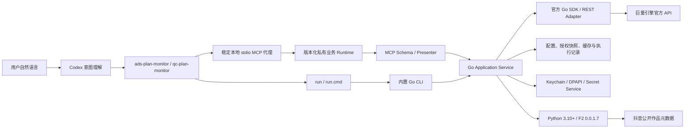

# 架构说明

## 总览

Ocean Watch 是模块化单体。业务逻辑只有一套 Go Application/Domain 实现，CLI 与 MCP 是同一实现之上的两个 Transport，不是两套业务运行时，也不存在 MCP 启动 CLI 或解析 CLI stdout 的链路。F2 是作品元数据 Adapter 的外部进程依赖，不属于广告业务运行时。

## 当前状态

Go 切换已经完成。本地 stdio MCP 的外层稳定合同共注册 17 个工具：模板列表/详情 2 个、千川预检/快照与常用查询 9 个、巨量营销授权/素材/报表查询 5 个，以及只读能力目录 `get_capabilities`。前 16 个业务工具直接转发到当前版本化 Runtime 的同名 MCP 服务，不启动 CLI 或解析 CLI stdout；能力目录返回 76 条 CLI 能力、渠道、副作用和提交门禁。Skill 对高频目标直接选择唯一工具，只在未知但已确认属于 Ocean Watch 的目标上查询一次能力目录。

`.mcp.json` 在 macOS/Linux 启动固定本地代理。代理监控 `$CODEX_HOME/plugins/cache/ocean-watch/ocean-watch/` 的本地安装版本目录，不调用可能阻塞的 `codex plugin list`；目录名只用于发现候选，不能证明候选可信。代理随后校验 Plugin 名称/版本、Runtime 清单、MCP 配置、两套 Skill 及其资源、全部签名平台二进制 SHA-256 与最多 2 秒的当前平台自报版本探针，再把完整五平台产物复制到 `$CODEX_HOME/ocean-watch/runtime/versions/<manifest-sha256>` 私有只读槽位。槽位身份只由版本、清单哈希和槽位根确定，arm64/x64 进程从同一槽位选择各自二进制。若桌面客户端仍缓存被安装器删除的旧版本目录，代理只在该路径确属 Ocean Watch 缓存且不存在时建立指向已验证新 Host 的兼容别名，使随后新任务加载新版 Skill/MCP。同一外层 MCP 会话只在工具合同兼容时建立新内层会话并原子切换；工具名、Schema 或注解变化时，当前任务保留上一 Runtime，新任务别名仍发布新版 Host，因此只需新任务、不需退出客户端。真正无法初始化或校验身份的候选不会发布；候选握手失败时自动恢复上一 Runtime，成功切换后则清除瞬时回退状态，并通过跨进程共享租约删除不再使用的历史签名槽位。私有 Runtime 状态只提供启动解析与只读诊断，不再提供长期固定或人工回退入口。

当前 Plugin/MCP 清单没有操作系统命令分支。macOS 与 Linux 可使用同一个 POSIX 稳定启动器；五个平台 Go CLI 仍是 CLI 分发目标，Windows MCP 尚无原生 Host 启动合同，不得把 Windows CLI 或交叉构建成功描述为 Windows MCP 已验收。旧 Python 业务实现、Prototype、Shadow、兼容迁移入口和旧运行目录已从当前分发中删除，历史设计不作为运行或回退路径。

因此，任何广告业务修复都只进入 `runtime/ocean-watch-go`，不得再增加并行实现。`internal/adapters/python` 的唯一职责是发现 Python 并运行固定 F2；它不能承载授权、账户、模板、计划、报表或官方 API 调用。

## 目录职责

| 路径 | 职责 |
| --- | --- |
| `skills/*/SKILL.md` | 自然语言意图、业务安全边界、强制输出合同 |
| `bin/ocean-watch-launcher` | macOS/Linux 稳定 MCP/CLI 外壳与 Runtime 解析入口 |
| `skills/*/run*` | Unix 委派稳定外壳；Windows 解析版本化 CLI Runtime |
| `.codex-plugin/bin/` | Marketplace 快照内的五平台 Go CLI |
| `runtime/ocean-watch-go/cmd/` | CLI 与确定性运行时构建器 |
| `runtime/ocean-watch-go/internal/mcpserver/` | 稳定代理、stdio MCP、工具 Schema、专用 Presenter、稳定错误和脱敏阶段日志 |
| `runtime/ocean-watch-go/internal/runtimeupdate/` | 安装快照发现、完整性校验、版本槽位、切换与回滚状态机 |
| `runtime/ocean-watch-go/internal/bootstrap/` | CLI 与 MCP 共享的 Adapter/Application 组合根，不承载业务规则 |
| `runtime/ocean-watch-go/internal/cli/` | 参数解析、路由、JSON envelope、Presentation |
| `runtime/ocean-watch-go/internal/application/` | OAuth、账户、模板、素材、计划和报表用例 |
| `runtime/ocean-watch-go/internal/domain/` | 领域模型、规则和稳定错误 |
| `runtime/ocean-watch-go/internal/ports/` | 官方 API、状态、凭据和元数据端口 |
| `runtime/ocean-watch-go/internal/adapters/` | 官方 SDK、文件、凭据、浏览器回调、F2 Adapter |
| `runtime/ocean-watch-go/internal/platform/` | 分页、重试、限流、请求计数和写入对账 |
| `f2/resolve.py` | F2 原始响应到稳定作品元数据合同的只读映射 |

生成的官方 SDK 类型只能出现在 `internal/adapters/oceanengine`。Application 与 Domain 依赖端口和稳定 DTO，不直接依赖生成 SDK 或 CLI。

## 请求治理

- 只读请求只对明确临时错误做有界重试；分页失败只重试当前页。
- 分页器拒绝页码倒退、cursor 不前进、总量矛盾和跨页重复 ID。
- Token 刷新按渠道和授权单飞；业务请求严格按广告主解析对应授权。
- 千川批量作品预检不持有广告主写锁；使用一次命令级有界读取池，调用级 `concurrency` 默认为 8、最大 10，不表示 QPS 目标。提交、删除和计划设置仍共享广告主写锁；批量读取与普通千川读取共用跨进程请求控制与官方限流冷却。
- 巨量营销达人素材 MCP 使用显式页码和最多 100 条的官方单页读取，`limit` 直接约束 `page_size`，不会为了返回少量结果预先扫描全部授权素材页。
- 在线写入默认 dry-run；`--submit` 后如结果不确定，先读回对账，禁止盲目重放。
- 营销项目/单元和千川计划/素材均在成功后检查官方对象 ID 或状态。

## 状态与凭据

CLI 配置优先级为显式 `--config`、`ADS_PLAN_MONITOR_CONFIG`、当前 Plugin 仓库的忽略配置、`$CODEX_HOME/ads-plan-monitor/config.json`。MCP 不接受路径或 `ADS_PLAN_MONITOR_CONFIG` 覆盖，只读取启动时解析出的当前操作系统用户 `$CODEX_HOME/ads-plan-monitor/config.json`；Unix 目录权限不得宽于 `0700`、配置文件不得宽于 `0600`，且拒绝符号链接和路径逃逸。授权快照、缓存和执行记录位于 `$CODEX_HOME/ads-plan-monitor/state/`。

MCP 启动后只保留执行官方查询与预检所需的最小运行环境，包括 locale、`PATH`、Python/F2 覆盖、可选 F2 Cookie、代理和开发文件凭据开关；不会把 Cookie、Token 或路径写入工具输出和日志。`list_templates`、`get_template`、`list_managed_accounts`、`get_marketing_authorization`、`get_qianchuan_authorization` 和 `get_qianchuan_preflight` 只读本地状态，不刷新 Token、不调用官方接口；营销素材/报表、千川商品/计划/报表和预检工具可能按现有 Token Manager 规则刷新对应渠道授权并访问官方读取接口。

营销与千川拥有独立 App、OAuth state、Token 和广告主索引。官方广告主发现只有在完整分页和验证成功后才原子替换当前授权快照；部分或异常结果保留旧快照。

凭据使用 macOS Keychain、Windows DPAPI 或 Linux Secret Service。明文文件只在开发者显式设置 `ADS_PLAN_MONITOR_ALLOW_INSECURE_FILE_FALLBACK=1` 时启用。

## F2 边界

Go 通过 `internal/adapters/workmetadata` 调用 `f2/resolve.py`。该包装层：

- 要求 Python `3.10+` 和 F2 `0.0.1.7`；
- 只查询公开作品信息，不下载媒体、不创建数据库、不自动读取浏览器 Cookie；
- 对一批作品共享只读连接池，设置单作品和整批截止时间，并只重试失败项一次；
- 映射作品 ID、达人 UID、可见抖音号、昵称、视频和首个商品提示；
- 把原始元数据作为诊断数据传回 Go，但不赋予其官方授权证明力。

F2 不可用、超时或数据不完整时，单条作品可使用有效的 30 天身份缓存继续定向官方复核，否则快速跳过该条。任何情况下都不会恢复无条件扫描全部授权达人。

## 输出合同

CLI stdout 只输出一个 UTF-8 JSON 文档。MCP stdout 只输出换行分隔的 JSON-RPC 协议帧，结构化运行日志只写 stderr。MCP 使用独立白名单 Presenter，不输出配置路径、凭据、原始配置或内部对象；所有业务 ID 均序列化为字符串。`presentation.required=true` 时，Skill 必须原样使用 `presentation.rendered_markdown` 并保留所有必需列、日期和口径。日志、错误、Presentation 和执行记录不得包含 Secret 或 Token。

## 构建与分发

`cmd/build-runtime` 使用固定 Go 工具链、`CGO_ENABLED=0`、`-trimpath` 与清空 build ID 构建五个平台二进制，并从 Plugin 基础版本注入 CLI 版本。`--all --verify` 在临时位置重建并逐字节对比仓库内产物。

Marketplace 安装直接消费 Git 快照中的 `.codex-plugin/bin/`。Release 工作流不修改文件或回推 `main`，只验证固定提交、测试、重建产物并创建不可变 Tag/Release。

## 升级与耗时证据

- 兼容升级不改变外层 17 工具名称、Schema 或注解；稳定代理在同一 Host 会话中切换实现，不要求重启客户端。
- 非兼容工具合同或 Skill 触发合同由 Host 在任务开始时加载，当前方案不声称能热替换；此类升级需要新任务。
- 代理 stderr 分别记录 `runtime_initialized`、`runtime_switched`、`runtime_rejected` 和 `business_tool` 阶段及 `duration_ms`；工具结果 `_meta.ocean_watch` 返回实际 Runtime 版本和代理内业务调用耗时。版本目录监控只在安装目录变化时触发完整候选验证，普通业务调用不查询插件清单或扫描仓库。
- 千川作品预检结构化 `performance` 记录独立组件 stages（输入规范化、短链、F2、凭据、官方核验、计划库存、组对账、素材差集、快照持久化和总墙钟）以及 requests（短链、F2、官方请求、重试、缓存和绑定计数）。并行组件耗时允许重叠且不得相加，`total_runtime_seconds` 是唯一端到端 Runtime 墙钟。模型意图理解发生在 Host 侧，Plugin 无法伪造内部计时；通过 Skill 第一屏唯一矩阵、禁止仓库/缓存探索和一次性能力目录约束其可控路径。
