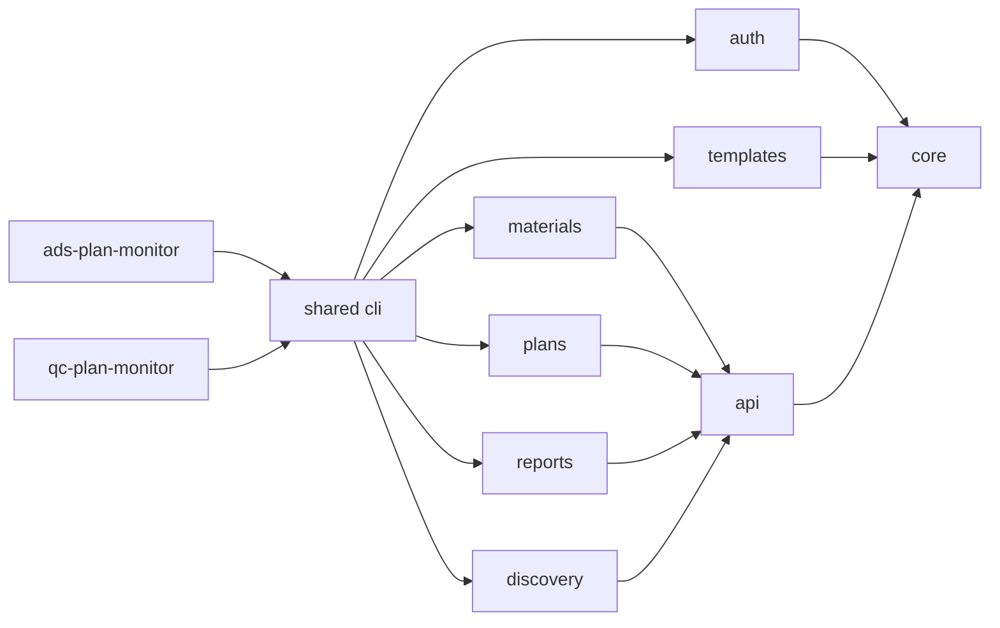
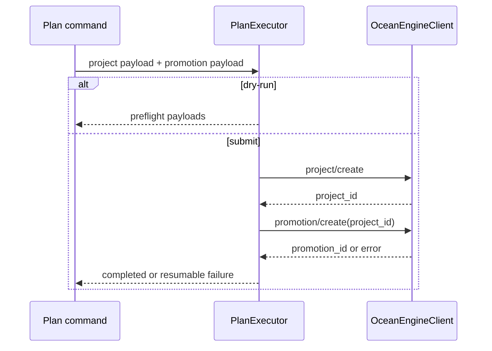

# 架构说明

> Organization: westng
> Project: ocean-watch
> Plugin: ocean-watch
> Skills: ads-plan-monitor, qc-plan-monitor

## 设计原则

1. **一个 Plugin，两个业务 Skill，一个 CLI。** Codex 按渠道路由到独立 Skill，确定性操作通过共享 CLI 执行。
2. **领域边界优先。** 授权、模板、素材、计划、报表各自拥有模型与规则。
3. **基础设施单一实现。** 配置、凭据、HTTP、错误、锁和公共数据工具不能在领域模块复制。
4. **写操作显式。** 创建默认 dry-run，在线提交必须显式 `--submit`。
5. **业务状态外置。** 真实配置、凭据、任务清单、journal 和结果不进入开源仓库。

## 模块依赖

领域模块不能导入 CLI。`core` 不能导入任何业务领域。普通业务网络请求只能由 `api.OceanEngineClient` 发出。

## API Client

`OceanEngineClient` 统一负责：

- 基础 URL 与 endpoint 拼接。
- GET 查询参数的官方 JSON 编码。
- `Access-Token` 与 JSON Header。
- 请求超时。
- HTTP 错误转换。
- 网络错误转换为结构化 `ApiError`。

OAuth Token endpoint 和官方 MCP 使用不同协议适配器，可以直接使用标准库网络，但必须遵守相同脱敏和错误边界。

## 计划创建

`PlanExecutor` 是所有素材来源和批量模式共享的创建事务：

上传素材和达人素材只负责选择、校验并把来源特有字段注入 promotion payload。批量模块只负责并发调度、journal 和汇总，不重复实现项目/单元提交。

千川全域计划不进入上述营销事务。`QianchuanPlanExecutor` 单独调用官方 `/v1.0/qianchuan/uni_aweme/ad/create/`，以 `code: 0` 和 `data.ad_id` 作为成功条件。`qianchuan_creator_accounts` 负责授权达人分页，`query_qianchuan_creator_videos` 负责官方视频查询，`douyin_work_links` 只负责受限短链跳转，`qianchuan_work_materials` 通过“作品归属、模板商品”两阶段查询建立运行时素材集合。

`batch_qianchuan_work_plans` 按数值 `aweme_id` 聚合运行时素材。`QianchuanPlanGateway` 一次读取商品全域计划，再通过详情精确确认达人；已有计划先拉取全部视频素材并按 `aweme_item_id` 去重，只调用素材追加接口。没有计划才走创建接口。不同达人受控并发，同一达人串行；在线提交持有广告主级进程锁。整个流程不保存本地计划映射，因此重试时仍以官方计划和素材状态恢复幂等。

`remove_qianchuan_work_materials` 使用同一短链解析器和广告主级锁，先把 `aweme_item_id` 与计划素材内层 `material_id` 精确对应，再只对 `CUSTOM` 素材调用官方删除端点。写入后必须重新查询 `DELETED` 状态；重复操作幂等，多个不同素材 ID 的歧义匹配不自动选择。

## 模板模型

模板 Schema v3 包含：

- `default_plan_template`：跨业务默认骨架，不可投放。
- `plan_templates`：真实业务模板。
- `bindings`：渠道、广告主、平台、流量来源、商品 ID 与商品名。
- `material_strategy`：`ACCOUNT_UPLOAD` 或 `CREATOR_AUTHORIZED`。
- `overrides`：业务投放参数、链接、追踪链接和官方资产 ID。
- `copy_materials`：标题文案及复制来源。

模板绑定是执行约束。目标渠道或广告主不匹配时，创建在 Token 刷新和 API 调用前停止。

千川商品模板使用独立 Schema v2。`qianchuan_product_templates` 以稳定 `template_id` 存储业务模板，绑定广告主、产品和最多 30 个商品；显示名称以广告主 ID 开头，`default_qianchuan_product_template` 只作为向导骨架。模板只保存投放设置和 `CREATOR_RUNTIME_QUERY` 策略，达人及素材 ID 只能存在于单次创建运行中。

## 授权与凭据

每个渠道拥有独立应用、授权记录和广告主索引。一次 OAuth 授权对应一个本地 authorization record；业务命令根据目标 `advertiser_id` 解析正确 Token。

`auth/channel_adapters.py` 定义渠道授权 URL、Token/账户端点及角色展开规则。营销适配器使用 `account_source=AD`；千川适配器增加店铺角色、`QC_AWEME` 权限和 `account_source=QIANCHUAN`。共享 OAuth 和授权存储层不判断具体业务角色。

所有渠道共用 `http://127.0.0.1:8787/oauth/callback`。OAuth `state` 采用 `<渠道短码>.<随机值>`：巨量营销为 `AD`，巨量千川为 `QC`。回调处理器校验完整 `state` 后再解析渠道，解析结果必须与发起授权的渠道一致，Token 交换和存储使用回调确认后的渠道。

敏感字段保存在操作系统凭据仓库。非敏感授权索引和迁移 journal 位于用户状态目录。配置文件只保存业务设置和公开 endpoint。

Token 交换成功后先保存 `pending_account_sync` 授权，再拉取并校验完整广告主快照。同步成功后原子激活账户索引；失败时保留 Token，允许按本地授权 ID 重试。

## 错误与输出

CLI 边界使用机器可读 JSON。公共异常包含稳定 `code`、用户可读 `message`、可选 `details` 和退出码。领域命令尚未迁移到公共异常的历史结果仍保持结构化 JSON，新增代码应优先使用 `OceanWatchError`。

所有输出必须在打印前脱敏。严禁输出 Secret、Access Token、Refresh Token、授权码或包含用户标识符的完整 MCP URL。

## 测试边界

- 纯模型、校验和 payload 使用单元测试。
- API 事务通过 Fake Client 或显式依赖注入测试。
- CLI 测试验证命令路由、参数透传、JSON 错误和退出码。
- 测试不访问网络、不读取本机凭据、不加载真实业务配置。

新增领域能力时，应先扩展已有服务契约；只有确实存在新职责时才增加模块。
