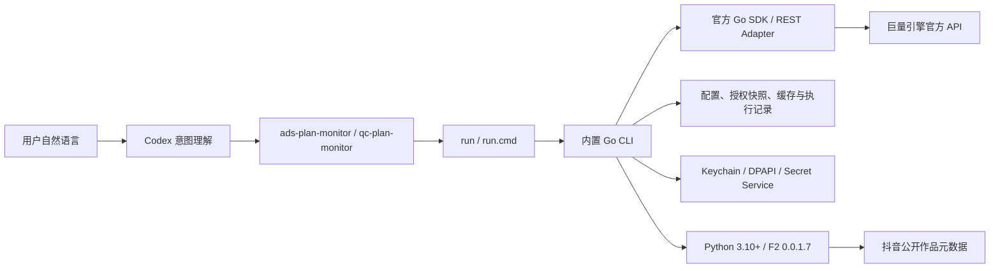

# 架构说明

## 总览

Ocean Watch 是模块化单体。业务命令只有 Go 实现，不存在第二套业务运行时或静默回退。F2 是作品元数据 Adapter 的外部进程依赖，不属于广告业务运行时。

## 当前状态

Go 切换已经完成。生产路由清单只接受 `go`，两个 Skill 也只通过 `run`/`run.cmd` 进入五平台内置二进制。旧 Python 业务实现、Prototype、Shadow、运行时策略文件、MCP 兼容入口和迁移验收资产已从当前分发中删除；历史设计仅保留在 Git 历史和已发布版本记录中，不再作为运行或回退路径。

因此，任何广告业务修复都只进入 `runtime/ocean-watch-go`，不得再增加并行实现。`internal/adapters/python` 的唯一职责是发现 Python 并运行固定 F2；它不能承载授权、账户、模板、计划、报表或官方 API 调用。

## 目录职责

| 路径 | 职责 |
| --- | --- |
| `skills/*/SKILL.md` | 自然语言意图、业务安全边界、强制输出合同 |
| `skills/*/run*` | 按操作系统和架构选择内置二进制 |
| `.codex-plugin/bin/` | Marketplace 快照内的五平台 Go CLI |
| `runtime/ocean-watch-go/cmd/` | CLI 与确定性运行时构建器 |
| `runtime/ocean-watch-go/internal/cli/` | 参数解析、路由、JSON envelope、Presentation |
| `runtime/ocean-watch-go/internal/application/` | OAuth、账户、模板、素材、计划和报表用例 |
| `runtime/ocean-watch-go/internal/domain/` | 领域模型、规则和稳定错误 |
| `runtime/ocean-watch-go/internal/ports/` | 官方 API、状态、凭据和元数据端口 |
| `runtime/ocean-watch-go/internal/adapters/` | 官方 SDK、文件、凭据、浏览器回调、F2 Adapter |
| `runtime/ocean-watch-go/internal/platform/` | 分页、重试、限流、请求计数和写入对账 |
| `f2/resolve.py` | F2 原始响应到稳定作品元数据合同的只读映射 |

生成的官方 SDK 类型只能出现在 `internal/adapters/oceanengine`。Application 与 Domain 依赖端口和稳定 DTO，不直接依赖生成 SDK 或 CLI。

## 请求治理

- 只读请求只对明确临时错误做有界重试；分页失败只重试当前页。
- 分页器拒绝页码倒退、cursor 不前进、总量矛盾和跨页重复 ID。
- Token 刷新按渠道和授权单飞；业务请求严格按广告主解析对应授权。
- 千川同广告主请求跨命令和进程串行，至少间隔 250 ms，并共享官方限流冷却。
- 在线写入默认 dry-run；`--submit` 后如结果不确定，先读回对账，禁止盲目重放。
- 营销项目/单元和千川计划/素材均在成功后检查官方对象 ID 或状态。

## 状态与凭据

配置优先级为显式 `--config`、`ADS_PLAN_MONITOR_CONFIG`、当前 Plugin 仓库的忽略配置、`$CODEX_HOME/ads-plan-monitor/config.json`。授权快照、缓存和执行记录位于 `$CODEX_HOME/ads-plan-monitor/state/`。

营销与千川拥有独立 App、OAuth state、Token 和广告主索引。官方广告主发现只有在完整分页和验证成功后才原子替换当前授权快照；部分或异常结果保留旧快照。

凭据使用 macOS Keychain、Windows DPAPI 或 Linux Secret Service。明文文件只在开发者显式设置 `ADS_PLAN_MONITOR_ALLOW_INSECURE_FILE_FALLBACK=1` 时启用。

## F2 边界

Go 通过 `internal/adapters/workmetadata` 调用 `f2/resolve.py`。该包装层：

- 要求 Python `3.10+` 和 F2 `0.0.1.7`；
- 只查询公开作品信息，不下载媒体、不创建数据库、不自动读取浏览器 Cookie；
- 对一批作品共享只读连接池，设置单作品和整批截止时间，并只重试失败项一次；
- 映射作品 ID、达人 UID、可见抖音号、昵称、视频和首个商品提示；
- 把原始元数据作为诊断数据传回 Go，但不赋予其官方授权证明力。

F2 不可用、超时或数据不完整时，单条作品可使用有效的 30 天身份缓存继续定向官方复核，否则快速跳过该条。任何情况下都不会恢复无条件扫描全部授权达人。

## 输出合同

CLI stdout 只输出一个 UTF-8 JSON 文档。`presentation.required=true` 时，Skill 必须原样使用 `presentation.rendered_markdown` 并保留所有必需列、日期和口径。日志、错误、Presentation 和执行记录不得包含 Secret 或 Token。

## 构建与分发

`cmd/build-runtime` 使用固定 Go 工具链、`CGO_ENABLED=0`、`-trimpath` 与清空 build ID 构建五个平台二进制，并从 Plugin 基础版本注入 CLI 版本。`--all --verify` 在临时位置重建并逐字节对比仓库内产物。

Marketplace 安装直接消费 Git 快照中的 `.codex-plugin/bin/`。Release 工作流不修改文件或回推 `main`，只验证固定提交、测试、重建产物并创建不可变 Tag/Release。
