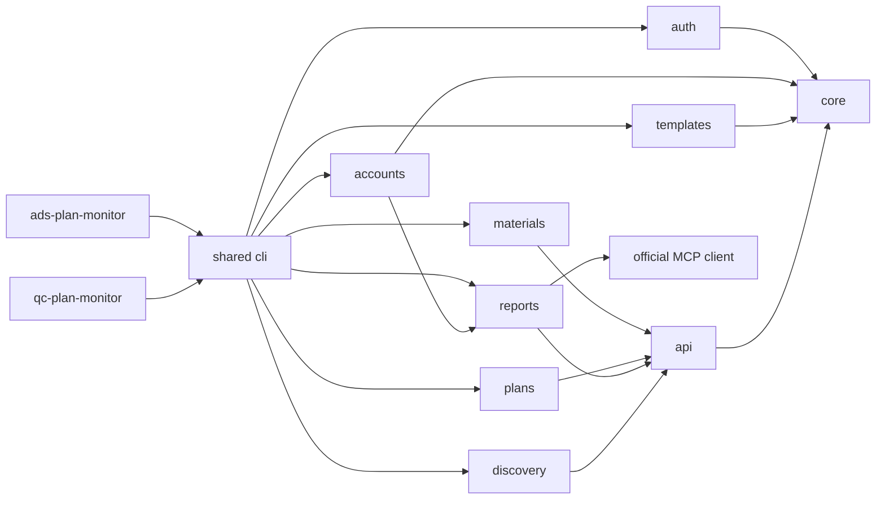
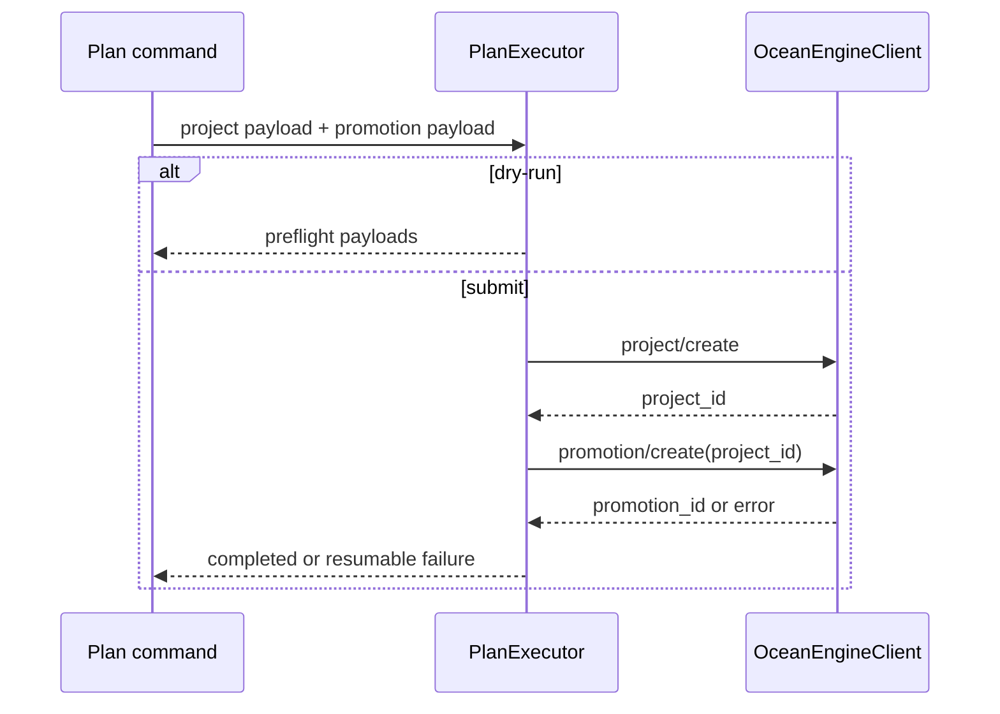

# 架构说明

本文面向贡献者，说明共享运行时的职责和依赖规则。用户操作请从[文档中心](README.md)开始。

## 设计原则

1. **一个 Plugin，两个业务 Skill，一个 CLI。** Codex 按渠道路由到独立 Skill，确定性操作通过共享 CLI 执行。
2. **领域边界优先。** 授权、模板、素材、计划、报表各自拥有模型与规则。
3. **基础设施单一实现。** 配置、凭据、HTTP、错误、锁和公共数据工具不能在领域模块复制。
4. **写操作显式。** 创建默认 dry-run，在线提交必须显式 `--submit`。
5. **业务状态外置。** 真实配置、凭据、任务清单、journal 和结果不进入开源仓库。

## 模块依赖

领域模块不能导入 CLI。`core` 不能导入任何业务领域。普通业务网络请求只能由 `api.OceanEngineClient` 发出。

## API Client

`OceanEngineClient` 统一负责：

- 基础 URL 与 endpoint 拼接。
- GET 查询参数的官方 JSON 编码。
- `Access-Token` 与 JSON Header。
- 请求超时。
- HTTP 错误转换。
- 网络错误转换为结构化 `ApiError`。

OAuth Token endpoint 和官方 MCP 使用不同协议适配器，可以直接使用标准库网络，但必须遵守相同脱敏和错误边界。`StreamableHttpMcpClient` 只负责 JSON-RPC、Streamable HTTP、SSE 兼容解析、`Tool-Range` 和协议错误；业务分页、字段选择、报表数值读取与汇总留在报表服务。

## 负责账户

`accounts/managed_accounts.py` 管理用户主动维护的跨渠道账户簿。它与 OAuth 授权索引、当前账户和模板绑定相互独立，唯一键为 `channel + advertiser_id`；授权同步不能修改账户簿。真实记录只保存在被忽略的项目配置或用户配置中。

`accounts list` 只读取本机启用账户簿，并返回固定的名单展示合同；它不解析 OAuth、不刷新 Token、也不调用官方报表。`query_managed_accounts_report` 仅服务明确的账户表现意图，按配置顺序调度启用账户并受控并发。营销账户读取无维度 `BASIC_DATA` 聚合；千川账户直接读取 `/v1.0/qianchuan/report/uni_promotion/get/` 全域投放账户维度聚合，不经过计划报表或计划列表。总消耗可跨渠道汇总；GMV、订单和 ROI 通过 `metric_basis` 保留渠道官方口径，并在 `channel_summaries` 分渠道聚合，避免把营销应用内成交与千川含券 ROI2 成交误当作完全可比。单账户失败结构化返回但不取消其他任务，官方只读限频可有限重试。

配置更新统一经过文件级进程锁和原子替换；读改写操作在锁内重新读取。交互式模板向导先记录 revision，提交时使用 compare-and-swap，检测到并发修改后返回 `configuration_conflict`，不覆盖另一进程的结果。首次初始化使用锁内 create-if-missing，多个进程同时启动也只会有一个写入模板。

## 千川全域报表

`query_qianchuan_plan_report` 根据目标广告主解析并刷新千川 OAuth Token，再连接官方 `https://open.oceanengine.com/qianchuan/mcp`。Token 只存在于请求 Header 和进程内存，不进入 Plugin 清单、Codex MCP 配置或命令输出。

财务指标只读取 `qianchuan_report_uni_promotion_data_get_v1` 的 `SITE_PROMOTION_PRODUCT_AD` 报表，使用 `ad_id` 维度和官方返回的 `metrics.Value/ValueStr`。`qianchuan_uni_promotion_list_v1` 只补充计划名称、状态、达人、商品、预算和目标 ROI；其 `stats_info` 是内部固定精度表示，不能用于展示或推算金额。报表层分别分页后按 `ad_id` 关联，再计算总消耗和加权 ROI；展示条数不影响汇总口径。

## 计划创建

`PlanExecutor` 是所有素材来源和批量模式共享的创建事务：

上传素材和达人素材只负责选择、校验并把来源特有字段注入 promotion payload。批量模块只负责并发调度、journal 和汇总，不重复实现项目/单元提交。

`marketing_runtime_assets` 是营销创建路径共享的提交前解析层。它先按广告主、商品、落地类型、营销目标和优化目标匹配官方历史项目；模板缺少转化资产时，仅在候选唯一时自动补齐。商品模板使用 `DPA` 主图时，解析层先验证商品库字段；字段不可用时，只能从同广告主、同商品的官方历史单元复用图片和非空品牌 ID。候选不唯一或无可用商品图片时，在 `project/create` 之前阻断，不猜测资产，也不留下只有项目没有单元的孤立记录。解析结果只存在于本次运行内存，不写入 Token、动态素材字段或业务模板。

千川全域计划不进入上述营销事务。`QianchuanPlanExecutor` 单独调用官方 `/v1.0/qianchuan/uni_aweme/ad/create/`，以 `code: 0` 和 `data.ad_id` 作为成功条件。商品全域与直播全域使用独立模板 Schema，再汇入同一官方 payload 校验和执行器；直播模板不保存商品或作品素材字段。`qianchuan_creator_accounts` 负责授权达人分页，`query_qianchuan_creator_videos` 负责官方视频查询。`douyin_work_links` 可从本机配置的可选公开链接解析服务读取作品、达人和商品提示，未配置或失败时回退到受限抖音短链跳转；`qianchuan_work_materials` 仍通过官方“作品归属、模板商品”两阶段查询建立运行时素材集合。

`batch_qianchuan_work_plans` 按数值 `aweme_id` 聚合运行时素材。`QianchuanPlanGateway` 查询执行当天的商品全域计划，再通过详情精确确认达人和商品，用于判断本批次是创建计划还是追加素材；计划列表遇到 `40100`、`51010` 或明确的临时传输错误时在当前页有界退避，候选详情的临时 RPC 超时采用同一只读重试边界，不会重新扫描当天已完成分页。已有计划先拉取全部视频素材并按 `aweme_item_id` 去重，只调用素材追加接口。没有计划才走创建接口。不同达人受控并发，同一达人串行；在线提交持有广告主级进程锁。整个流程不保存本地计划映射，因此重试时仍以官方计划和素材状态恢复幂等。

`qianchuan_work_owner_cache` 只缓存公开作品与达人的数值 ID 映射，不保存 Token、计划结论或商品匹配结论。缓存命中仅用于缩小官方查询候选集；每次预检和提交仍重新验证当前授权、作品和商品。缓存按广告主隔离、30 天过期、原子写入并使用进程锁；故障时安全降级为全量扫描。

公开链接解析结果中的非空商品 ID 只参与前置否决：未命中模板任一商品时直接跳过，命中或为空不能作为可投结论。外部返回的达人身份只作为官方接口的定向查询提示；正式新建或追加前仍需官方确认当前授权、作品归属和模板商品匹配。

`remove_qianchuan_work_materials` 使用同一短链解析器和广告主级锁，先把 `aweme_item_id` 与计划素材内层 `material_id` 精确对应，再只对 `CUSTOM` 素材调用官方删除端点。写入后必须重新查询 `DELETED` 状态；重复操作幂等，多个不同素材 ID 的歧义匹配不自动选择。

## 模板模型

营销模板 Schema v5 包含：

- `default_plan_template`：跨业务默认骨架，不可投放。
- `plan_templates`：真实业务模板。
- `bindings`：渠道、广告主、平台、流量来源、商品 ID 与商品名。
- `material_strategy`：`ACCOUNT_UPLOAD` 或 `CREATOR_AUTHORIZED`。
- `overrides`：业务投放参数、链接、追踪链接和官方资产 ID。
- `copy_materials`：标题文案及复制来源。

模板绑定是执行约束。目标渠道或广告主不匹配时，创建在 Token 刷新和 API 调用前停止。

Schema v4 将现有营销模板迁移到共享命名规则，并同步更新模板键、显示名称和模板间来源引用；发生规范名称碰撞时整次迁移失败，不覆盖任何模板。Schema v5 删除历史 `active_plan_template` 指针，创建计划必须显式选择业务模板。

千川商品模板使用独立 Schema v4。`qianchuan_product_templates` 以稳定 `template_id` 存储业务模板，绑定广告主、产品和最多 30 个商品；显示名称遵循共享的 `渠道-广告账户ID-商品名-商品ID-模版类型` 规则，`default_qianchuan_product_template` 只作为向导骨架。v2 升级只重算显示名称，不改变模板 ID 或业务绑定，v4 删除历史默认业务模板指针。模板只保存投放设置和 `CREATOR_RUNTIME_QUERY` 策略，达人及素材 ID 只能存在于单次创建运行中。

千川直播模板使用独立 Schema v1，绑定广告主、直播账号名称和数值 `aweme_id`。默认骨架采用长期投放、保守出价、预算 5000 和智能选材；模板不保存商品 ID、作品 ID 或手工素材。统一模板查询会同时返回千川商品和直播模板，并以 `template_kind` 明确区分。

`update_plan_settings` 是营销和千川计划参数写入的统一保护层。它按官方 endpoint 构造固定 payload，默认只预演，提交时解析广告主绑定的同渠道 Token、持有广告主级进程锁并检查批量部分失败。千川 `DELETE` 还要求独立确认参数。

## 授权与凭据

每个渠道拥有独立应用、授权记录和广告主索引。一次 OAuth 授权对应一个本地 authorization record；业务命令根据目标 `advertiser_id` 解析正确 Token。

`auth/channel_adapters.py` 定义渠道授权 URL、Token/账户端点及角色展开规则。营销适配器使用 `account_source=AD`；千川适配器增加店铺角色、`QC_AWEME` 权限和 `account_source=QIANCHUAN`。共享 OAuth 和授权存储层不判断具体业务角色。

普通业务 API、OAuth 和两种 MCP 传输只接受巨量官方 HTTPS 主机，默认 opener 禁止重定向，JSON/SSE 响应均有大小上限。错误输出在进入结构化异常前脱敏 Token。抖音短链解析使用单独的官方域名白名单，不与广告 API 客户端共用信任边界。

所有渠道共用 `http://127.0.0.1:8787/oauth/callback`。OAuth `state` 采用 `<渠道短码>.<随机值>`：巨量营销为 `AD`，巨量千川为 `QC`。回调处理器校验完整 `state` 后再解析渠道，解析结果必须与发起授权的渠道一致，Token 交换和存储使用回调确认后的渠道。

敏感字段保存在操作系统凭据仓库。非敏感授权索引和迁移 journal 位于用户状态目录。配置文件只保存业务设置和公开 endpoint。

Token 交换成功后先保存 `pending_account_sync` 授权，再拉取并校验完整广告主快照。同步成功后原子激活账户索引；失败时保留 Token，允许按本地授权 ID 重试。

## 错误与输出

CLI 边界使用机器可读 JSON。公共异常包含稳定 `code`、用户可读 `message`、可选 `details` 和退出码。领域命令尚未迁移到公共异常的历史结果仍保持结构化 JSON，新增代码应优先使用 `OceanWatchError`。

所有输出必须在打印前脱敏。严禁输出 Secret、Access Token、Refresh Token、授权码或包含用户标识符的完整 MCP URL。

## 测试边界

- 纯模型、校验和 payload 使用单元测试。
- API 事务通过 Fake Client 或显式依赖注入测试。
- CLI 测试验证命令路由、参数透传、JSON 错误和退出码。
- 测试不访问网络、不读取本机凭据、不加载真实业务配置。

新增领域能力时，应先扩展已有服务契约；只有确实存在新职责时才增加模块。
