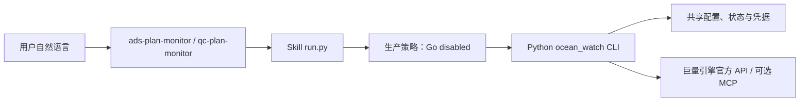
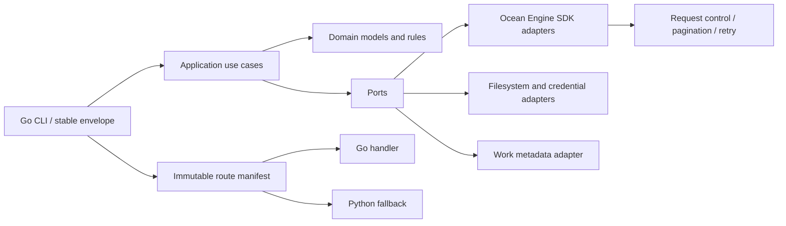

# 架构说明

本文是 Ocean Watch 当前架构的正式说明，面向贡献者和发布维护者。用户操作请从[文档中心](README.md)开始；逐命令迁移证据见[Go SDK 迁移矩阵](go-sdk-migration-matrix.md)。

## 当前状态

截至 2026-07-28，仓库处于“双运行时、单生产路径”的迁移状态：

| 范围 | 当前事实 |
| --- | --- |
| 用户安装态 | Plugin 仍要求 Python 3.9+；两个 Skill 的 `run.py` 继续是稳定入口 |
| 生产命令路由 | `.codex-plugin/runtime-policy.json` 保持 `enabled: false`，全部命令走 Python |
| Go 候选 | `prototype/ocean-watch-go` 已实现模块化单体、官方 SDK Adapter、合同运行器及 P1–P4 大部分 Shadow 业务路径 |
| 本地开发路由 | Go 候选的默认 manifest 只启用已接入的本地命令；网络和写入路径通过测试专用 manifest 做 Shadow 验证 |
| 发布装配 | `prototype/runtime-bootstrap`、五平台候选构建、签名、证据汇总和 seal 自动化已实现 |
| 未完成 Gate | 当前远端 CI 失败；真实只读/写 canary、受保护环境、独立签字、五平台 Marketplace 验收和分批观察尚未完成 |

“实现为 Shadow”只表示 Go 路径已在隔离候选中通过相应自动化合同，不表示生产启用，也不等于 Gate 已签字。生产路由只有在 G1–G5 的证据和审批全部满足后才能改变。

## 设计原则

1. **一个 Plugin，两个业务 Skill，一个稳定 CLI 合同。** Skill 理解自然语言，确定性运行时负责参数、状态、API 和输出。
2. **生产路由与实现完成度分离。** Go 代码可以先完成 Shadow 验证，生产仍安全地保持 Python。
3. **领域和端口优先。** CLI、Application、Domain、Port、Adapter 分层；官方 SDK 类型不能进入业务层。
4. **基础设施单一实现。** 配置、凭据、Token、分页、重试、限流、锁、脱敏和输出合同集中维护。
5. **写操作显式且可对账。** 默认 dry-run；只有 `--submit` 才写入，未知写结果禁止盲目重放。
6. **状态原地兼容。** Python 与 Go 读取同一配置和授权状态，并遵守相同锁与原子替换协议。
7. **发布身份不可拆分。** 源码、Plugin、Go 运行时、bootstrap、证据、签字、seal 和 Tag 必须绑定同一候选身份。

现有 `setup/auth/accounts/templates/...` 命令组和历史混合的 `plans` namespace 只属于兼容 CLI 合同，不是领域模块划分。新 Go 代码按 Application、Domain、Port、Adapter 以及 Marketing/Qianchuan 业务边界组织；兼容命令映射由 CLI 层完成，不能反向污染领域依赖。

## 运行时拓扑

### 当前生产路径

生产安装不执行 `prototype/` 中的开发候选，也不会根据本地环境自行切换到 Go。

### 隔离 Go 候选

Go 候选是本地模块化单体，不拆微服务。Application 只依赖 Domain 和 Port；Adapter 实现 Port；CLI 负责解析、路由和稳定 JSON envelope，不承载业务判断。

## 仓库结构与职责

| 路径 | 职责 | 当前使用边界 |
| --- | --- | --- |
| `skills/ads-plan-monitor/src/ocean_watch/` | 现行 Python 业务运行时 | 生产默认 |
| `skills/*/SKILL.md` | 自然语言意图、调用约束和展示要求 | 生产默认 |
| `prototype/ocean-watch-go/cmd/ocean-watch/` | Go 候选 CLI | 隔离开发与候选构建 |
| `prototype/ocean-watch-go/internal/domain/` | 稳定领域模型、错误、Presentation | 不依赖 SDK/CLI |
| `prototype/ocean-watch-go/internal/application/` | 用例、事务、Token 生命周期和路由 | 只依赖 Port |
| `prototype/ocean-watch-go/internal/ports/` | 营销、千川、报表和作品元数据端口 | Adapter 合同边界 |
| `prototype/ocean-watch-go/internal/adapters/` | 官方 SDK、文件、凭据、浏览器和 Python fallback | 基础设施边界 |
| `prototype/ocean-watch-go/internal/platform/` | 分页、重试、限流和请求预算 | 所有 Go 网络路径共用 |
| `prototype/runtime-bootstrap/` | 签名 manifest 与平台运行时校验、缓存、执行 | P5 候选，生产未启用 |
| `contracts/` | 命令、输出、Presentation、阶段和 Gate 的机器合同 | 验收事实源 |
| `scripts/acceptance/` | P0–P5 证据生成和验证 | 本地与 CI |
| `scripts/release/` | 候选构建、seal 和发布校验 | 受保护发布链 |

`prototype/` 是迁移早期保留下来的历史目录名，不再表示“可行性原型”。为避免迁移期间同时改 Go module/import 路径而暂不重命名；目录中的实现仍然只是隔离 Shadow 候选，是否可发布只由阶段状态、生产路由和 Gate 证据决定。

## 命令路由模型

路由状态必须区分三层：

1. **组件状态**：领域服务、Adapter 或安全组件是否已经实现。
2. **候选命令状态**：Go CLI handler 是否已接入，并能在 Shadow manifest 下执行完整命令合同。
3. **生产路由状态**：签名发布 manifest 是否允许用户安装态执行 Go。

当前 `ProductionRouteManifest` 把全部命令固定到 Python。开发候选的 `DefaultRouteManifest` 只将本地 setup、账户簿、运行记录、模板和授权迁移命令接入 Go；其他已实现的网络或写入路径通过测试构造显式 Shadow manifest 验证，不会因为测试通过而自动进入默认路由。

例如，Go 中已经存在 OAuth Client、Token 单飞刷新、凭据和广告主快照组件，但 `auth authorize/status/refresh/sync-accounts/mappings` 尚未接入 Go CLI handler，因此这些命令的迁移状态仍不是完整 Shadow。`qc-materials inspect-work` 同样保留 Python，因为 Go handler 尚未实现。`mcp configure/status/capabilities` 是兼容诊断面，业务数据路径迁到 SDK 后仍可保留 Python，不得作为 SDK 失败时的静默业务回退。

## 官方 SDK 防腐层

Go 候选固定使用 `github.com/oceanengine/ad_open_sdk_go` `v1.1.92`。生成 SDK 只能出现在 `internal/adapters/oceanengine`：

1. Adapter 校验领域输入并构造生成 request/model。
2. Client Factory 选择编译期官方 host profile，并按请求注入 Access Token。
3. Envelope Guard 同时检查 HTTP 和官方业务 `code`。
4. Adapter 将生成 response 映射为稳定领域 DTO。

Application、Domain、CLI 和 Skill 不得导入 SDK 类型，也不得使用通用 `Call(path, map)` 绕过 Adapter。官方 ID 在输出和关联键中保持十进制字符串；只有生成请求明确需要数值时才做带溢出检查的转换。

SDK 日志中间件永久关闭，Client 不长期保存 Token，不允许运行时修改 host 或追加全局默认 Header。普通业务只访问编译期官方 HTTPS allowlist；重定向、响应上限和错误脱敏由统一 Transport 控制。

## 请求治理

### 分页、重试与限流

- 只读请求只对明确临时错误重试：`40100`、`51010`、HTTP `429/502/503/504` 以及可识别的临时传输或 RPC 超时。
- 默认最多三次尝试；失败页只重试当前 page/cursor，不从第 1 页重扫。
- 分页器检测页码倒退、cursor 不前进、声明总数矛盾和跨页重复 ID。
- 请求预算统计所有真实 HTTP 尝试，包括重试；本地命令预算为零，不能触达 SDK Transport。
- 读限流按 `channel + authorization_id + endpoint family` 隔离；写入按 `channel + advertiser_id` 串行。
- Token 刷新按 `channel + authorization_id` 单飞，等待者复用刷新结果。

### 写入与对账

创建、追加、更新和删除默认 dry-run。在线写入必须显式 `--submit`；千川删除还要求 `--confirm-delete`。写请求一旦可能送达官方端点，超时或断连会进入 `applied / not_applied / ambiguous` 对账，禁止通用重试器直接重放。

营销项目和单元使用共享事务执行器及 journal 续建。千川计划创建只在 `code=0` 且存在 `ad_id` 时成功；未知结果通过执行当天计划列表和详情确认达人 + 商品。追加与删除必须回读官方素材状态。

## 状态、凭据与授权

Python 和 Go 使用相同的配置优先级、`$CODEX_HOME/ads-plan-monitor` 状态根、凭据 service/account 命名、文件锁粒度和原子替换协议。读取旧状态不得隐式改写或删除未知字段。

每个渠道拥有独立 App、授权记录、Token 和广告主快照。OAuth callback 校验完整 `state` 后确定渠道；Token 成功交换后先保存 pending 授权，只有全部广告主角色和分页成功才原子激活新快照。任何分页失败都保留旧快照，不能用部分账户覆盖。

App Secret、Access Token、Refresh Token 和可选 MCP Developer ID 只进入操作系统凭据后端。配置、日志、Presentation、journal、证据和错误详情不得包含这些值或动态 MCP URL。

## 关键业务数据路径

### 负责账户

`managed_accounts` 是用户主动维护的本地账户簿，不是全部 OAuth 授权账户。“我负责的账户”“我常用的账户”等名单意图执行 `accounts list`，零网络、零 Token 刷新；消耗、GMV、ROI、订单或日期表现才执行 `accounts report`。

营销账户表现使用账户级 `BASIC_DATA` 聚合。千川账户表现直接调用 `/v1.0/qianchuan/report/uni_promotion/get/`，不得扫描计划列表。单账户失败不取消其他账户；跨渠道只合计可比较的消耗，GMV/ROI 保留渠道口径。

### 千川计划报表

财务指标来自 `/v1.0/qianchuan/report/uni_promotion/data/get/`；计划列表只补充名称、状态、达人、商品、预算和目标 ROI，其 `stats_info` 不能作为金额。Go Shadow 使用 SDK REST；Python 生产路径在迁移期维持兼容实现和对比证据。

### 千川批量创建

批量判重只扫描执行当天的商品全域计划，逐页完成并仅在当前页退避；候选详情确认达人 + 商品。已有计划只追加缺失素材，没有计划才创建。禁止扩大为 180 天历史扫描。

成功明细的强制列为：`计划ID｜达人昵称｜商品ID｜素材ID｜素材标题`。跳过、失败和诊断信息只能放在表外，不能替换这五列。

## Presentation 合同

CLI stdout 只输出一个 UTF-8 JSON 文档。需要强制对话展示的结果包含版本化 `presentation`：列定义、行、必要说明和 `rendered_markdown`。

`presentation.required=true` 时，Skill 必须保留完整语义和所有必需列，不能自行简化。静态 Skill 文本、确定性合同测试和 model-in-the-loop 语义评测分别验证：

- 自然语言是否选择正确命令，而不是要求用户说固定句式。
- CLI 是否调用正确数据源并保留分页、日期和指标口径。
- 最终回答是否遵守强制展示合同。

## 构建、发布与回滚

P5 自动化为 macOS arm64/amd64、Linux arm64/amd64 和 Windows amd64 构建 Go 运行时与 native bootstrap。正式候选还必须包含 checksum、Ed25519 签名、SBOM、provenance 和不可变候选身份。

普通 CI 使用公开 RFC 8032 测试向量，只能生成非发布候选。正式发布需要受保护信任根、六类不同成功证据 run、六角色独立签字和 seal；Tag workflow 只能发布 seal 中既有资产，不能重建候选。

生产启用前必须同时满足：

1. 当前候选 CI 全绿且五平台原生消费证据有效。
2. 真实只读和受控写 canary 完成。
3. Marketplace 安装、升级、离线缓存和前版本回滚通过。
4. G1–G5 Owner 签字和受保护环境配置完成。
5. 发布 manifest 将获批命令从 Python 改为 Go。

回滚只改变运行时路由，不转换或回滚用户状态。Go 全量稳定两个正式版本后，才能通过独立 ADR 讨论删除 Python 业务实现。

## 状态与证据来源

不要从目录名、代码量或一次本地测试推断迁移完成度：

| 问题 | 事实源 |
| --- | --- |
| 当前生产是否启用 Go | `.codex-plugin/runtime-policy.json` 与发布 manifest |
| 某命令是否有 Go Shadow | `docs/go-sdk-migration-matrix.md` 与对应 Go CLI/测试 |
| P0–P5 自动化和阻断项 | `contracts/p0-status.yaml` 至 `contracts/p5-status.yaml` |
| 验收定义 | `contracts/README.md` 与 `contracts/acceptance/` |
| 正式候选身份 | 候选中的 `candidate-identity.json`、`checksums.json` 与 seal |
| 发布是否成立 | 受保护 workflow 证据、签字、seal、Tag 和 Release |

阶段状态文件是完成度、阻断项和 Gate 证据的权威来源。更新时必须写明 `as_of`、候选提交、证据范围和仍未完成的外部 Gate。

## 测试边界

- Python 回归继续验证当前生产行为。
- Go 单元、race、vet、staticcheck、govulncheck 和 gosec 验证候选实现。
- Contract runner 使用合成 fixture 对比 Python/Go 的 stdout、stderr、退出码、Presentation 和文件副作用。
- 请求预算测试验证零网络本地命令、页级重试、限流隔离和批量调用上限。
- 测试不得读取真实凭据或调用真实业务 API；真实 canary 必须使用独立审批和受保护证据流程。
- 本地通过不代替远端多平台 CI；失败的 workflow 不能作为 Gate 证据。

新增能力时先扩展领域 Port 和机器合同；只有出现真正的新职责时才增加模块。任何生产切流、发布或真实写 canary 都必须单独获得相应 Gate 授权。
