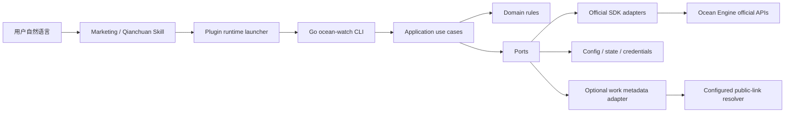

# Go SDK 目标架构

本文定义 Ocean Watch 从 Python 运行时迁移到巨量引擎官方 Go SDK 的批准目标态。它是实施约束，不描述当前已落地能力；当前实现仍以[架构说明](architecture.md)为准，执行顺序见[实施任务书](go-sdk-execution-plan.md)，逐项验收见[验收计划](go-sdk-acceptance-plan.md)。

## 1. 文档状态

| 属性 | 值 |
| --- | --- |
| 状态 | 已批准实施基线，代码尚未迁移 |
| 适用范围 | Plugin、两个 Skill 共用的本地 CLI 运行时 |
| 目标形态 | Go 本地模块化单体，不拆微服务 |
| SDK | `github.com/oceanengine/ad_open_sdk_go` `v1.1.92` |
| SDK 来源 | `https://github.com/oceanengine/ad_open_sdk_go` |
| SDK 提交 | `3b0bab7648f8e94fba1fd8bcfb96c43539b95c28` |
| 核验日期 | 2026-07-23 |
| Go 基线 | Go 1.26.5；SDK 自身最低声明 Go 1.18 |
| 决策责任人 | Maintainer + Architecture Owner |
| 变更方式 | 修改本文件并新增 ADR；不得在实现 PR 中隐式改变 |

官方 SDK 的版本、提交、许可证、生成服务和构建结果必须记录在依赖清单中。SDK 升级属于受控变更，必须重新运行完整合同、韧性和安全验收，不能由依赖机器人直接合并。

## 2. 目标与非目标

### 2.1 目标

1. 使用官方生成模型和服务替代散落的手写请求，降低字段漂移与接口升级成本。
2. 保持现有 CLI、JSON、退出码、dry-run、写入确认和对话展示合同不变。
3. 将 SDK 限制在 Adapter 防腐层，使领域规则、Skill 和测试不依赖 24 万行左右的生成类型。
4. 统一超时、限流、分页、重试、Token 刷新、未知写入结果对账和敏感信息脱敏。
5. 由 Plugin 固定并选择平台运行时；用户不需要安装 Go、Python 包或理解 SDK。
6. 支持 Python 与 Go 在迁移期按命令切换、可观测对比和一键回滚，避免大爆炸替换。

### 2.2 非目标

- 不改变用户自然语言表达方式；意图识别仍由 Skill 负责。
- 不把 Skill 写成固定句式匹配器，也不把领域判断搬到提示词。
- 不拆分远程服务，不引入数据库、消息队列或常驻守护进程。
- 不借迁移修改模板 Schema、报表指标口径、默认日期或固定表格列。
- 不把官方 SDK 响应直接作为 CLI JSON，也不在业务层暴露 SDK 枚举和指针类型。
- 不在本阶段删除现有 MCP 诊断命令；业务数据路径迁移后另行决定其生命周期。

## 3. 冻结的兼容合同

以下合同是迁移硬门禁。除非单独批准破坏性版本，否则任何 Go 实现都必须与当前 Python 实现兼容。

| 合同 | 强制要求 |
| --- | --- |
| 命令入口 | 保留 `ocean-watch`、两个 Skill 的 `run.py` 入口、完整命令树、参数名、默认值和 `--help` 语义 |
| 安装前置 | 兼容期保留当前 Python 3.9+ 解释器要求；用户无需安装 Go 工具链、官方 SDK 或 Ocean Watch Python 包。取消解释器前置需要独立 launcher ADR 和全平台安装验收 |
| 退出码 | 成功 `0`；业务/API/部分失败沿用 `1`；配置和输入冲突沿用 `2`；中断 `130` |
| 标准输出 | stdout 只输出一个 UTF-8 JSON 文档；诊断写 stderr；不得混入 SDK 日志 |
| 写入保护 | 创建、更新、删除默认 dry-run；仅显式 `--submit` 写入；千川删除继续要求 `--confirm-delete` |
| 输出文件 | 只有显式 `--out` 才写用户结果文件；内部状态仅限既有受控目录 |
| 名单意图 | “我常用的账户”“我负责的账户”“我管的户”等执行 `accounts list`，只读本地账户簿，不刷新 Token、不调用报表 |
| 名单展示 | `presentation.required=true`，固定四列：渠道、账户名称、广告主 ID、启用状态 |
| 账户表现 | `accounts report`；营销调用账户聚合报表，千川只调用 `/v1.0/qianchuan/report/uni_promotion/get/`，不得扫描计划列表 |
| 强制展示 | 任何 `presentation.required=true` 的结果都必须让 Skill 原样输出 `presentation.rendered_markdown` |
| 千川批量完成 | 固定五列且顺序不变：`计划ID｜达人昵称｜商品ID｜素材ID｜素材标题`；跳过和失败详情放表外 |
| 千川批量判重 | 计划列表 `start_time`、`end_time` 为执行当天；完成当日全部分页后只对候选调用详情确认“达人 + 商品”，不得扫描 180 天 |
| 分页失败 | 只重试失败的当前页；不得从第 1 页重扫；账户同步失败不得覆盖上次成功快照 |
| 未知写入结果 | 请求可能已到达官方服务时不得盲重试；必须查询官方状态对账，再决定完成、续建或人工处理 |
| 渠道隔离 | 营销与千川使用独立 App、授权记录、Token 映射和官方 host profile，禁止跨渠道回退凭据 |
| 本地状态 | 继续读取当前配置、授权索引、账户簿、模板、缓存和 journal；迁移不能要求用户重新授权或重建模板 |

冻结合同的机器可执行清单由 `P0-02` 生成，逐项来源见[迁移矩阵](go-sdk-migration-matrix.md)。

## 4. 已核验的 SDK 事实与补偿措施

| SDK 事实 | 工程风险 | 目标态补偿 |
| --- | --- | --- |
| 当前使用的官方 OpenAPI 均有生成 Service | 直接散用会让领域层耦合生成代码 | 每个 endpoint 只能由对应 Adapter 调用；当前 endpoint 不使用 `CommonApi` |
| 支持 `context.Context` | 未设置 deadline 仍可无限等待 | CLI 根 context、用例 deadline、`http.Client.Timeout` 三层同时设置 |
| 支持自定义 `http.Client` 和 Middleware | 运行时改配置可能出现数据竞争 | Client 按 host profile 初始化后不可变，只复用不修改 |
| HTTP 200 且响应 `code != 0` 不会自动成为 Go error | 业务失败可能被误判为成功 | Adapter 的 `EnvelopeGuard` 同时检查 HTTP、SDK error、业务 `code` 和必需数据 |
| 默认 `http.DefaultClient` 无总超时 | 网络故障可能挂死进程 | 禁止默认 Client；使用统一 Transport 和总超时 |
| 日志 Middleware 可 dump Header 与 Body | Token、请求体和响应体可能泄漏 | `UseLogMw=false`、`LogEnable=false`；CI 检查禁止 `SetLogEnable(true)` |
| 上游没有 `_test.go`，`go test ./...` 会受 examples 多个 `main` 影响 | 不能把上游全仓测试当质量证明 | 只校验 pin、许可证和可导入核心包；质量责任由本仓库 Adapter 合同测试承担 |
| 生成代码规模大且字段多为可选指针 | 空值、默认值和枚举易泄漏到业务层 | Adapter 显式完成 SDK DTO 与领域 DTO 的双向映射，领域层使用值对象 |

当前基线验证命令为：

```bash
go test . ./api ./config ./middleware ./models
```

该命令只证明固定 SDK 核心包可编译，不替代 Ocean Watch 的验收。

## 5. 系统上下文



Skill 不调用 SDK、不拼官方 payload、不自行分页，也不从 JSON 自选展示列。Skill 只负责：

- 理解口语、简称、错别字和上下文中的业务意图。
- 选择稳定 CLI 命令及参数。
- 在写入前获取用户明确授权。
- 遵守 `presentation`、安全和失败处理合同。

Plugin 负责：

- 固定 Ocean Watch 版本与目标平台二进制。
- 选择并启动正确的运行时。
- 校验下载产物的摘要和签名。
- 提供迁移期 Python 回退和发布回滚，不把选择责任交给普通用户。

兼容期的 `run.py` 是只使用 Python 标准库的入口，不再承载业务实现或签名算法。它选择随 Plugin 分发的当前平台 Go bootstrap；bootstrap 负责验证签名、下载和缓存 Go 运行时。Python 仍可作为路由清单明确选择的业务回退，因此迁移期间用户不必安装 Go、SDK 或项目 wheel。若后续要做到“机器上完全没有 Python 也能首次启动”，必须先通过独立 ADR 扩展平台 bootstrap 分发合同。

## 6. 模块化单体目录

目标目录在 `P1-01` 创建：

```text
cmd/
  ocean-watch/                 # 唯一生产 CLI main
  contract-runner/             # 合同回放与差异报告
internal/
  cli/                         # 命令树、参数绑定、退出码、stdout/stderr
  application/
    auth/ accounts/ templates/ materials/ plans/ reports/ discovery/
  domain/
    auth/ accounts/ templates/ materials/ plans/ reports/
  ports/                       # 官方 API、凭据、状态、时钟、锁、浏览器等接口
  adapters/
    oceanengine/
      sdkclient/               # SDK 初始化、host profile、middleware、envelope guard
      oauth/ marketing/ qianchuan/
    credentials/ filesystem/ browser/ workmetadata/ mcp/
  platform/
    config/ state/ lock/ retry/ pagination/ observability/ redaction/
  presentation/                # JSON envelope 与固定 Markdown 渲染
contracts/                     # 版本化 JSON Schema、命令清单、展示合同
testdata/
  contracts/ oceanengine/ state/
packaging/
  launchers/ checksums/         # Plugin 运行时选择与供应链元数据
```

### 6.1 依赖方向

```text
cmd -> cli -> application -> domain
                     |          ^
                     v          |
                   ports -------+
                     ^
                     |
                  adapters -> official SDK
```

强制规则：

1. `domain` 只能依赖 Go 标准库和同领域值对象。
2. `application` 可依赖 `domain` 与 `ports`，不得导入官方 SDK。
3. `cli` 不包含业务判断，只做参数、调用、输出和退出码映射。
4. `adapters/oceanengine` 是唯一允许导入 `github.com/oceanengine/ad_open_sdk_go` 的目录。
5. 生成 SDK 模型不得出现在 Port 方法签名、领域事件、状态文件或 CLI JSON 中。
6. Marketing Adapter 不得读取 Qianchuan credential handle，反之亦然。
7. CI 使用 import-boundary 测试阻止越层依赖。

### 6.2 用例边界

每个命令映射一个 Application 用例。用例接收领域输入，依赖最小 Port，并返回稳定结果模型。例如：

```go
type ManagedAccountReporter interface {
    Report(ctx context.Context, query AccountReportQuery) (AccountReport, error)
}

type QianchuanPlanReader interface {
    ListCurrentDay(ctx context.Context, query PlanListQuery) (PlanPage, error)
    Detail(ctx context.Context, advertiserID, adID string) (PlanDetail, error)
}
```

接口示例只表达边界。最终命名可以在 `P1-01` 调整，但不得合并账户聚合报表与计划列表，也不得以一个通用 `Call(path, map)` 绕开领域 Port。

## 7. SDK 防腐层

### 7.1 Client 生命周期

`SDKClientFactory` 按下列不可变键缓存 Client：

```text
channel + official host profile + timeout profile
```

Access Token 不写入共享 Configuration，也不作为默认 Header 长期保存。每次请求通过 context 或生成请求的 `AccessToken` setter 注入，从而避免授权之间串 Token。初始化完成后禁止调用 `SetHost`、`AddDefaultHeader`、`SetLogEnable` 或直接修改 `ApiClient.Cfg`。

固定安全配置：

- `UseLogMw=false`。
- `LogEnable=false`。
- `HTTPClient` 必须来自 Ocean Watch Transport Factory。
- host 只能取编译期官方 allowlist profile，不能由普通配置覆盖。
- 禁止自动跟随重定向。
- 单响应默认上限 8 MiB；需要更大响应的 endpoint 必须单独 ADR。

固定 host profile：

| Profile | SDK `Host` | 适用 Service |
| --- | --- | --- |
| `official-business` | `api.oceanengine.com` | 除下列例外外的营销与千川业务、报表和账户角色展开 Service |
| `official-oauth` | `ad.oceanengine.com` | `Oauth2AccessTokenApiService`、`Oauth2RefreshTokenApiService`、`Oauth2AdvertiserGetApiService` |
| `official-agent` | `ad.oceanengine.com` | `AgentAdvertiserSelectV2ApiService` |
| `official-qianchuan-video` | `ad.oceanengine.com` | `QianchuanFileVideoAwemeGetV10ApiService` |

Factory 必须显式选择 profile，不能依赖 SDK 当前默认 `api.oceanengine.com`。同一业务用例可以同时持有不同 profile 的不可变 Client，但 Token 仍按请求注入；endpoint、Service、HTTP 方法和 host 四元组由 Adapter 合同测试锁定。

### 7.2 DTO 映射

每个 Adapter 明确包含四步：

1. 校验领域输入并构造 SDK request/model。
2. 调用唯一生成 Service。
3. 通过 `EnvelopeGuard` 判断传输和业务成功。
4. 将 SDK response 映射为稳定领域 DTO。

必须保留官方 ID 的十进制字符串表示。只有 SDK request 明确要求数值时，Adapter 才做带溢出检查的 `int64` 转换；输出、状态和关联键仍使用字符串，避免 JavaScript 或 JSON 消费端精度丢失。

### 7.3 错误规范化

统一错误结构保持现有 CLI 形状：

```json
{
  "ok": false,
  "error": {
    "code": "api_error",
    "message": "Ocean Engine API request failed",
    "details": {}
  }
}
```

内部错误分类至少包括：

| 分类 | 示例 | 默认退出码 | 是否可重试 |
| --- | --- | --- | --- |
| `validation` | 参数、模板或 payload 不合法 | `2` | 否 |
| `configuration` | 渠道未配置、映射冲突 | `2` | 否 |
| `authentication` | Token 无效且刷新失败 | `1` | 仅通过一次受控刷新 |
| `rate_limit` | `40100`、HTTP `429` | `1` | 仅满足读策略时 |
| `transient` | `51010`、明确 RPC/传输超时 | `1` | 仅满足读策略时 |
| `business` | HTTP 200 且官方 `code != 0` | `1` | 按错误白名单，默认否 |
| `unknown_write` | 写请求结果未知 | `1` | 禁止重放，必须对账 |
| `interrupted` | SIGINT / context canceled | `130` | 否 |

`details` 只保留安全诊断字段：渠道、endpoint 代号、官方错误码、HTTP 状态、attempt、page/cursor 和 request correlation ID。不得包含 Token、Secret、auth code、完整请求/响应、素材链接或动态 MCP URL。

### 7.4 `CommonApi` 使用规则

迁移矩阵中的当前 endpoint 全部使用生成 Service。只有同时满足下列条件才可临时使用 `CommonApi`：

1. 官方文档已发布 endpoint，而固定 SDK 尚未生成。
2. 有独立 ADR、官方文档链接、Owner 和移除期限。
3. 请求/响应由本仓库 DTO 严格校验，不传任意 map 到领域层。
4. 通过与生成 Service 相同的 host、超时、脱敏、业务 code 和合同测试。

## 8. 韧性与流量治理

### 8.1 超时

| 层级 | 默认值 | 说明 |
| --- | --- | --- |
| TCP connect | 5 秒 | 每次连接 |
| TLS handshake | 5 秒 | 每次连接 |
| response header | 15 秒 | 防止服务端无响应 |
| 单次 HTTP 总超时 | 30 秒 | 包含读取响应 |
| 单个只读页 deadline | 45 秒 | 包含本页重试等待 |
| 单个写请求 deadline | 45 秒 | 超时后进入未知结果对账 |
| CLI 根 context | 由用例预算决定 | 中断时取消所有派生请求 |

这些值先作为编译期 profile；只有经压测和 ADR 才能调整。用户配置不得关闭超时。

### 8.2 重试分类

默认读策略为最多三次尝试，即首次请求加两次重试；退避为 1 秒、2 秒并加入不超过 20% jitter。若官方返回 `Retry-After`，使用其值但单次等待不超过 30 秒。

只读请求仅在下列情况重试：

- 官方业务码 `40100` 或 `51010`。
- HTTP `429`、`502`、`503`、`504`。
- 明确可重试的连接重置、临时 DNS、context 内的传输超时或 RPC timeout。

不重试参数、权限、素材、账户状态等确定性业务失败。写请求在调用 SDK 后不自动重试；即使客户端收到超时，也先进入对账流程。

### 8.3 分页状态机

分页器是 Application/Platform 能力，不使用 SDK 内隐循环。状态至少包含：

```text
endpoint + stable query fingerprint + page/cursor + accumulated identity set
```

规则：

1. 一次只请求一页，并先验证官方分页元数据。
2. 当前页失败时重试同一 page/cursor，不清空已完成页。
3. 检测页码倒退、cursor 不前进、声明总数矛盾和跨页重复唯一键。
4. 汇总基于完整分页结果；`--top` 只影响展示。
5. 账户授权同步只在所有角色和页成功后原子替换快照；任一页失败保留旧快照。
6. 千川批量计划扫描固定执行当天，完成当天全部声明页，不设置任意计划数截断。

### 8.4 限流与并发

- 读限流器按 `channel + authorization_id + endpoint family` 隔离，避免一个授权拖垮其他授权。
- 同一授权默认最多 4 个普通读请求并发；千川作品解析沿用业务上限 8、硬上限 10。
- 写入按 `channel + advertiser_id` 串行并继续持有跨进程文件锁。
- Token 刷新按 `channel + authorization_id` 单飞，等待者复用刷新结果。
- 限流器参数由代码 profile 管理并可观测，不从 Skill 提示词或用户句式推导。

### 8.5 写入幂等与对账

| 操作 | 成功判据 | 结果未知后的动作 |
| --- | --- | --- |
| 营销项目创建 | `code=0` 且有 `project_id` | 以本次稳定业务键查询项目；唯一匹配则续建，否则停止 |
| 营销单元创建 | `code=0` 且有 `promotion_id` | 以已知项目和稳定业务键查询单元；唯一匹配则完成，否则停止 |
| 千川计划创建 | `code=0` 且有 `ad_id` | 查询执行当天计划并用详情确认达人 + 商品；不得直接重发 |
| 千川追加素材 | 写成功且重新查询能看到目标作品 | 查询计划素材，补充仍缺失的素材 ID |
| 千川删除素材 | 写成功且重新查询状态为 `DELETED` | 查询素材状态；已删除视为幂等，否则停止 |
| 状态/预算/ROI 更新 | 每个结果行成功且回读符合目标 | 回读当前值；只对明确未应用项重新取得用户确认 |

对账结论必须是 `applied`、`not_applied` 或 `ambiguous`。只有 `not_applied` 且用户原有写授权仍在当前命令生命周期内时，才允许业务用例决定是否重试；`ambiguous` 必须停止并输出可操作信息。

## 9. 授权、状态与并发一致性

### 9.1 状态兼容

Go 运行时直接兼容[配置与授权](configuration.md)定义的现有路径和 Schema：

- 项目配置与 `$CODEX_HOME/ads-plan-monitor/config.json` 的解析优先级不变。
- 负责账户、模板、授权索引、owner hint cache 和 run journal 的 JSON 字段不变。
- 未经独立 Schema migration，不得重写文件、排序未知字段或删除旧字段。
- Go 首次读取不得产生写操作；只有显式命令或确需更新的原子事务写状态。

迁移期 Python 与 Go 可能访问同一状态，因此两者使用同名锁、相同锁粒度和相同原子替换协议。平台必须验证 macOS、Linux 和 Windows 的互斥行为；无法证明跨运行时锁兼容前，不允许将任何写命令切到 Go。

### 9.2 凭据 Port

凭据仍由操作系统安全后端持有：macOS Keychain、Windows DPAPI 用户文件、Linux Secret Service。Go Adapter 必须读取当前 Python 创建的 service/account 命名，保证升级不要求重新授权。

敏感值生命周期：

1. 通过 `CredentialStore` Port 读取到最小作用域变量。
2. 只注入目标请求 context/request builder。
3. 不进入日志、error details、metrics label、状态文件或 crash dump。
4. 请求结束后不缓存到全局 map；SDK Client 不持有长期 Token。

开发环境的明文回退仍只在现有显式环境变量开启时允许，并继续位于工作树之外。

### 9.3 Token 刷新

业务调用前按现有 margin 检查 TTL。过期或接近过期时：

- 获取授权级进程锁并在锁内重新读取凭据。
- 若其他进程已刷新，直接复用新 Token。
- 否则调用 `Oauth2RefreshTokenApiService`，先验证业务 `code` 再原子保存。
- 业务请求遇到明确 Token 过期只允许刷新并重放一次；写请求只有在能证明服务端因鉴权拒绝且未执行业务时才可重放。

## 10. 输出与 Presentation

`presentation` 是 CLI 与 Skill 之间的正式协议，不是模型建议。目标态在 `internal/presentation` 内集中渲染 Markdown，并将列定义版本化。

每个强制展示结果包含：

```json
{
  "presentation": {
    "required": true,
    "allow_column_omission": false,
    "allow_column_reordering": false,
    "columns": [],
    "rows": [],
    "required_details": [],
    "rendered_markdown": ""
  }
}
```

合同测试同时比较结构化列和 `rendered_markdown`。Skill 测试继续检查“原样输出”指令，防止安装到其他用户机器后被模型自行简化。

### 10.1 Skill 模型对话评测

静态扫描 `SKILL.md` 只能证明约束文字存在，不能证明模型理解用户意图。P0 必须建立真实模型参与的对话评测，发布 Gate 同时要求两类证据：

1. 确定性合同测试验证 CLI、JSON、Presentation、网络调用和写入边界。
2. model-in-the-loop 评测在干净 Plugin 安装中加载真实 Skill，让批准的 Codex 模型处理单轮、多轮、口语、简称、错别字、省略、上下文追问和相邻意图负例，并记录其工具选择、参数、是否发生多余调用以及最终展示。

评测集按语义期望定义，例如 `responsible-account-membership -> accounts list`、`responsible-account-performance -> accounts report`，不得把示例句做成生产运行时关键词匹配器。公开回归集和发布前保密改写集都必须覆盖“我常用的”“我负责的”等非固定表达；`presentation.required=true` 时还要对最终 `rendered_markdown` 做字节级比较。证据记录 Codex 版本、模型快照、推理配置、Plugin 版本、Git commit、case ID、试次和脱敏后的工具轨迹，使模型或 Skill 变化可以复现和比较。

## 11. 安全与供应链

### 11.1 运行时安全

- 只允许官方 HTTPS host profile；API 客户端拒绝跨 host 重定向。
- 可选作品链接解析器保持独立信任边界，只发送公开链接，并由官方 API 复核业务事实。
- SDK request/response dump 永久关闭；调试模式也只能记录脱敏元数据。
- 所有错误和日志通过同一 redactor，测试覆盖 Header、JSON、URL query 和嵌套 error。
- stdout、journal、缓存和 `--out` 不得包含 Token、Secret、auth code 或 MCP 动态 URL。
- 默认构建 `CGO_ENABLED=0`，减少动态依赖；凭据后端若确需平台能力，使用小型、可审计的隔离实现。

### 11.2 依赖与产物

每个候选版本必须产生：

- `go.sum` 和直接/间接依赖清单。
- 官方 SDK 版本、提交、许可证和来源证明。
- 每个平台二进制的 SHA-256。
- CycloneDX 或 SPDX SBOM。
- 漏洞扫描、静态分析和 secret scan 结果。
- 可复现构建元数据：Git commit、Go version、`-trimpath`、构建 flags。

禁止从 `main` 或 `latest` 动态下载 SDK 或运行时。Plugin 版本只解析同版本、同提交发布的清单和二进制。

## 12. 可观测性

可观测性不能破坏 JSON 合同：

- stdout：唯一业务 JSON。
- stderr：默认安静；`--diagnostics` 时输出结构化、脱敏事件。
- 每次运行生成内存中的 `run_id`；只有既有 run journal 业务显式要求时才落盘。
- 事件字段限定为 command、channel、endpoint alias、duration、attempt、page/cursor、result class 和限流等待。
- advertiser、creator、product、material 等业务 ID 不作为 metrics label；必要时只在用户结果中返回。

关键观测项：Token 刷新单飞命中、分页页数、当前页重试、限流等待、SDK 业务错误、未知写入结果、对账结果、Python/Go 合同差异和 launcher 选择结果。

## 13. 构建、Plugin 装配与发布

### 13.1 平台矩阵

正式支持：

| GOOS | GOARCH | 产物名 |
| --- | --- | --- |
| `darwin` | `arm64` | `ocean-watch_darwin_arm64` |
| `darwin` | `amd64` | `ocean-watch_darwin_amd64` |
| `linux` | `amd64` | `ocean-watch_linux_amd64` |
| `linux` | `arm64` | `ocean-watch_linux_arm64` |
| `windows` | `amd64` | `ocean-watch_windows_amd64.exe` |

### 13.2 装配协议

P5 发布链将原来的“仅 Tag、无资产”流程拆为不可变的证据与发布阶段：

1. 受保护的正式候选 Job 从同一干净提交构建两次全部平台产物，生成 SBOM、`checksums.json`、provenance 和签名；签名 Secret 不进入其他 Job。
2. 五平台原生证据与模型、真实 canary、Marketplace、前版本回滚和分批观察五类外部证据绑定同一候选和六个不同 workflow run；最终摘要必须无 missing、not-run 或 blocker。
3. 六角色对精确摘要独立签字后，seal 同时绑定候选、证据树、摘要、签字和来源运行；Tag Job 只消费并双重校验既有 seal，不重新构建或签名。
4. 原始 19 个候选文件与不含审批身份的 `g5-seal.json` 发布为该 Tag 的不可变 GitHub Release assets；完整审批和证据保留为受限 artifact，不把二进制提交进源码历史。
5. Plugin 保留轻量 Python launcher 和五个平台 bootstrap。Python 从 `.codex-plugin/plugin.json` 读取版本并选择 bootstrap；bootstrap 选择 `GOOS/GOARCH`，下载同一产品版本的资产并先校验签名与 SHA-256。
6. 校验后的二进制原子缓存到 `$CODEX_HOME/ocean-watch/runtime/<version>/<platform>/`；权限限制为当前用户。
7. launcher 不查询 `latest`、不静默跨版本升级、校验失败不执行。无网络且缓存不存在时返回结构化安装错误和人工安装命令，不回退下载未验证来源。

两个 `run.py` 在兼容期保留，内部只调用统一 launcher；它们不再导入业务代码。独立安装的 `ocean-watch` 命令与 Plugin launcher 启动同一 Go 二进制。

版本身份必须无歧义：

- `product_version` 是 `.codex-plugin/plugin.json` 去掉 `+codex.*` build metadata 后的 SemVer 核心版本，并与 `pyproject.toml`、`ocean_watch.__version__` 和 Tag `v<product_version>` 一致。
- `plugin_version` 是完整 Plugin 版本，允许在发布时保留当前 cachebuster；它不是 GitHub Release asset 的版本键。目标资产流程启用后，cachebuster 不得脱离 `product_version` 单独发布或变更：任何 Plugin/launcher 内容变化都必须提升产品版本、创建新 Tag 和新资产。
- 签名的 runtime manifest 必须绑定 `product_version`、完整 `plugin_version`、Tag、Git commit、命令路由、每个平台资产名、SHA-256 和签名身份。launcher 必须拒绝任一身份不一致的资产。

当前 [发布指南](releasing.md) 已纳入 `P5-03` 的正式候选、六来源汇总、受限签字、密封和只消费 seal 的发布流程；Marketplace 仍从仓库 Tag 安装，仓库策略保持禁用。只有五个平台原生 bootstrap、最终 Marketplace 装配、升级/回滚、真实 canary、分批观察和独立签字全部通过并完成 seal 后，才能启用生产路由；候选 ZIP 或普通 CI 绿灯不能替代该 Gate。

### 13.3 迁移与回滚开关

迁移期 launcher 读取发布清单中的命令路由，而不是让用户设置开关：

```text
command -> python | go
```

- 开发和 canary 可用 `OCEAN_WATCH_RUNTIME=python|go` 强制对比，但正式用户默认不需要配置。
- 每个阶段只把已通过对应验收的命令切到 Go。
- 回滚发布将路由切回 Python，不回滚或转换用户状态。
- Go 全量稳定两个正式版本后，才通过独立 ADR 删除 Python 业务实现和兼容开关。

## 14. 业务数据路径决策

### 14.1 千川账户与计划报表必须分离

```text
账户表现 -> QianchuanReportUniPromotionGetV10ApiService
计划表现 -> QianchuanReportUniPromotionDataGetV10ApiService
计划元数据 -> QianchuanUniPromotionListV10ApiService
```

账户请求不得为补数据调用计划列表。计划报表只用 `data/get` 的财务指标；计划列表的 `stats_info` 永远不能当货币值。

### 14.2 千川计划报表从 MCP 迁到 SDK REST

`qc-reports plans` 的业务数据目标路径改为官方 SDK 的 `config/get`、`data/get` 和计划列表 Service，同时保持现有输出、指标和 Presentation 合同。迁移期保留 MCP 实现用于 shadow comparison；Go 结果通过 `AC-115` 后才成为默认。`mcp configure/status/capabilities` 保持兼容，但业务用例不得在 SDK 失败时静默回退 MCP，以免出现不同口径。

### 14.3 批量创建判重

千川批量创建只执行以下读链路：

```text
当天计划列表（逐页、页级重试）
  -> 候选身份筛选
  -> 候选计划详情（临时错误重试）
  -> 精确确认达人 + 商品
  -> 创建或追加素材
```

任何“为了保险”扩大到 180 天或在失败后从第 1 页重扫的实现都视为合同失败。

## 15. ADR 登记

| ADR | 决策 | 状态 |
| --- | --- | --- |
| `ADR-GO-001` | 使用本地模块化单体，不拆微服务 | Accepted |
| `ADR-GO-002` | 官方 SDK 只能存在于 Adapter 防腐层 | Accepted |
| `ADR-GO-003` | CLI、JSON、退出码和 Presentation 向后兼容 | Accepted |
| `ADR-GO-004` | 原地兼容现有状态与凭据，不要求重新授权 | Accepted |
| `ADR-GO-005` | 读请求白名单重试；未知写入结果先对账 | Accepted |
| `ADR-GO-006` | Plugin 选择签名的同版本平台二进制 | Accepted |
| `ADR-GO-007` | 千川计划报表业务数据迁到 SDK REST，MCP 仅保留兼容诊断 | Accepted |
| `ADR-GO-008` | 按命令绞杀迁移，发布清单控制路由 | Accepted |

实施仓库在 `docs/adr/` 写入每条 ADR 的完整记录。若实现发现这些决策不可行，必须先提交 ADR 替代方案和影响分析，不能绕过本文件继续编码。

## 16. 架构完成标准

只有同时满足下列条件，才能宣布 Go 目标架构落地：

1. [迁移矩阵](go-sdk-migration-matrix.md)中所有命令与 endpoint 状态为 `Go default`，没有无 Owner 的例外。
2. [实施任务书](go-sdk-execution-plan.md)的 `P0`–`P5` Gate 全部签字。
3. [验收计划](go-sdk-acceptance-plan.md)所有阻断级用例通过，并保存可追溯证据。
4. 三个平台族的 launcher、签名、缓存、升级和回滚演练通过。
5. 真实 canary 证明 Token 刷新、完整分页、账户报表、千川当日判重和受控写入符合合同。
6. 至少两个正式版本无严重回归后，才评审是否移除 Python 运行时。
